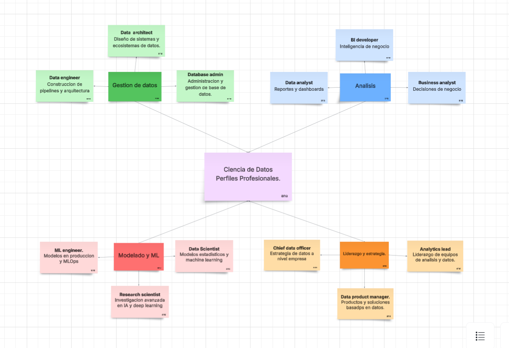

# Actividad 1.1: Investigación de Conceptos Fundamentales.

1. La `ciencia de datos ` es un campo interdisciplinario que utiliza métodos, algoritmos y herramientas para analizar datos y extraer conocimiento útil que ayude a tomar decisiones.

- Matematicas y Estadisticas: analisis de datos
- Programación: procesamiento de informacion.
- Base de Datos: almacenamiento y manejo de datos.
- Machine learning: realizar predicciones.
- Visualizacion de datos: representar resultados de forma clara.

2. Los  `Datos estructurados ` tienen un formato fijo(filas y columnas), tienen una organización clara y predecible, lo que los hace muy fáciles de almacenar y consultar. los  `Datos no estructurados `,en cambio, no tienen un formato definido, son mas dificiles de procesar ya que son de gran volumen como por ejemplo; imagens, videos, correos, etc..

3. las 5V describen las dimensiones clave que definen y desafian al Big Data:

- Volumen : La cantidad masiva de datos generados. Facebook - procesa cientos de terabytes de publicaciones, likes y mensajes cada día.
- Velocidad : La rapidez con que se generan y deben procesarse los datos. Las transacciones con tarjeta de crédito deben analizarse en milisegundos para detectar fraudes en tiempo real.
- Variedad : Los diferentes tipos y formatos de datos. Un hospital combina expedientes médicos en texto, radiografías en imagen, señales de monitores cardíacos y grabaciones de voz de médicos.
- Veracidad : La calidad y confiabilidad de los datos. En plataformas de comercio electrónico, distinguir entre reseñas auténticas y reseñas falsas generadas por bots es un reto constante.
- Valor : La utilidad real que se puede extraer. Netflix analiza el historial de visualización de millones de usuarios para construir un motor de recomendaciones que mantiene a los suscriptores enganchados.

3. Mapa conceptual de perfiles profesionales de ciencia de datos.

