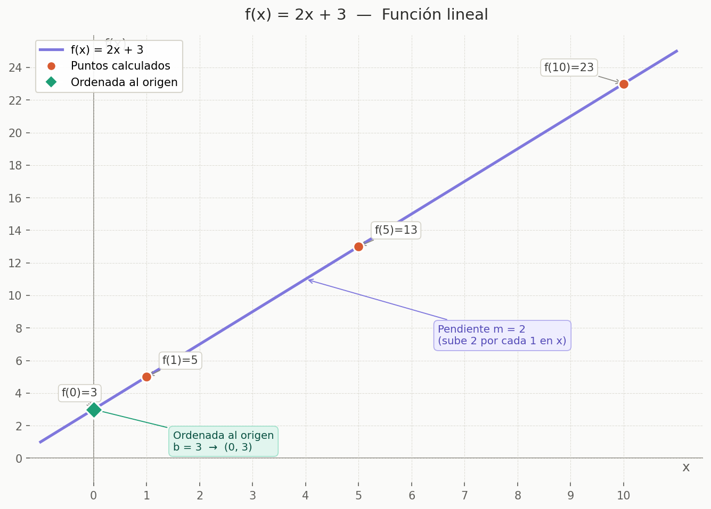
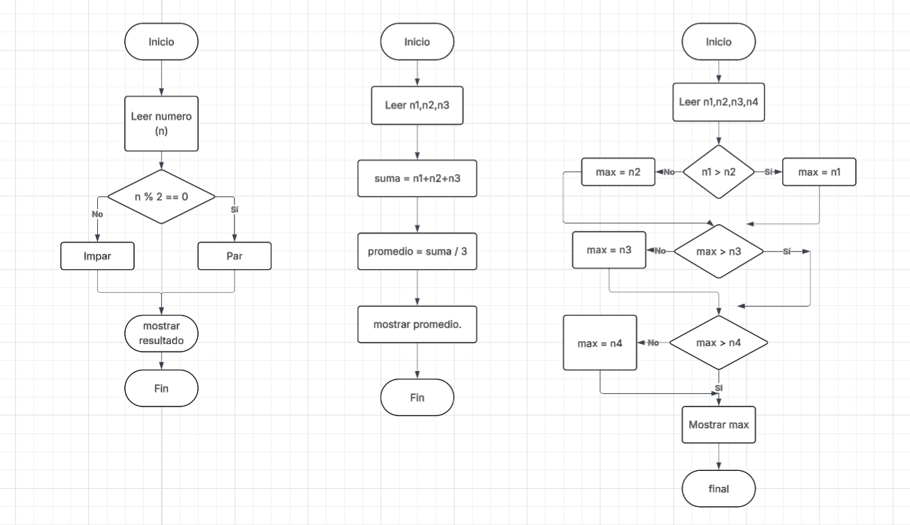

# Semana 1: Fundamentos de Ciencia de Datos y Big Data.

> Ana Sarai Zuñiga Esquivel

>AL03049128@tecmilenio.mx

>Ciencia de Datos.

>Profesor: Ricardo Alfredo Monroy Rodríguez.


## 1. Ejercicios Complementarios

### Ejercicio 1: Operaciones Algebraicas Básicas.

**Solución:**


### Ejercicio 2: Funciones Lineales

**Solución:**




### Ejercicio 3: Escalas y Volúmenes

**Solución:**

| Cantidad                    | Notación Científica |
| --------------------------- | ------------------- |
| 1,000,000 bytes             |        1x10⁶        |
| 1,000,000,000 registros     |        1x10⁹        |
| 1,000,000,000,000 bytes     |        1x10¹²       |

### Ejercicio 4: Diagrama de Flujo.

**Solución:**



### Ejercicio 5: Pseudocódigo.

**Solución:**

```
ALGORITMO Factorial(n)
  SI n < 0 ENTONCES
      RETORNAR "Error: n debe ser >= 0"
  SI n == 0 O n == 1 ENTONCES
      RETORNAR 1
  resultado ← 1
  PARA i DESDE 2 HASTA n HACER
      resultado ← resultado * i
  FIN PARA
  RETORNAR resultado
FIN ALGORITMO
```
```
ALGORITMO BuscarElemento(lista, objetivo)
  PARA i DESDE 0 HASTA longitud(lista) - 1 HACER
      SI lista[i] == objetivo ENTONCES
          RETORNAR i          
      FIN SI
  FIN PARA
  RETORNAR -1                 
FIN ALGORITMO
```
```
ALGORITMO BurbujaOrdenar(lista)
  n ← longitud(lista)
  PARA i DESDE 0 HASTA n - 2 HACER
      PARA j DESDE 0 HASTA n - 2 - i HACER
          SI lista[j] > lista[j+1] ENTONCES
              temp       ← lista[j]
              lista[j]   ← lista[j+1]
              lista[j+1] ← temp
          FIN SI
      FIN PARA
  FIN PARA
  RETORNAR lista
FIN ALGORITMO
```

### Ejercicio 6: Operaciones Booleanas.

**Solución:**


### Ejercicio 7: Historia de la Ciencia de Datos

**Solución:**

**1. ¿Quién es considerada la primera científica de datos?.**

`Florance Nightingale` es reconocida como la primera cientifica de datos debido a su innovadora aplicacion de la estadística y la visualización de datos para transformar la salud pública y la enfermeria. En 1854 recopiló, analizó y visualizó datos sobre mortalidad en hospitales militares durante la Guerra de Crimea, usando gráficas polares para convencer a autoridades de mejorar las condiciones sanitarias. Fue pionera en usar datos para tomar decisiones.

**2. ¿Qué es el "Data Science Venn Diagram" de Drew Conway?.**

El `Data Science Venn Diagram` de `Drew Conway` es un modelo visual creado en 2010 para definir las competencias esenciales que debe tener un científico de datos. El diagrama está compuesto por tres círculos que muestran que la ciencia de datos emerge de la intersección de:

- Habilidades matemáticas y estadísticas — modelado y análisis
- Conocimiento de programación/hacking — manipulación de datos a escala
- Experiencia en el dominio — entender el contexto del problema

La zona central donde los tres se cruzan es el `Data Science` real. Conway advertía que tener solo dos de los tres lleva a resultados incompletos o peligrosos.

**3. Menciona 3 herramientas modernas de Big Data.**

- `Apache Spark`: Sirve para procesamiento distribuido de datos a gran velocidad, en memoria.
- `Apache Kafka` : Transmision de datos en tiempo real (streaming) entre sistemas.
- `Snowflake` : Ofrece soluciones en la nube conescalabilidad automatica y entiende el contexto del problema.

### Ejercicio 8: Aplicaciones de Big Data.

**Salud:** DeepMind desarrolló un sistema de IA que analiza imágenes de retina para detectar retinopatía diabética con la misma precisión que especialistas humanos. Se implementó en hospitales del Reino Unido, mejorando la detección temprana de enfermedades que pueden causar ceguera. IBM Watson Health analiza registros genéticos y clínicos de millones de pacientes para ayudar a oncólogos a seleccionar tratamientos personalizados contra el cáncer.

**Finanzas:** Los bancos analizan cientos de terabytes de transacciones en tiempo real para detectar patrones de fraude. BBVA se alió con FeatureSpace (plataforma ARIC) y Google Cloud Chronicle para ser el primer banco europeo en usar análisis de seguridad avanzado. El sistema detecta automáticamente transacciones inusuales y las suspende hasta que el titular confirme la operación.

**Redes Sociales:** Meta usa más de 100 modelos de IA y aprendizaje automático para analizar el comportamiento de casi 3,000 millones de usuarios y personalizar el feed de cada uno. El algoritmo procesa señales como interacciones pasadas, tiempo de visualización, tipo de contenido y relaciones entre cuentas. En 2025 incorporó mejoras que aumentaron un 50% la visibilidad de Reels publicados el mismo día, priorizando contenido reciente y relevante.

**Deportes:** La NBA usa dispositivos wearables para monitorear la carga de trabajo de jugadores y detectar patrones de riesgo de lesión en tiempo real. El FC Barcelona implementó el dispositivo GPS OLIVER (colocado dentro de las medias) para medir rendimiento físico y prevenir sobrecargas. En Fórmula 1, escuderías como McLaren tienen 60 especialistas en datos que reciben información de sensores del auto en directo para tomar decisiones tácticas durante la carrera.

 ## 2. Actividades Prácticas

### Actividad 1.1: Investigación de Conceptos Fundamentales.
**Entregable:** 

1. La `ciencia de datos ` es un campo interdisciplinario que utiliza métodos, algoritmos y herramientas para analizar datos y extraer conocimiento útil que ayude a tomar decisiones.

- Matematicas y Estadisticas: analisis de datos
- Programación: procesamiento de informacion.
- Base de Datos: almacenamiento y manejo de datos.
- Machine learning: realizar predicciones.
- Visualizacion de datos: representar resultados de forma clara.

2. Los  `Datos estructurados ` tienen un formato fijo(filas y columnas), tienen una organización clara y predecible, lo que los hace muy fáciles de almacenar y consultar. los  `Datos no estructurados `,en cambio, no tienen un formato definido, son mas dificiles de procesar ya que son de gran volumen como por ejemplo; imagens, videos, correos, etc..

3. las 5V describen las dimensiones clave que definen y desafian al Big Data:

- Volumen : La cantidad masiva de datos generados. Facebook - procesa cientos de terabytes de publicaciones, likes y mensajes cada día.
- Velocidad : La rapidez con que se generan y deben procesarse los datos. Las transacciones con tarjeta de crédito deben analizarse en milisegundos para detectar fraudes en tiempo real.
- Variedad : Los diferentes tipos y formatos de datos. Un hospital combina expedientes médicos en texto, radiografías en imagen, señales de monitores cardíacos y grabaciones de voz de médicos.
- Veracidad : La calidad y confiabilidad de los datos. En plataformas de comercio electrónico, distinguir entre reseñas auténticas y reseñas falsas generadas por bots es un reto constante.
- Valor : La utilidad real que se puede extraer. Netflix analiza el historial de visualización de millones de usuarios para construir un motor de recomendaciones que mantiene a los suscriptores enganchados.

3. Mapa conceptual de perfiles profesionales de ciencia de datos.


### Actividad 1.2: Análisis de Casos de Uso
**Entregable:** 

Para el analisis de Uso, se investigo acerca de las empresas de Tesla, Duolingo y Airbnb. La presentacion se encuentra en la carpeta de Actividad 1.2.

### Actividad 1.3: Configuración del Entorno de Trabajo.
**Entregable:** 
| Archivo | Descripción |
|---|---|
| `verificar_entorno.py` | Script de verificación de librerías |
| `carga_de_datos.ipynb` | Cuaderno Jupyter con ejemplos de carga y visualización |

## Librerías instaladas
- Python 3.12.3
- NumPy 2.4.2
- Pandas 3.0.1
- Matplotlib 3.10.8
- Seaborn 0.13.2
- Scikit-learn 1.8.0
- Jupyter 5.9.1

## Cómo ejecutar
```bash
python verificar_entorno.py      # Verificar instalación
jupyter notebook carga_de_datos.ipynb  # Abrir notebook
```

### Actividad 1.4: Exploración de Fuentes de Datos.
**Entregable:** 
| Archivo | Descripción |
|---|---|
| `exploracion_fuentes_datos.ipynb` | Cuaderno con análisis de Kaggle y datasets de salud |
| `heart_disease_exploracion.png` | Visualizaciones del dataset elegido |

## Datasets explorados (salud y medicina)
1. **Heart Disease UCI** — Variables clínicas para predicción de enfermedades cardíacas
2. **Diabetes Health Indicators** — Encuesta CDC con 253K personas y hábitos de vida
3. **COVID-19 Vaccination Progress** — Progreso de vacunación en 218 países

## Dataset elegido: Heart Disease UCI
**Razón:** Dataset limpio, relevancia médica alta, ideal para clasificación binaria.

**Preguntas de investigación:**
- ¿Qué variable clínica es el mejor predictor de enfermedad cardíaca?
- ¿Los pacientes > 55 años tienen significativamente más riesgo?
- ¿Podemos construir un modelo con >80% de precisión con pocas variables?
 ## 3. Actividad 1.

 ## Reporte de Ciencia de Datos — DeportivaMX

> **Caso práctico:** Optimización del almacenamiento y tratamiento de datos para una tienda en línea de artículos deportivos en crecimiento acelerado.

---

## 1. Perfiles de Ciencia de Datos

Para atender los desafíos de crecimiento de DeportivaMX, se propone contratar los siguientes perfiles especializados:

### 1.1 Data Engineer (Ingeniero de Datos)

**Justificación:** DeportivaMX carece de infraestructura para gestionar el volumen creciente de datos. El Data Engineer es el responsable de diseñar, construir y mantener los pipelines de datos (procesos ETL/ELT), así como la arquitectura de almacenamiento. Sin este perfil, los demás especialistas no tendrían datos limpios ni accesibles para trabajar. Es el cimiento técnico de toda la solución.

**Responsabilidades clave en el proyecto:**
- Diseño e implementación de la arquitectura de datos (Data Lake / Data Warehouse).
- Construcción de pipelines de ingesta de datos desde múltiples fuentes (ventas, clientes, productos).
- Integración y configuración de la base de datos MongoDB.

---

### 1.2 Data Scientist (Científico de Datos)

**Justificación:** El objetivo principal del proyecto es optimizar la experiencia del cliente. El Data Scientist es quien analiza los datos para descubrir patrones de comportamiento, predecir tendencias de compra y proponer recomendaciones personalizadas. Convierte los datos en valor de negocio real mediante modelos estadísticos y de machine learning.

**Responsabilidades clave en el proyecto:**
- Análisis del comportamiento de compra de los clientes.
- Desarrollo de modelos predictivos (demanda de productos, churn de clientes).
- Identificación de oportunidades de mejora en el catálogo y las campañas de marketing.

---

### 1.3 Data Analyst (Analista de Datos)

**Justificación:** La empresa necesita visibilidad operativa inmediata sobre sus ventas, inventario y clientes. El Data Analyst traduce los datos en reportes, dashboards e insights accionables para los tomadores de decisiones del negocio. A diferencia del Data Scientist, su foco es descriptivo y diagnóstico (qué está pasando y por qué), no predictivo.

**Responsabilidades clave en el proyecto:**
- Creación de dashboards de ventas, inventario y comportamiento del cliente.
- Monitoreo de KPIs clave (ticket promedio, tasa de conversión, productos más vendidos).
- Soporte analítico para las áreas de marketing, operaciones y logística.

---

### 1.4 Data Governance / Quality Analyst (Analista de Calidad y Gobernanza de Datos)

**Justificación:** Dado que los datos provienen de múltiples fuentes heterogéneas, es crítico garantizar su calidad, consistencia y seguridad. Este perfil es fundamental para establecer estándares de datos, procesos de limpieza y políticas de privacidad (cumplimiento con la Ley Federal de Protección de Datos Personales en México). Sin calidad de datos, los análisis y modelos serán poco confiables.

**Responsabilidades clave en el proyecto:**
- Definición de reglas de validación y limpieza de datos.
- Implementación de políticas de privacidad y seguridad de datos.
- Creación del catálogo de datos corporativo (metadata).

---

### 1.5 MLOps / DevOps Engineer

**Justificación:** Una vez que los modelos de Data Science estén desarrollados, necesitan desplegarse, monitorearse y actualizarse de manera continua en producción. El MLOps Engineer garantiza que los modelos no solo funcionen en el ambiente de desarrollo, sino que operen de forma estable, escalable y automatizada en el entorno real de la tienda en línea.

**Responsabilidades clave en el proyecto:**
- Despliegue y monitoreo de modelos predictivos en producción.
- Automatización de pipelines de reentrenamiento de modelos.
- Gestión de la infraestructura en la nube (escalabilidad y disponibilidad).

---

## 2. Las 5 V del Big Data aplicadas a DeportivaMX

### 2.1 Volumen

**Relación con el caso:** DeportivaMX experimenta un crecimiento acelerado en sus registros de ventas en línea. Cada transacción genera múltiples registros: datos del cliente, del producto, del carrito de compra, del método de pago, del historial de navegación y de logística. A medida que la base de clientes crece, este volumen se multiplica exponencialmente. La solución debe ser capaz de almacenar y procesar cientos de millones de registros de manera eficiente, lo que justifica el uso de arquitecturas distribuidas como un Data Lake.

---

### 2.2 Velocidad

**Relación con el caso:** Las ventas en línea se generan en tiempo real, los siete días de la semana. El sistema debe procesar transacciones, actualizar inventarios y detectar comportamientos de compra de forma inmediata. Por ejemplo, si un producto se agota, el sistema debe reflejarlo en tiempo real para no generar ventas fallidas. Además, las campañas de marketing digital (descuentos flash, promociones estacionales) requieren análisis casi instantáneo para medir su efectividad y reaccionar oportunamente.

---

### 2.3 Variedad

**Relación con el caso:** Los datos de DeportivaMX provienen de fuentes diversas y tienen formatos heterogéneos. Se tienen datos estructurados (registros de ventas, inventarios en bases de datos relacionales), datos semiestructurados (catálogos de productos en JSON, logs de navegación del sitio web) y datos no estructurados (reseñas y comentarios de clientes, imágenes de productos, interacciones en redes sociales). Esta variedad es precisamente la razón por la que una solución NoSQL como MongoDB resulta más adecuada que una base de datos relacional tradicional.

---

### 2.4 Veracidad

**Relación con el caso:** La calidad y confiabilidad de los datos es un desafío crítico en este caso. Al integrar múltiples fuentes de datos, es posible que existan registros duplicados, información incompleta de clientes, precios desactualizados o errores en el inventario. Si los datos no son veraces, las decisiones de negocio (reabastecimiento, segmentación de clientes, recomendaciones de productos) serán incorrectas. Por ello se propone el perfil de Data Governance Analyst, cuya función principal es garantizar la veracidad de los datos.

---

### 2.5 Valor

**Relación con el caso:** El objetivo final de todo el proyecto es generar valor de negocio tangible para DeportivaMX. El valor se materializa al transformar los datos crudos en insights accionables: identificar qué productos tienen mayor demanda para optimizar el inventario, personalizar la experiencia de compra de cada cliente para aumentar la conversión, detectar patrones de abandono de carrito para activar campañas de recuperación, y predecir temporadas de alta demanda para preparar la logística. El Big Data solo justifica su inversión cuando genera un retorno medible para la empresa.

---

## 3. Arquitectura de Almacenamiento

### 3.1 Arquitectura Recomendada: Lambda Architecture + Data Lake

Para DeportivaMX se propone una **arquitectura Lambda** soportada sobre un **Data Lake**, complementada con una capa de base de datos NoSQL (MongoDB) para el almacenamiento operacional. Esta combinación es la más adecuada por las siguientes razones:

#### ¿Por qué Lambda Architecture?

La Arquitectura Lambda divide el procesamiento de datos en dos capas complementarias:

**Capa de Batch (procesamiento por lotes):** Procesa el historial completo de datos de forma periódica (por ejemplo, cada noche) para generar reportes, entrenar modelos de machine learning y actualizar el Data Warehouse analítico. Es altamente tolerante a fallos y garantiza precisión en los análisis históricos.

**Capa de Speed (procesamiento en tiempo real):** Procesa los datos que llegan en streaming en tiempo real (transacciones de venta, actualizaciones de inventario, clics en el sitio web) para generar vistas rápidas y alertas inmediatas. Herramientas como Apache Kafka y Apache Spark Streaming son adecuadas para esta capa.

Esta arquitectura resuelve directamente el desafío de DeportivaMX: necesita tanto análisis histórico profundo (para entender tendencias de largo plazo) como reacción en tiempo real (para gestionar ventas y stock de forma inmediata).

#### ¿Por qué un Data Lake?

Un Data Lake permite almacenar datos en su formato crudo y original, sin necesidad de definir un esquema previo. Esto es ideal para DeportivaMX dado que sus datos provienen de múltiples fuentes y formatos (la "V" de Variedad). El Data Lake actúa como repositorio centralizado donde todos los datos —estructurados, semiestructurados y no estructurados— conviven antes de ser procesados. Se puede implementar sobre plataformas en la nube como Amazon S3, Google Cloud Storage o Azure Data Lake Storage, lo que garantiza escalabilidad automática y costos optimizados.

---

### 3.2 Base de Datos NoSQL: MongoDB (Documental)

#### Justificación de la selección de NoSQL documental

Entre los tipos de bases de datos NoSQL (clave-valor, documental, columnar, grafo), **MongoDB** —del tipo documental— es la opción más factible para DeportivaMX por las siguientes razones:

**Flexibilidad de esquema:** El catálogo de una tienda deportiva es naturalmente heterogéneo. Un par de tenis tiene atributos completamente distintos a una bicicleta o a una raqueta de tenis. MongoDB permite almacenar cada producto con sus propios campos sin forzar un esquema rígido, a diferencia de las bases de datos relacionales.

**Formato JSON nativo:** Los datos del e-commerce (pedidos, perfiles de cliente, catálogos de productos) se representan naturalmente en JSON. MongoDB almacena documentos en formato BSON (Binary JSON), lo que elimina la necesidad de transformaciones complejas.

**Escalabilidad horizontal:** MongoDB escala horizontalmente mediante sharding, distribuyendo los datos entre múltiples servidores. Esto es crítico para soportar el crecimiento acelerado de DeportivaMX sin degradar el rendimiento.

**Consultas ricas y agregaciones:** A diferencia de bases de datos de clave-valor simples, MongoDB permite consultas complejas, filtros, agregaciones y búsquedas de texto, lo que lo hace suficientemente expresivo para los análisis operacionales del negocio.

**Ecosistema y madurez:** MongoDB cuenta con una interfaz gráfica (MongoDB Compass), amplia documentación, drivers para todos los lenguajes de programación relevantes (Python, Node.js, Java) y servicios gestionados en la nube (MongoDB Atlas), reduciendo la carga operativa para el equipo de tecnologia.

## Conclusión

DeportivaMX se encuentra en un punto de inflexión: su crecimiento acelerado representa una oportunidad enorme, pero también expone las limitaciones de una infraestructura de datos que no fue diseñada para escalar. La solución propuesta en este reporte no es una mejora incremental, sino una transformación estructural en la forma en que la empresa captura, almacena y aprovecha sus datos.

La contratación de los cinco perfiles especializados —Data Engineer, Data Scientist, Data Analyst, Data Governance Analyst y MLOps Engineer— garantiza que la organización cuente con las capacidades humanas necesarias para operar en cada capa del ciclo de vida del dato: desde su ingesta y calidad hasta su análisis y puesta en producción. Ningún perfil es prescindible; cada uno cubre un eslabón crítico de la cadena de valor de los datos.

El análisis bajo las 5 V del Big Data confirma que el caso de DeportivaMX cumple con todas las características que definen un proyecto de esta naturaleza. La empresa no solo maneja grandes volúmenes de datos, sino que estos llegan con alta velocidad, en formatos variados, con retos de veracidad reales, y con un potencial de valor de negocio directamente vinculado a la experiencia del cliente y la rentabilidad operativa.

La Arquitectura Lambda sobre un Data Lake resuelve de manera elegante la tensión entre análisis histórico profundo y respuesta en tiempo real, ofreciendo además escalabilidad y flexibilidad para adaptarse al crecimiento futuro. La elección de MongoDB como base de datos NoSQL documental es coherente con la naturaleza heterogénea del catálogo deportivo y con la necesidad de iterar rápidamente sobre el modelo de datos sin las restricciones de un esquema rígido.

Finalmente, el diseño de las cinco colecciones en MongoDB —clientes, productos, pedidos, reseñas y sesiones de navegación— sienta las bases de un ecosistema de datos que va más allá del simple almacenamiento: es el insumo para sistemas de recomendación personalizados, análisis de abandono de carrito, predicción de demanda y segmentación de clientes, todas capacidades que se traducen directamente en una mejor experiencia de compra y en una ventaja competitiva sostenible para DeportivaMX en el mercado del e-commerce deportivo en México.