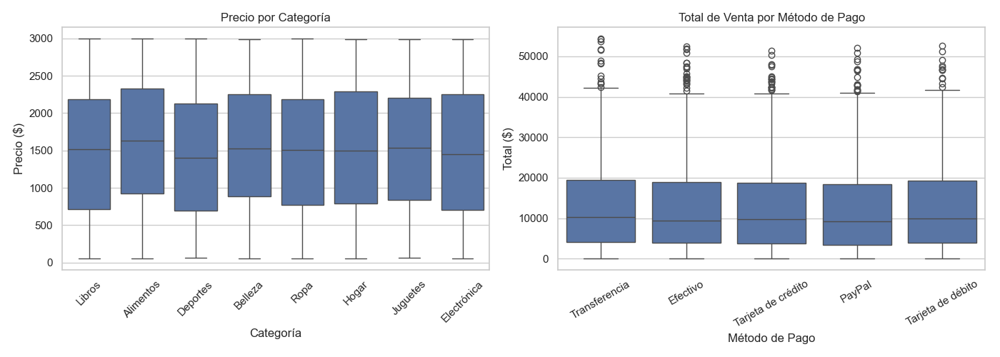
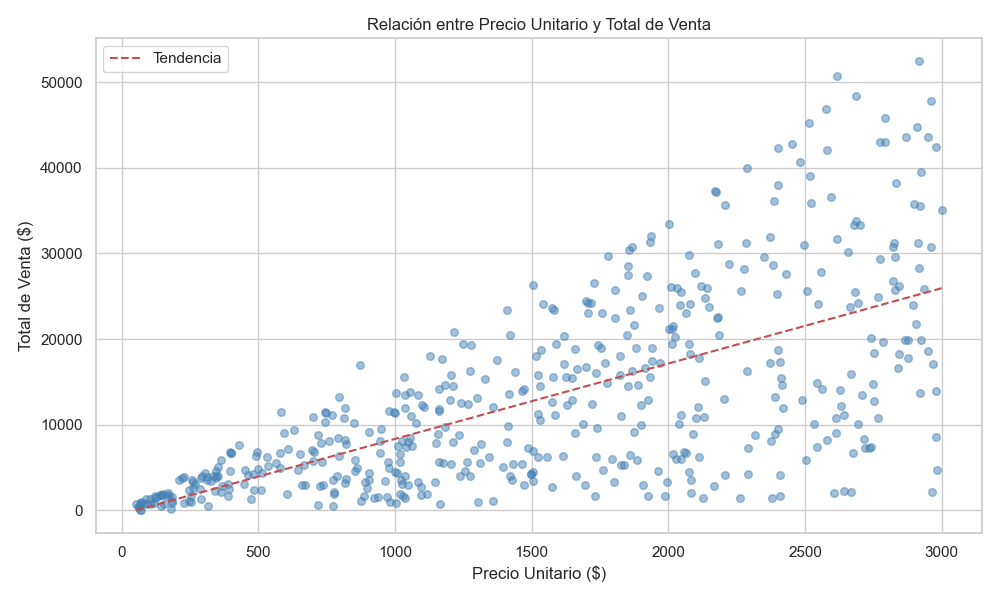
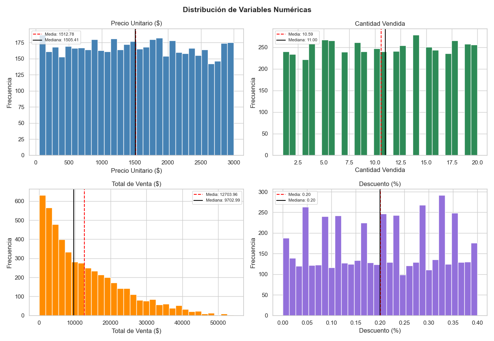

# Semana 2: Arquitecturas de Datos y MongoDB.

> Ana Sarai Zuñiga Esquivel. - AL03049128. - Ciencia de Datos. - Prof. Ricardo Alfredo Monroy Rodriguez.

## 1. Ejercicios Complementarios.

### Ejercicio 1. Consultas Básicas.

**Solución:**

```sql
USE test_db;
CREATE TABLE empleados (
    id            INT PRIMARY KEY,
    nombre        VARCHAR(50),
    departamento  VARCHAR(50),
    salario       INT
);

INSERT INTO empleados VALUES
    (1, 'Juan',   'IT',        50000),
    (2, 'María',  'HR',        45000),
    (3, 'Carlos', 'IT',        55000),
    (4, 'Ana',    'Finanzas',  48000),
    (5, 'Pedro',  'Marketing', 42000);
    
    SELECT * FROM empleados;
    SELECT nombre, salario FROM empleados WHERE departamento = 'IT';
    SELECT * FROM empleados ORDER BY salario DESC LIMIT 1;
    SELECT departamento, COUNT(*) AS total FROM empleados GROUP BY departamento;
    UPDATE empleados SET salario = 50000 WHERE nombre = 'María';
	SELECT nombre, salario FROM empleados WHERE nombre = 'María';

```


### Ejercicio 2. Joins.

**Solución:**

```sql
CREATE TABLE departamentos (
    id     INT PRIMARY KEY,
    nombre VARCHAR(50)
);

CREATE TABLE empleados (
    id               INT PRIMARY KEY,
    nombre           VARCHAR(50),
    id_departamento  INT
);

INSERT INTO departamentos VALUES
    (1, 'IT'),
    (2, 'HR'),
    (3, 'Finanzas');

INSERT INTO empleados VALUES
    (1, 'Juan',   1),
    (2, 'María',  2),
    (3, 'Carlos', 1);

SELECT e.nombre, d.nombre AS departamento
FROM empleados e
INNER JOIN departamentos d ON e.id_departamento = d.id;
SELECT e.nombre, d.nombre AS departamento
FROM empleados e
LEFT JOIN departamentos d ON e.id_departamento = d.id;
SELECT d.nombre, COUNT(e.id) AS total_empleados
FROM departamentos d
LEFT JOIN empleados e ON d.id = e.id_departamento
GROUP BY d.nombre;
```


## 1. Ejercicios Complementarios.

### Ejercicio 3. Manipulación de JSON.

**Solución:**

```py

import json

data = {
  "empleados": [
    {"id": 1, "nombre": "Juan",   "habilidades": ["Python", "SQL"]},
    {"id": 2, "nombre": "María",  "habilidades": ["Java", "MongoDB"]},
    {"id": 3, "nombre": "Carlos", "habilidades": ["Python", "R"]}
  ]
}
nombres = [e["nombre"] for e in data["empleados"]]
print(nombres)

data["empleados"][0]["habilidades"].append("Docker")
print(data["empleados"][0])

nuevo = {"id": 4, "nombre": "Ana", "habilidades": ["JavaScript"]}
data["empleados"].append(nuevo)
print(len(data["empleados"]))  

data["empleados"][1]["habilidades"] = []
print(data["empleados"][1])

```


### Ejercicio 4: Estructuras de Datos en Python.

**Solución:**

```py
empleados = [
    {"id": 1, "nombre": "Juan",   "salario": 50000},
    {"id": 2, "nombre": "María",  "salario": 45000},
    {"id": 3, "nombre": "Carlos", "salario": 55000}
]
empleados.append({"id": 4, "nombre": "Ana", "salario": 48000})
print(empleados)
def buscar(id):
    return next((e for e in empleados if e["id"] == id), None)

print(buscar(2))
print(buscar(99)) 
promedio = sum(e["salario"] for e in empleados) / len(empleados)
print(f"Promedio: {promedio:.2f}")
altos = [e for e in empleados if e["salario"] > 50000]
print(altos)
for e in empleados:
    if e["id"] == 2:
        e["nombre"] = "María García"
        break

print(buscar(2))
```


### Ejercicio 5: Operaciones CRUD.

**Solución:**

```javascript
db.productos.insertMany([
    { nombre: "Laptop",     precio: 999, categoria: "Electrónica" },
    { nombre: "Mouse",      precio: 29,  categoria: "Electrónica" },
    { nombre: "Escritorio", precio: 299, categoria: "Muebles"     }
])

db.productos.find({ categoria: "Electrónica" })
db.productos.find({ precio: { $lt: 100 } })
db.productos.updateOne(
    { nombre: "Laptop" },
    { $mul: { precio: 1.10 } }
)

db.productos.findOne({ nombre: "Laptop" })
db.productos.deleteMany({ precio: { $lt: 50 } })
db.productos.insertOne({
    nombre:    "Teclado",
    precio:    79,
    categoria: "Electrónica"
})
```


### Ejercicio 6: Consultas Avanzadas en MongoDB.

**Solución:**

```javascript
db.estudiantes.insertMany([
    { nombre: "Ana",   materias: ["Math", "Physics"],   edad: 20 },
    { nombre: "Luis",  materias: ["Math", "Chemistry"], edad: 22 },
    { nombre: "Sofia", materias: ["Biology"],           edad: 19 }
])
db.estudiantes.find({ materias: "Math" })
db.estudiantes.find({ edad: { $gt: 20 } })
db.estudiantes.aggregate([
    { $group: { _id: "$edad", total: { $sum: 1 } } }
])
db.estudiantes.find({}, { nombre: 1, _id: 0 })
```


### Ejercicio 7: Tipos de Bases de Datos NoSQL.

Las bases de datos NoSQL se dividen en distintos tipos según cómo organizan y gestionan la información. Por ejemplo, las documentales como MongoDB y CouchDB guardan los datos en documentos tipo JSON, lo que resulta muy útil para manejar información semi-estructurada en aplicaciones web o APIs; su gran ventaja es la flexibilidad y la facilidad para escalar, aunque no funcionan tan bien cuando se necesitan relaciones complejas. Las de tipo Key-Value, como Redis y Amazon DynamoDB, almacenan la información en pares de clave y valor, lo que las hace extremadamente rápidas y prácticas para cachés o sesiones, aunque limitan mucho las consultas posibles. En cambio, las bases columnar como Apache Cassandra y Apache HBase organizan los datos por columnas, lo que las hace ideales para trabajar con grandes volúmenes y análisis masivos; ofrecen un rendimiento muy alto, pero su diseño y administración suelen ser más complicados. Finalmente, las bases de grafos como Neo4j representan la información mediante nodos y relaciones, lo que las convierte en la mejor opción para redes sociales o sistemas de recomendación; destacan por manejar de forma eficiente relaciones complejas, aunque no son tan adecuadas para datos simples o sin conexiones.

### Ejercicio 8: Arquitecturas de Almacenamiento.

Un Data Lake es un sistema que permite almacenar enormes cantidades de datos en su formato original, sin necesidad de procesarlos previamente, lo que lo hace útil para guardar información variada como registros de actividad, archivos multimedia o datos provenientes de sensores. En cambio, un Data Warehouse funciona como un repositorio donde los datos ya están procesados y estructurados, optimizados para consultas y análisis, especialmente en el ámbito empresarial para apoyar la toma de decisiones.

Por otro lado, los sistemas OLTP (Online Transaction Processing) están orientados a manejar transacciones rápidas y frecuentes, como compras o registros diarios, mientras que los sistemas OLAP (Online Analytical Processing) se enfocan en analizar datos históricos para generar reportes y descubrir tendencias. Finalmente, el proceso ETL (Extract, Transform, Load) es clave en la gestión de datos, pues consiste en extraer información de distintas fuentes, transformarla para que tenga un formato adecuado y cargarla en un sistema como un Data Warehouse, donde después puede ser analizada.

## 2. Actividad 2.

## Descripción
 
Imagina que eres el responsable de un proyecto de reciente creación, cuyo objetivo es examinar un conjunto de datos que contiene información sobre ventas de productos de una tienda en línea llamada **"Todo Ventas en Línea, S.A. de C.V."** durante un período de tiempo.
 
Se te pide realizar un **análisis exploratorio de los datos** para comprender de manera más profunda el rendimiento de las ventas y extraer información valiosa que contribuya a la **toma de decisiones comerciales** para el presente año. De la información que obtengas dependerán todas las estrategias comerciales de la organización para determinar qué producto vender más, a qué nicho de mercado dirigirse y en qué época del año reforzar las promociones.
 
---
 
## Objetivo
 
Reforzar el análisis exploratorio de datos utilizando **Python** y **MongoDB** para comprender mejor el rendimiento de las ventas en una tienda en línea. Este proceso incluirá:
 
- La importación de datos desde **MongoDB**.
- La exploración de los mismos utilizando **Pandas** y **NumPy**.
- La visualización de la información a través de herramientas como **Matplotlib** y **Seaborn**.
 
---
 
## Tecnologías y Librerías Utilizadas
 
| Librería      | Propósito                                              |
|---------------|--------------------------------------------------------|
| `pandas`      | Manipulación y análisis de datos tabulares             |
| `numpy`       | Operaciones numéricas y generación de datos aleatorios |
| `faker`       | Generación de datos ficticios realistas en español MX  |
| `pymongo`     | Conexión e inserción de datos en MongoDB               |
| `matplotlib`  | Visualización de gráficas                              |
| `seaborn`     | Visualización estadística avanzada                     |
| `json`        | Serialización de estructuras anidadas (direcciones)    |
| `datetime`    | Manejo y generación de fechas                          |
 
---
 
## Estructura del Dataset
 
El conjunto de datos contiene **5,000 registros** con **10 columnas**, simulando transacciones reales de una tienda en línea durante el año 2026.
 
| Campo                | Tipo         | Descripción                                         |
|----------------------|--------------|-----------------------------------------------------|
| `precio_unitario`    | `float64`    | Precio por unidad del producto vendido (MXN)        |
| `cantidad`           | `int64`      | Número de unidades vendidas por transacción         |
| `total_venta`        | `float64`    | Monto total de la venta, aplicando descuento        |
| `descuento_pct`      | `float64`    | Porcentaje de descuento aplicado a la venta         |
| `categoria`          | `str`        | Categoría del producto vendido                      |
| `metodo_pago`        | `str`        | Forma de pago utilizada por el cliente              |
| `fecha_venta`        | `datetime`   | Fecha en que se realizó la transacción              |
| `direccion_envio`    | `str (JSON)` | Dirección de envío del cliente (estructura anidada) |
| `comentario_cliente` | `str`        | Opinión textual del cliente sobre el producto       |
| `nombre_producto`    | `str`        | Nombre específico del producto adquirido            |
 
---

## Descripción de Celdas y Código
 
---
 
### Generación del Dataset Sintético
 
```python
import random
import json
from datetime import datetime, timedelta
import pandas as pd
import numpy as np
from faker import Faker


fake = Faker('es_MX')
random.seed(42)
np.random.seed(42)

N = 5000

CATEGORIAS = ['Electrónica', 'Ropa', 'Hogar', 'Deportes',
              'Juguetes', 'Alimentos', 'Belleza', 'Libros']

METODOS_PAGO = ['Tarjeta de crédito', 'Tarjeta de débito',
                'PayPal', 'Transferencia', 'Efectivo']

PRODUCTOS = {
    'Electrónica':  ['Laptop Core i7 16GB', 'Smartphone 5G 256GB',
                     'Tablet 10 pulgadas', 'Auriculares Bluetooth'],
    'Ropa':         ['Playera algodón premium', 'Jeans slim fit',
                     'Vestido casual verano', 'Sudadera con capucha'],
    'Hogar':        ['Silla ergonómica oficina', 'Lámpara LED escritorio',
                     'Cafetera programable', 'Set de sábanas 400 hilos'],
    'Deportes':     ['Tenis running profesional', 'Mancuernas ajustables',
                     'Colchoneta yoga antideslizante', 'Bicicleta estática'],
    'Juguetes':     ['Set Lego arquitectura', 'Muñeca articulada deluxe',
                     'Auto control remoto', 'Juego de mesa familiar'],
    'Alimentos':    ['Pack proteína whey 1kg', 'Café molido orgánico 500g',
                     'Snack saludable mixto', 'Suplemento vitamínico'],
    'Belleza':      ['Crema hidratante FPS 50', 'Perfume floral 100ml',
                     'Kit maquillaje profesional', 'Shampoo sin sulfatos'],
    'Libros':       ['Python para Ciencia de Datos', 'Marketing Digital 2024',
                     'Finanzas personales', 'Novela bestseller año']
}

COMENTARIOS = [
    'Excelente producto, llegó antes de lo esperado y en perfectas condiciones.',
    'Muy buena relación calidad-precio, lo recomiendo ampliamente.',
    'El producto es tal y como se describe, estoy muy satisfecho.',
    'Entrega rápida, el empaque estaba en buen estado.',
    'El artículo es de buena calidad aunque el envío tardó un poco.',
    'No cumplió del todo mis expectativas pero sirve para lo básico.',
    'Increíble producto, superó todas mis expectativas.',
    'Buen precio pero la calidad podría mejorar.',
    'Segunda compra, siempre quedo satisfecho con este vendedor.',
    'Producto auténtico y de calidad, envío rápido y seguro.'
]

fecha_inicio = datetime(2026, 1, 1)
fechas = [fecha_inicio + timedelta(days=random.randint(0, 364)) for _ in range(N)]

registros = []
for i in range(N):
    categoria = random.choice(CATEGORIAS)
    precio    = round(random.uniform(50, 3000), 2)
    cantidad  = random.randint(1, 20)
    descuento = round(random.uniform(0, 0.40), 2)
    total     = round(precio * cantidad * (1 - descuento), 2)

    direccion = {
        'calle':  fake.street_address(),
        'ciudad': fake.city(),
        'estado': fake.state(),
        'cp':     fake.postcode()
    }

    registros.append({
        'precio_unitario':    precio,
        'cantidad':           cantidad,
        'total_venta':        total,
        'descuento_pct':      descuento,
        'categoria':          categoria,
        'metodo_pago':        random.choice(METODOS_PAGO),
        'fecha_venta':        fechas[i].strftime('%Y-%m-%d'),
        'direccion_envio':    json.dumps(direccion, ensure_ascii=False),
        'comentario_cliente': random.choice(COMENTARIOS),
        'nombre_producto':    random.choice(PRODUCTOS[categoria])
    })

df = pd.DataFrame(registros)
print(f'Dataset creado: {df.shape[0]} filas × {df.shape[1]} columnas')
df.head()

```
 
**Interpretación:**
 
Esta celda crea el conjunto de datos de manera sintética, simulando 5,000 transacciones de una tienda en línea. Se definen 8 categorías de productos (Electrónica, Ropa, Hogar, Deportes, Juguetes, Alimentos, Belleza y Libros), cada una con 4 productos específicos.
 
Para cada transacción se generan aleatoriamente:
- Un **precio unitario** entre $50 y $3,000 MXN.
- Una **cantidad** entre 1 y 20 unidades.
- Un **descuento** de hasta el 40%.
- Un **total de venta** calculado como: `precio × cantidad × (1 - descuento)`.
- Una **fecha** aleatoria dentro del año 2026.
- Una **dirección de envío** ficticia usando `Faker` con localización en México.
 
El uso de `random.seed(42)` y `np.random.seed(42)` garantiza la **reproducibilidad** del dataset: los resultados serán idénticos cada vez que se ejecute el código.

**Resultado:** 


### Conexión a MongoDB e Inserción de Datos
 
```python
from pymongo import MongoClient
from pymongo.errors import ConnectionFailure

try:
 cliente = MongoClient('mongodb://localhost:27017/',
 serverSelectionTimeoutMS=5000)
 cliente.admin.command('ping') # Verificar conexión
 print('Conexión a MongoDB exitosa')
except ConnectionFailure as e:
 print(f' Error de conexión: {e}')

db = cliente['todo_ventas_db']
coleccion = db['ventas_2026']

coleccion.drop()
print(f'Colección limpiada. Cargando {len(registros)} documentos...')

tamano_lote = 500
for i in range(0, len(registros), tamano_lote):
 lote = registros[i : i + tamano_lote]
 coleccion.insert_many(lote)
print(f' {coleccion.count_documents({})} documentos insertados en MongoDB')
```
 
**Interpretación:**
 
Esta celda establece una conexión con una instancia local de **MongoDB** que corre en el puerto 27017. Se verifica la conexión mediante un comando `ping`; si falla, se captura la excepción `ConnectionFailure` y se notifica al usuario.
 
Una vez conectado, se trabaja con la base de datos `todo_ventas_db` y la colección `ventas_2026`. Antes de insertar, se limpia la colección con `drop()` para evitar duplicados en ejecuciones repetidas.
 
Los 5,000 registros se insertan en **lotes de 500 documentos** usando `insert_many()`, lo cual es una práctica eficiente para operaciones masivas en MongoDB, ya que reduce el número de viajes de red al servidor.
 
**Resultado:**


### Recuperación de Datos desde MongoDB
 
```python
import pandas as pd
import numpy as np

cursor = coleccion.find({}, {'_id': 0})
df = pd.DataFrame(list(cursor))

df['fecha_venta'] = pd.to_datetime(df['fecha_venta'])
df['precio_unitario'] = df['precio_unitario'].astype(float)
df['total_venta'] = df['total_venta'].astype(float)
df['descuento_pct'] = df['descuento_pct'].astype(float)
df['cantidad'] = df['cantidad'].astype(int)
print(f'DataFrame cargado: {df.shape}')
df.head(3)
```
 
**Interpretación:**
 
Esta celda recupera todos los documentos almacenados en MongoDB mediante el método `find()`. El parámetro `{'_id': 0}` excluye el campo interno `_id` de MongoDB del resultado, ya que no es relevante para el análisis.
 
Los documentos se convierten a un **DataFrame de Pandas** para facilitar el análisis posterior. Acto seguido, se aplica un tipado explícito a cada columna para garantizar que las operaciones matemáticas y temporales funcionen correctamente:
 
- `fecha_venta` → `datetime64` para operaciones de series de tiempo.
- `precio_unitario` y `total_venta` → `float64` para cálculos decimales.
- `descuento_pct` → `float64` para cálculos porcentuales.
- `cantidad` → `int64` para valores enteros.
 
**Resultado:** 


### Verificación de Calidad de Datos
 
```python
print('Tipos de datos:')
print(df.dtypes)
print('\nValores nulos:')
print(df.isnull().sum())
print(f'\nDuplicados: {df.duplicated().sum()}')
```
 
**Interpretación:**
 
Esta celda realiza una **auditoría de calidad del dataset**, verificando tres aspectos fundamentales antes de cualquier análisis:
 
1. **Tipos de datos (`dtypes`):** Confirma que cada columna tenga el tipo correcto asignado en la celda anterior.
2. **Valores nulos (`isnull().sum()`):** Detecta si alguna columna tiene registros faltantes que puedan sesgar los resultados. En este caso, todas las columnas arrojan **0 valores nulos**.
3. **Registros duplicados (`duplicated().sum()`):** Identifica si existen filas idénticas que inflen las métricas. El resultado es **0 duplicados**.
 
Este paso es crítico en cualquier proyecto de análisis de datos, ya que garantiza que los resultados obtenidos sean fiables y representativos de la realidad.

**Resultado:** 


### Estadísticas Descriptivas (Media, Mediana y Moda)
 
```python
columnas_num = ['precio_unitario', 'cantidad', 'total_venta', 'descuento_pct']

medias   = df[columnas_num].mean().round(2)
medianas = df[columnas_num].median().round(2)
modas    = df[columnas_num].mode().iloc[0].round(2)


resumen = pd.DataFrame({
    'Media':   medias,
    'Mediana': medianas,
    'Moda':    modas
})

print('Resumen estadístico:')
print(resumen)
```
 
**Interpretación:**
 
Esta celda calcula las tres medidas de tendencia central para las variables numéricas del dataset, permitiendo comprender la distribución de los datos.
 
| Variable          | Media       | Mediana    | Moda     |
|-------------------|-------------|------------|----------|
| `precio_unitario` | $1,512.78   | $1,505.41  | $74.84   |
| `cantidad`        | 10.59       | 11.00      | 14.00    |
| `total_venta`     | $12,703.96  | $9,702.98  | $492.44  |
| `descuento_pct`   | 0.20        | 0.20       | 0.32     |
 
**Hallazgos clave:**
 
- El **precio promedio** de los productos es de $1,512.78, con una mediana muy cercana ($1,505.41), lo que indica una distribución bastante simétrica sin sesgos extremos.
- El **total de venta promedio** es de $12,703.96, considerablemente mayor a la mediana ($9,702.98), lo que sugiere la existencia de **ventas de alto valor** que jalan la media hacia arriba.
- El **descuento promedio** es del 20%, y coincide con la mediana, indicando que los descuentos se aplican de forma uniforme en toda la base de clientes.

**Resultado:** 


### Distribución por Categoría y Método de Pago
 
```python
# ventas por categoria
print('Ventas por categoría:')
print(df['categoria'].value_counts())

# metodos de pago mas usados
print('\nMétodos de pago:')
print(df['metodo_pago'].value_counts())
```
 
**Interpretación:**
 
Esta celda analiza la frecuencia de ventas según la **categoría del producto** y el **método de pago** utilizado.
 
**Ventas por categoría:**
 
| Categoría   | Transacciones |
|-------------|--------------|
| Electrónica | 661          |
| Ropa        | 659          |
| Belleza     | 656          |
| Deportes    | 653          |
| Libros      | 628          |
| Hogar       | 615          |
| Juguetes    | 566          |
| Alimentos   | 562          |
 
La distribución entre categorías es bastante **equilibrada**, con una diferencia máxima de menos de 100 transacciones entre la categoría más vendida (Electrónica) y la menos vendida (Alimentos). Esto sugiere que la tienda no depende de una sola categoría para sostener sus ventas.
 
**Métodos de pago:**
 
| Método             | Transacciones |
|--------------------|--------------|
| Tarjeta de crédito | 1,021        |
| Transferencia      | 1,013        |
| Efectivo           | 1,007        |
| Tarjeta de débito  | 980          |
| PayPal             | 979          |
 
Los cinco métodos de pago tienen una distribución prácticamente **igualitaria**, con cerca de 1,000 transacciones cada uno. Esto refleja que los clientes utilizan todos los canales disponibles de manera similar.


### Gráfica: Box Plot de Precio y Monto de Venta
 
```python
import matplotlib.pyplot as plt
import seaborn as sns

sns.set_theme(style='whitegrid')
%matplotlib inline

fig, axes = plt.subplots(1, 2, figsize=(14, 5))

# Box plot del precio por categoría
sns.boxplot(data=df, x='categoria', y='precio_unitario', ax=axes[0])
axes[0].set_title('Precio por Categoría')
axes[0].set_xlabel('Categoría')
axes[0].set_ylabel('Precio ($)')
axes[0].tick_params(axis='x', rotation=45)

# Box plot del total de venta por método de pago
sns.boxplot(data=df, x='metodo_pago', y='total_venta', ax=axes[1])
axes[1].set_title('Total de Venta por Método de Pago')
axes[1].set_xlabel('Método de Pago')
axes[1].set_ylabel('Total ($)')
axes[1].tick_params(axis='x', rotation=30)

plt.tight_layout()
plt.savefig('boxplot.png')
plt.show()
```
 
**Interpretación:**
 
Se generan dos **diagramas de caja (box plots)** que permiten visualizar la variabilidad y distribución de los datos:
 
**Box Plot 1 — Precio Unitario por Categoría:**
Este gráfico muestra el rango intercuartílico del precio para cada categoría de producto. Permite identificar qué categorías tienen precios más dispersos o concentrados. Categorías como Electrónica presentan una caja más amplia, reflejando una mayor variedad de productos a distintos precios. Los bigotes muestran los valores extremos sin llegar a ser considerados atípicos (*outliers*).
 
**Box Plot 2 — Total de Venta por Método de Pago:**
Muestra cómo varía el monto total gastado según la forma de pago del cliente. Cada método presenta una distribución similar, con medianas comparables, aunque se aprecian valores extremos (*outliers*) en todos los canales, indicando que existen compras de muy alto valor independientemente del método elegido.


     
### Gráfica: Diagrama de Dispersión (Precio vs. Total de Venta)
 
```python
muestra = df.sample(n=500, random_state=42)

fig, ax = plt.subplots(figsize=(10, 6))

ax.scatter(muestra['precio_unitario'], muestra['total_venta'],
           alpha=0.5, color='steelblue', s=30)


z = np.polyfit(muestra['precio_unitario'], muestra['total_venta'], 1)
p = np.poly1d(z)
x_vals = np.linspace(muestra['precio_unitario'].min(),
                      muestra['precio_unitario'].max(), 100)
ax.plot(x_vals, p(x_vals), 'r--', label='Tendencia')

ax.set_title('Relación entre Precio Unitario y Total de Venta')
ax.set_xlabel('Precio Unitario ($)')
ax.set_ylabel('Total de Venta ($)')
ax.legend()

plt.tight_layout()
plt.savefig('scatter.png')
plt.show()
```
 
**Interpretación:**
 
Esta gráfica toma una muestra aleatoria de 500 transacciones y visualiza la relación entre el **precio unitario** (eje X) y el **total de venta** (eje Y) de cada transacción.
 
Se superpone una **línea de tendencia** (regresión lineal de grado 1) calculada con `np.polyfit`, representada en rojo discontinuo.
 
**Hallazgos:**
- Los puntos se encuentran ampliamente dispersos a lo largo de todo el gráfico, lo que indica que el **precio unitario por sí solo no determina el total de la venta**.
- La línea de tendencia tiene una pendiente positiva moderada, confirmando que aunque existe una correlación entre precio y total, la **cantidad de unidades compradas** tiene un peso igual o mayor en el resultado final.
- Se observan ventas de montos muy elevados (superiores a $50,000 MXN) generadas por productos de precio medio pero adquiridos en grandes cantidades.
 

 
### Gráfica: Histogramas de Variables Numéricas
 
```python
fig, axes = plt.subplots(2, 2, figsize=(13, 9))

variables = [
    ('precio_unitario', 'Precio Unitario ($)', 'steelblue'),
    ('cantidad',        'Cantidad Vendida',    'seagreen'),
    ('total_venta',     'Total de Venta ($)',  'darkorange'),
    ('descuento_pct',   'Descuento (%)',       'mediumpurple'),
]

for ax, (col, titulo, color) in zip(axes.flat, variables):
    ax.hist(df[col], bins=30, color=color, edgecolor='white')

    # Líneas de media y mediana
    ax.axvline(df[col].mean(),   color='red',   linestyle='--',
               label=f'Media: {df[col].mean():.2f}')
    ax.axvline(df[col].median(), color='black', linestyle='-',
               label=f'Mediana: {df[col].median():.2f}')

    ax.set_title(titulo)
    ax.set_xlabel(titulo)
    ax.set_ylabel('Frecuencia')
    ax.legend(fontsize=8)

plt.suptitle('Distribución de Variables Numéricas', fontsize=14, fontweight='bold')
plt.tight_layout()
plt.savefig('histogramas.png')
plt.show()
```
 
**Interpretación:**
 
Se generan 4 histogramas en una cuadrícula de 2×2, uno por cada variable numérica, mostrando la frecuencia de aparición de cada valor. Cada histograma incluye líneas verticales que marcan la **media** (línea roja discontinua) y la **mediana** (línea negra continua).
 
**Histograma 1 — Precio Unitario ($):**
La distribución es aproximadamente **uniforme**, con precios distribuidos de manera bastante equitativa entre $50 y $3,000 MXN. La media y mediana son muy cercanas (~$1,512 y ~$1,505), confirmando la ausencia de sesgos pronunciados en el precio.
 
**Histograma 2 — Cantidad Vendida:**
Distribución **uniforme discreta** entre 1 y 20 unidades. La media (10.59) y mediana (11) son casi idénticas, lo que indica que no hay tendencia a comprar en volúmenes pequeños ni grandes de manera predominante.
 
**Histograma 3 — Total de Venta ($):**
Presenta una distribución **sesgada hacia la derecha** (asimetría positiva). La media ($12,703.96) es notablemente mayor que la mediana ($9,702.98), evidenciando que existen transacciones de alto valor que elevan el promedio. La mayoría de las ventas se concentran en montos inferiores a $20,000 MXN.
 
**Histograma 4 — Descuento (%):**
La distribución es **uniforme** entre 0% y 40%, con media y mediana en el 20%. Esto indica que la política de descuentos de la empresa se aplica de manera homogénea y sin favorecer rangos específicos.



### Conclusión.

El análisis de las 5,000 transacciones de Todo Ventas en Línea muestra un negocio estable con datos limpios y bien organizados. Las 8 categorías de productos tienen una participación equilibrada, aunque Electrónica y Ropa destacan ligeramente, lo que refleja diversidad en la oferta. Se recomienda analizar los ingresos por categoría, ya que productos de mayor precio, como los electrónicos, pueden aportar más al total.

El precio promedio de $1,512.78 MXN confirma que la tienda cubre distintos segmentos, y la diferencia entre el promedio y la mediana del total de venta evidencia clientes de alto valor que podrían beneficiarse de programas de fidelización. Los descuentos, aplicados en promedio al 20%, requieren revisión: conviene evaluar si los más altos (40%) realmente impulsan ventas en categorías de bajo margen. En cuanto a los métodos de pago, la distribución uniforme entre cinco opciones es una fortaleza que reduce riesgos.

En síntesis, la empresa tiene una base sólida para decisiones estratégicas: reforzar Electrónica y Ropa con promociones, identificar picos de ventas por temporada, segmentar clientes de alto valor y medir la efectividad de los descuentos. Los siguientes pasos clave son el análisis temporal, la rentabilidad por categoría y la predicción de demanda.
