# Semana 3 : Ejercicios y Actividades.

### Ejercicios Complementarios.

**Ejercicio 1: Vaiables y tipos de Datos.**


```python
# 1. Crear variables de diferentes tipos: int, float, str, bool, list, dict
animal = "Lobo"
año = "1758"
peso_kg = 70 
altura_cm = 90
largo_m = 1.299
es_mamifero = True
alimentacion = ["conejos", "aves", "ovejas" , "ciervos"]
info = {"animal": animal, "peso_kg": peso_kg, "largo_m": largo_m}

print(f"animal: {animal}")
print(f"año: {año}")
print(f"peso_kg: {peso_kg}")
print(f"altura_cm: {altura_cm}")
print(f"largo_m: {largo_m}")
print(f"es_mamifero: {es_mamifero}")
print(f"alimentacion: {alimentacion}")
print(f"info: {info}")

# 2. Convertir tipos: str a int, float a int, int a float
año_int = int(año_str)
print(f"´{año_str}´ (str) → {año_int} (int)")

largo_entero = int(largo_m)
print(f"´{largo_m}´ (float) → {largo_entero} (int)")

peso_float = float(peso_kg)
print(f"{peso_kg} (int) → {peso_float} (float)")

# 3. Usar f-strings para formatear: "El usuario tiene X años"
print(f"\nEl {animal} es un mamífero: {es_mamifero}")
print(f"Puede medir {altura_cm} cm de alto y {largo_m:.2f} m de largo")
print(f"Pesa aproximadamente {peso_kg} kg")
print(f"Su alimentación incluye: {', '.join(alimentacion)}")
print(f"Fue clasificado en el año {año_int}")
```

    animal: Lobo
    año: 1758
    peso_kg: 70
    altura_cm: 90
    largo_m: 1.299
    es_mamifero: True
    alimentacion: ['conejos', 'aves', 'ovejas', 'ciervos']
    info: {'animal': 'Lobo', 'peso_kg': 70, 'largo_m': 1.299}


    ---------------------------------------------------------------------------

    NameError                                 Traceback (most recent call last)

    Cell In[18], line 21
         18 print(f"info: {info}")
         20 # 2. Convertir tipos: str a int, float a int, int a float
    ---> 21 año_int = int(año_str)
         22 print(f"´{año_str}´ (str) → {año_int} (int)")
         24 largo_entero = int(largo_m)


    NameError: name 'año_str' is not defined


**Ejercicio 2: Control de flujo.**


```python
# 1. Crear un programa que determine si un número es positivo, negativo o cero
def num_clasificacion(n):
    if n > 0:
        return "positivo"
    elif n < 0:
        return "negativo"
    else: 
        return "cero"
  
# 2. Crear un menú con if-elif-else
def menu(opcion):
    if opcion == 1:
        print(f" Numero 1 : {num_clasificacion(7)} 7")
    elif opcion == 2:
        print(f" Numero 2 : {num_clasificacion(-3)} -3")
    else:
        print(f" Numero 3 : {num_clasificacion(0)} 0")

opcion = int(input("Elige una opción (1/2/3): "))
menu(opcion)

# 3. Usar un loop for para iterar sobre una lista
numeros = [9, 7, 0, -3, -5, 10, -25 ]

for i, numero in enumerate(numeros):
    print(f"[{i}] {numero}")

# 4. Usar while para calcular factorial
def factorial(n):
    resultado = 1
    i = 1
    while i <= n:
        resultado *= i
        i += 1
    return resultado

n = int(input("Ingresa un número: "))
print(f"{n}! = {factorial(n)}")
```

     Numero 1 : positivo 7
    [0] 9
    [1] 7
    [2] 0
    [3] -3
    [4] -5
    [5] 10
    [6] -25
    5! = 120


**Ejercicio 3: Funciones.**


```python
# Crear funciones para:
# 1. Calcular el área de un círculo.
def area_circulo(radio):
    pi = 3.1416
    return pi * (radio ** 2)

print(area_circulo(5))

# 2. Convertir Celsius a Fahrenheit.
def celsius_a_fahrenheit(celsius):
    return (celsius * 9/5) + 32

print(celsius_a_fahrenheit(25))

# 3. Calcular el promedio de una lista.
def promedio(lista):
    suma = 0
    for num in lista:
        suma += num
    return suma / len(lista)

print(promedio([10, 20, 30]))
# 4. Encontrar el valor máximo y mínimo.
def max_min(lista):
    maximo = lista[0]
    minimo = lista[0]
    
    for num in lista:
        if num > maximo:
            maximo = num
        if num < minimo:
            minimo = num
            
    return maximo, minimo
    
print(max_min([3, 7, 1, 9, 2]))
```

    78.53999999999999
    77.0
    20.0
    (9, 1)


**Ejercicio 4: Operaciones con Arrays.**


```python
import numpy as np

# Crear arrays y realizar operaciones:
arr1 = np.array([6, 7, 8, 9, 10])
arr2 = np.array([10, 9, 8, 7, 6])
# 1. Sumar los arrays elemento a elemento.
suma = arr1 + arr2
print(f"arr1 + arr2 = {suma}")
# 2. Multiplicar por un escalar
multiplicado = arr1 * 7
print(f"arr1 * 5 = {multiplicado}")
# 3. Calcular la media, mediana y desviación estándar
print(f"Media: {np.mean(arr2)}")
print(f"Mediana: {np.median(arr2)}")
print(f"Desviación estándar: {np.std(arr2):.2f}")
# 4. Encontrar valores únicos.
arr_dobles = np.array([7,7,5,3,8,4,5,6])
simples = np.unique(arr_dobles)
print(f"Numeros unicos en {arr_dobles}: {simples}")
# 5. Reshape de un array 1D a 2D
reshape = arr1.reshape(5, 1)
print(f"Array original: {arr1}")
print(f"Array reshape (5x1):\n{reshape}")
```

    arr1 + arr2 = [16 16 16 16 16]
    arr1 * 5 = [42 49 56 63 70]
    Media: 8.0
    Mediana: 8.0
    Desviación estándar: 1.41
    Numeros unicos en [7 7 5 3 8 4 5 6]: [3 4 5 6 7 8]
    Array original: [ 6  7  8  9 10]
    Array reshape (5x1):
    [[ 6]
     [ 7]
     [ 8]
     [ 9]
     [10]]


**Ejercicio 5: Algebra con Numpy**


```python
import numpy as np
# Dados los vectores v1 = [1, 2, 3] y v2 = [4, 5, 6]
v1 = np.array([7, 8, 9])
v2 = np.array([10, 11, 12])
# Calcular:
# 1. Producto punto
producto_punto = np.dot(v1, v2)
print(f"Producto punto de {v1} y {v2}: {producto_punto}")
# 2. Producto cruz
producto_cruz = np.cross(v1, v2)
print(f"Producto cruz de {v1} y {v2}: {producto_cruz}")
# 3. Magnitud de cada vector
magnitud_v1 = np.linalg.norm(v1)
magnitud_v2 = np.linalg.norm(v2)
print(f"|v1| = {magnitud_v1:.2f}")
print(f"|v2| = {magnitud_v2:.2f}")
# 4. Normalización de vectores.
v1_normalizado = v1 / np.linalg.norm(v1)
v2_normalizado = v2 / np.linalg.norm(v2)
print(f"v1 normalizado: {v1_normalizado}")
print(f"v2 normalizado: {v2_normalizado}")


```

    Producto punto de [7 8 9] y [10 11 12]: 266
    Producto cruz de [7 8 9] y [10 11 12]: [-3  6 -3]
    |v1| = 13.93
    |v2| = 19.10
    v1 normalizado: [0.50257071 0.57436653 0.64616234]
    v2 normalizado: [0.52342392 0.57576631 0.62810871]


**Ejercicio 6: Dataframes basicos**


```python
import pandas as pd

# Crear un DataFrame con datos de estudiantes
data = {
    'nombre': ['Ana', 'Elias', 'Marina', 'Carlos', 'Karen'],
    'edad': [20, 25, 19, 21, 18],
    'carrera': ['Ing', 'Ing', 'Lic', 'Ing', 'Lic'],
    'promedio': [8.5, 9.3, 7.2, 9.8, 9.7]
}

df = pd.DataFrame(data)
print("Estudiantes:")
df
# 1. Seleccionar columna 'nombre'.
nombres = df['nombre']
print("Nombre:", nombres.tolist())
# 2. Filtrar estudiantes con promedio > 8.5
destacados = df[df['promedio'] > 8.5]
print("\nEstudiantes con promedio > 8.5:")
print(destacados)
# 3. Ordenar por edad
ordenado = df.sort_values('edad')
print("\nEstudiantes ordenados por edad:")
print(ordenado)
# 4. Agregar columna 'aprobado' (promedio >= 7)
df['aprobado'] = df['promedio'] >= 7
print("\nDataFrame con columna 'aprobado':")
print(df)
# 5. Group by carrera y promediar
promedio_por_carrera = df.groupby('carrera')['promedio'].mean()
print("Promedio por carrera:")
print(promedio_por_carrera)
```

    Estudiantes:
    Nombre: ['Ana', 'Elias', 'Marina', 'Carlos', 'Karen']
    
    Estudiantes con promedio > 8.5:
       nombre  edad carrera  promedio
    1   Elias    25     Ing       9.3
    3  Carlos    21     Ing       9.8
    4   Karen    18     Lic       9.7
    
    Estudiantes ordenados por edad:
       nombre  edad carrera  promedio
    4   Karen    18     Lic       9.7
    2  Marina    19     Lic       7.2
    0     Ana    20     Ing       8.5
    3  Carlos    21     Ing       9.8
    1   Elias    25     Ing       9.3
    
    DataFrame con columna 'aprobado':
       nombre  edad carrera  promedio  aprobado
    0     Ana    20     Ing       8.5      True
    1   Elias    25     Ing       9.3      True
    2  Marina    19     Lic       7.2      True
    3  Carlos    21     Ing       9.8      True
    4   Karen    18     Lic       9.7      True
    Promedio por carrera:
    carrera
    Ing    9.20
    Lic    8.45
    Name: promedio, dtype: float64


**Ejercicio 7: Manipulacion de Datos**


```python
import pandas as pd
import numpy as np

data = {
    'nombre': ['Ana', 'Elias', 'Marina', 'Carlos', 'Karen'],
    'edad': [20, 25, 19, 21, 18],
    'carrera': ['Ing', 'Ing', 'Lic', 'Ing', 'Lic'],
    'promedio': [8.5, 9.3, 7.2, 9.8, 9.7]
}

df = pd.DataFrame(data)

# 1. Manejar valores faltantes (agregar NaN y llenarlos)
df.loc[2, 'promedio'] = np.nan  # agregar un NaN
print("Con NaN:\n", df)

df['promedio'] = df['promedio'].fillna(df['promedio'].mean())  # llenar con promedio
print("\nNaN llenado:\n", df)

# 2. Eliminar duplicados
df = pd.concat([df, df])  # duplicar datos para el ejemplo
df = df.drop_duplicates()
print("\nSin duplicados:\n", df)

# 3. Aplicar funciones con apply()
df['nivel'] = df['promedio'].apply(lambda x: 'Alto' if x >= 9 else 'Bajo')
print("\nCon apply():\n", df)

# 4. Usar loc e iloc para slicing
print("\nUsando loc (filas 0 a 2, columnas nombre y edad):")
print(df.loc[0:2, ['nombre', 'edad']])

print("\nUsando iloc (primeras 3 filas, primeras 2 columnas):")
print(df.iloc[0:3, 0:2])

# 5. Concatenar dos DataFrames
df2 = pd.DataFrame({
    'nombre': ['Ingrid', 'Regina'],
    'edad': [22, 23],
    'carrera': ['Ing', 'Lic'],
    'promedio': [8.8, 9.1]
})

df_concat = pd.concat([df, df2], ignore_index=True)
print("\nDataFrames concatenados:\n", df_concat)
```

    Con NaN:
        nombre  edad carrera  promedio
    0     Ana    20     Ing       8.5
    1   Elias    25     Ing       9.3
    2  Marina    19     Lic       NaN
    3  Carlos    21     Ing       9.8
    4   Karen    18     Lic       9.7
    
    NaN llenado:
        nombre  edad carrera  promedio
    0     Ana    20     Ing     8.500
    1   Elias    25     Ing     9.300
    2  Marina    19     Lic     9.325
    3  Carlos    21     Ing     9.800
    4   Karen    18     Lic     9.700
    
    Sin duplicados:
        nombre  edad carrera  promedio
    0     Ana    20     Ing     8.500
    1   Elias    25     Ing     9.300
    2  Marina    19     Lic     9.325
    3  Carlos    21     Ing     9.800
    4   Karen    18     Lic     9.700
    
    Con apply():
        nombre  edad carrera  promedio nivel
    0     Ana    20     Ing     8.500  Bajo
    1   Elias    25     Ing     9.300  Alto
    2  Marina    19     Lic     9.325  Alto
    3  Carlos    21     Ing     9.800  Alto
    4   Karen    18     Lic     9.700  Alto
    
    Usando loc (filas 0 a 2, columnas nombre y edad):
       nombre  edad
    0     Ana    20
    1   Elias    25
    2  Marina    19
    
    Usando iloc (primeras 3 filas, primeras 2 columnas):
       nombre  edad
    0     Ana    20
    1   Elias    25
    2  Marina    19
    
    DataFrames concatenados:
        nombre  edad carrera  promedio nivel
    0     Ana    20     Ing     8.500  Bajo
    1   Elias    25     Ing     9.300  Alto
    2  Marina    19     Lic     9.325  Alto
    3  Carlos    21     Ing     9.800  Alto
    4   Karen    18     Lic     9.700  Alto
    5  Ingrid    22     Ing     8.800   NaN
    6  Regina    23     Lic     9.100   NaN


**Ejercicio 8: Matplotlib**


```python
import matplotlib.pyplot as plt
import numpy as np

x = np.linspace(0, 10, 100)
y = np.sin(x)

# 1. Gráfico de línea básico
plt.figure()
plt.plot(x, y, label='sin(x)', color='blue')
plt.title('Gráfico de Línea')
plt.xlabel('X')
plt.ylabel('sin(X)')
plt.legend()
plt.show()

# 2. Gráfico de dispersión
plt.figure()
plt.scatter(x, y, label='Puntos', color='red')
plt.title('Gráfico de Dispersión')
plt.xlabel('X')
plt.ylabel('sin(X)')
plt.legend()
plt.show()

# 3. Histograma
datos = np.random.randn(1000)

plt.figure()
plt.hist(datos, bins=30, color='green')
plt.title('Histograma')
plt.xlabel('Valores')
plt.ylabel('Frecuencia')
plt.show()

# 4. Gráfico de barras
categorias = ['A', 'B', 'C', 'D']
valores = [10, 20, 15, 25]

plt.figure()
plt.bar(categorias, valores, color='purple')
plt.title('Gráfico de Barras')
plt.xlabel('Categorías')
plt.ylabel('Valores')
plt.show()

# 5. Personalización adicional (ejemplo combinado)
plt.figure()
plt.plot(x, y, label='sin(x)', color='blue')
plt.scatter(x, y, color='red', s=10)
plt.title('Gráfico Personalizado')
plt.xlabel('Eje X')
plt.ylabel('Eje Y')
plt.legend()
plt.grid(True)
plt.show()
```

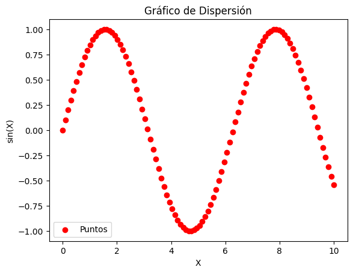
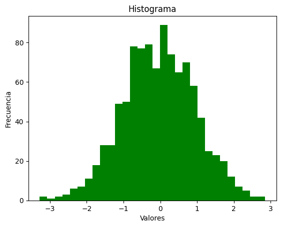
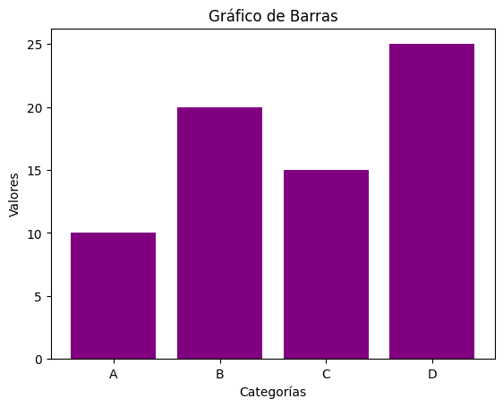
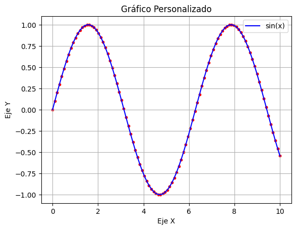

**Ejercicio 9: Analisis Exploratorio**


```python
import pandas as pd
import seaborn as sns
import matplotlib.pyplot as plt
import numpy as np

# 1. Cargar dataset y mostrar info básica
df = sns.load_dataset('iris')

print("Primeras filas:")
print(df.head())

print("\nInformación general:")
print(df.info())

# 2. Estadísticas descriptivas
print("\nEstadísticas descriptivas:")
print(df.describe())

# 3. Histogramas de columnas numéricas
df.hist(figsize=(8,6))
plt.suptitle("Histogramas de variables numéricas")
plt.show()

# 4. Matriz de correlación
corr = df.corr(numeric_only=True)

plt.figure()
sns.heatmap(corr, annot=True)
plt.title("Matriz de correlación")
plt.show()

# 5. Boxplots por categoría (species)
for col in df.select_dtypes(include=np.number).columns:
    plt.figure()
    sns.boxplot(x='species', y=col, data=df)
    plt.title(f'Boxplot de {col} por especie')
    plt.show()

# 6. Identificar outliers usando IQR
def detectar_outliers(col):
    Q1 = df[col].quantile(0.25)
    Q3 = df[col].quantile(0.75)
    IQR = Q3 - Q1
    limite_inf = Q1 - 1.5 * IQR
    limite_sup = Q3 + 1.5 * IQR
    
    outliers = df[(df[col] < limite_inf) | (df[col] > limite_sup)]
    return outliers

print("\nOutliers por columna:")
for col in df.select_dtypes(include=np.number).columns:
    outliers = detectar_outliers(col)
    print(f"\n{col}:")
    print(outliers)
```

    Primeras filas:
       sepal_length  sepal_width  petal_length  petal_width species
    0           5.1          3.5           1.4          0.2  setosa
    1           4.9          3.0           1.4          0.2  setosa
    2           4.7          3.2           1.3          0.2  setosa
    3           4.6          3.1           1.5          0.2  setosa
    4           5.0          3.6           1.4          0.2  setosa
    
    Información general:
    <class 'pandas.DataFrame'>
    RangeIndex: 150 entries, 0 to 149
    Data columns (total 5 columns):
     #   Column        Non-Null Count  Dtype  
    ---  ------        --------------  -----  
     0   sepal_length  150 non-null    float64
     1   sepal_width   150 non-null    float64
     2   petal_length  150 non-null    float64
     3   petal_width   150 non-null    float64
     4   species       150 non-null    str    
    dtypes: float64(4), str(1)
    memory usage: 6.0 KB
    None
    
    Estadísticas descriptivas:
           sepal_length  sepal_width  petal_length  petal_width
    count    150.000000   150.000000    150.000000   150.000000
    mean       5.843333     3.057333      3.758000     1.199333
    std        0.828066     0.435866      1.765298     0.762238
    min        4.300000     2.000000      1.000000     0.100000
    25%        5.100000     2.800000      1.600000     0.300000
    50%        5.800000     3.000000      4.350000     1.300000
    75%        6.400000     3.300000      5.100000     1.800000
    max        7.900000     4.400000      6.900000     2.500000


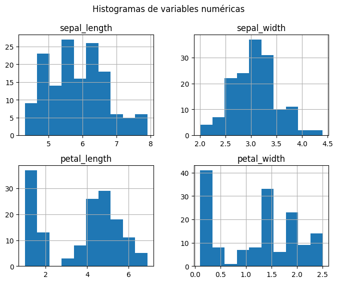
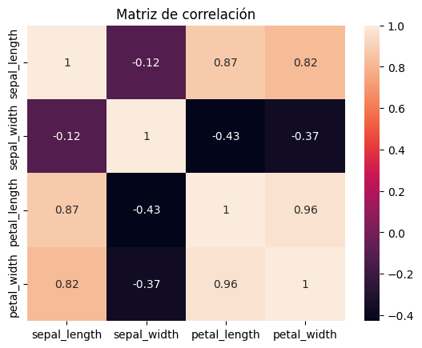
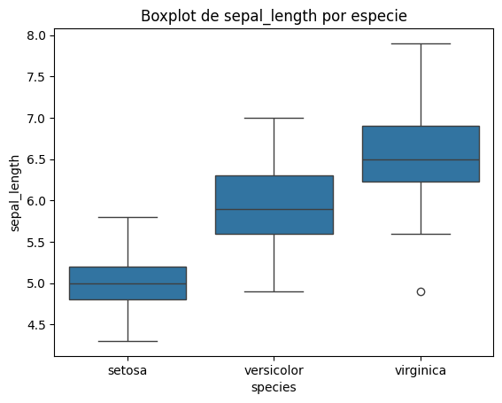
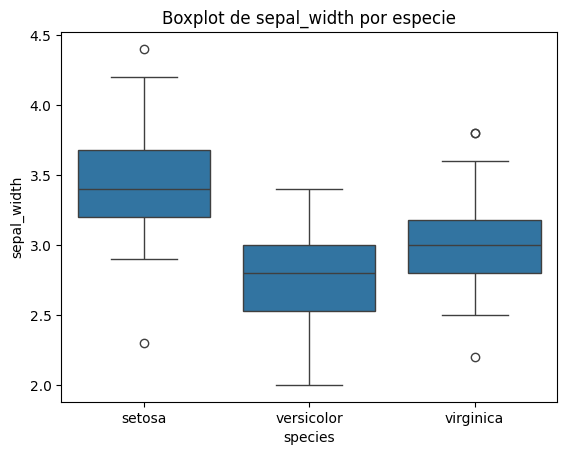
    


    
    Outliers por columna:
    
    sepal_length:
    Empty DataFrame
    Columns: [sepal_length, sepal_width, petal_length, petal_width, species]
    Index: []
    
    sepal_width:
        sepal_length  sepal_width  petal_length  petal_width     species
    15           5.7          4.4           1.5          0.4      setosa
    32           5.2          4.1           1.5          0.1      setosa
    33           5.5          4.2           1.4          0.2      setosa
    60           5.0          2.0           3.5          1.0  versicolor
    
    petal_length:
    Empty DataFrame
    Columns: [sepal_length, sepal_width, petal_length, petal_width, species]
    Index: []
    
    petal_width:
    Empty DataFrame
    Columns: [sepal_length, sepal_width, petal_length, petal_width, species]
    Index: []


**Ejercicio 10: Medidas de Tendencia Central**

Calcular manualmente (sin funciones built-in):

| Datos       | Media | Mediana | Moda   |
| ----------- | ----- | ------- | ------ |
| [5, 3, 8, 3, 7] |  5.2  |     5    |    No hay    |
| [10, 20, 30, 40]|  25     |    25     |    No hay    |
| [1, 2, 2, 3, 3, 3, 4]|  2.57 |     3    |    3   |

**Ejercicio 11: Dispersion**

Calcular:

| Datos       | Rango | Varianza | Desviación Estándar |
| ----------- | ----- | -------- | ------------------- |
| [2, 4, 4, 4, 5, 5, 7, 9] |  7     |     4     |         2            |
| [1, 3, 5, 7, 9]    |   8    |     8     |           2.83          |


**Ejercicio 12: El Proceso de Data Science**

Investigar y explicar:
1. ¿Qué es el ciclo CRISP-DM?

R. es una metodologia usada para desarollar proyectos de ciencias de datos paso a paso.

2. ¿Cuáles son las fases del proceso de ciencia de datos?

R. - Compresión del negocio, compresión de los datos, preparación de datos, modelado, evaluación y despliegue.

3. ¿Qué es el MVP (Minimum Viable Product) en ciencia de datos?

R. Es una versión basica de un modelo o solucióm que; funciona, resuelve el problema principal y se puede mejorar despues.

**Ejercicio 13: Caso de Estudio**

Investigar un caso real de análisis exploratorio de datos: Analisis de ventas en un tienda online.
- ¿Qué preguntas buscaban responder?

R.¿Que se vende mas?¿Cuando hay más ventas?¿Quiénes son los clientes más frecuentes?.

- ¿Qué técnicas usaron?

R. Análisis exploratorio (EDA), gráficas, estadística descriptiva y estadística descriptiva.

- ¿Qué insights encontraron?

R. Productos más vendidos en ciertas temporadas, Clientes frecuentes generan mayor ingreso y Días específicos con más ventas.

### Actividades.

**Actividad 3.1: Refuerzo de Python**


```python

# Lista
numeros = [1, 2, 3, 4, 5]

# Diccionario
persona = {
    "nombre": "Ana",
    "edad": 22,
    "ciudad": "Querétaro"
}

# Dataframe.
import pandas as pd

data = {
    "Nombre": ["Ana", "Elias", "Ivan"],
    "Edad": [22, 25, 30]
}

df = pd.DataFrame(data)
print(df)

# Funciones Lamnda

# Función normal
def cuadrado(x):
    return x**2

# Lambda
cuadrado_lambda = lambda x: x**2
print(cuadrado_lambda(5))

#List comprehensions.

cuadrados = [x**2 for x in numeros]
print(cuadrados)

# Manejo de errores

try:
    resultado = 10 / 0
except ZeroDivisionError:
    print("Error: No se puede dividir entre cero")

#Ejerrcicios.

# 1. Sumar elementos de una lista
print(sum(numeros))

# 2. Encontrar el máximo
print(max(numeros))

# 3. Contar elementos
print(len(numeros))

# 4. números pares
pares = [x for x in numeros if x % 2 == 0]
print(pares)

# 5. Convertir lista a diccionario
dicc = {i: numeros[i] for i in range(len(numeros))}
print(dicc)
```

      Nombre  Edad
    0    Ana    22
    1  Elias    25
    2   Ivan    30
    25
    [1, 4, 9, 16, 25]
    Error: No se puede dividir entre cero
    15
    5
    5
    [2, 4]
    {0: 1, 1: 2, 2: 3, 3: 4, 4: 5}


**Actividad 3.2: Carga y Esploracion de datos**


```python
import pandas as pd

# Cargar dataset ()
df = pd.read_csv("spotify_global_trends_2026 - spotify_global_trends_final.csv")

# Primeras 10 filas
print(df.head(10))

# Información general
print(df.info())

# Estadísticas
print(df.describe())

# Tipos de datos
print(df.dtypes)

# Valores nulos
print(df.isnull().sum())
```

                                       track_name     artist_name   streams  \
    0                                        SWIM             BTS  11273830   
    1                                Body to Body             BTS   6815694   
    2                                    Babydoll    Dominic Fike   5733862   
    3                                    Hooligan             BTS   5338608   
    4                                         FYA             BTS   5196767   
    5                                      NORMAL             BTS   4749288   
    6  Stateside + Zara Larsson (w/ Zara Larsson)  PinkPantheress   4738329   
    7                                      Aliens             BTS   4718569   
    8                                           2             BTS   4573989   
    9                                Like Animals             BTS   4567309   
    
       stream_change      7day            genre  country  pos  days  viral_score  \
    0       -3370522  25918182            K-Pop       KR    1     2     37192012   
    1       -4369341  18000729            K-Pop       KR    2     2     24816423   
    2         178968  36599831  Alternative Pop  Florida    3   119     42333693   
    3       -3396855  14074071            K-Pop       KR    4     2     19412679   
    4       -2873904  13267438            K-Pop       KR    5     2     18464205   
    5       -2410388  11908964            K-Pop       KR    6     2     16658252   
    6        -235112  34238168        Uk Garage  England    7    74     38976497   
    7       -3036604  12473742            K-Pop       KR    8     2     17192311   
    8       -2809104  11957082            K-Pop       KR    9     2     16531071   
    9       -2259887  11394505            K-Pop       KR   10     2     15961814   
    
         trend popularity_category   longevity  
    0  Falling            Trending         New  
    1  Falling            Trending         New  
    2   Rising            Trending   Evergreen  
    3  Falling            Trending         New  
    4  Falling            Trending         New  
    5  Falling             Average         New  
    6  Falling             Average  Stable Hit  
    7  Falling             Average         New  
    8  Falling             Average         New  
    9  Falling             Average         New  
    <class 'pandas.DataFrame'>
    RangeIndex: 178 entries, 0 to 177
    Data columns (total 13 columns):
     #   Column               Non-Null Count  Dtype
    ---  ------               --------------  -----
     0   track_name           178 non-null    str  
     1   artist_name          178 non-null    str  
     2   streams              178 non-null    int64
     3   stream_change        178 non-null    int64
     4   7day                 178 non-null    int64
     5   genre                178 non-null    str  
     6   country              178 non-null    str  
     7   pos                  178 non-null    int64
     8   days                 178 non-null    int64
     9   viral_score          178 non-null    int64
     10  trend                178 non-null    str  
     11  popularity_category  178 non-null    str  
     12  longevity            178 non-null    str  
    dtypes: int64(6), str(7)
    memory usage: 18.2 KB
    None
                streams  stream_change          7day         pos         days  \
    count  1.780000e+02   1.780000e+02  1.780000e+02  178.000000   178.000000   
    mean   2.093366e+06  -2.719877e+05  1.244096e+07   96.123596   536.275281   
    std    1.277789e+06   7.528285e+05  5.786175e+06   56.151997   617.572830   
    min    1.191777e+06  -4.369341e+06  2.523194e+06    1.000000     2.000000   
    25%    1.350050e+06  -1.267320e+05  9.277907e+06   48.250000    80.000000   
    50%    1.590738e+06  -7.408450e+04  1.080256e+07   96.500000   346.500000   
    75%    2.202585e+06  -5.174750e+03  1.354278e+07  141.750000   766.250000   
    max    1.127383e+07   1.899990e+05  3.659983e+07  200.000000  3070.000000   
    
            viral_score  
    count  1.780000e+02  
    mean   1.453433e+07  
    std    6.699639e+06  
    min    3.774959e+06  
    25%    1.067544e+07  
    50%    1.257072e+07  
    75%    1.608216e+07  
    max    4.233369e+07  
    track_name               str
    artist_name              str
    streams                int64
    stream_change          int64
    7day                   int64
    genre                    str
    country                  str
    pos                    int64
    days                   int64
    viral_score            int64
    trend                    str
    popularity_category      str
    longevity                str
    dtype: object
    track_name             0
    artist_name            0
    streams                0
    stream_change          0
    7day                   0
    genre                  0
    country                0
    pos                    0
    days                   0
    viral_score            0
    trend                  0
    popularity_category    0
    longevity              0
    dtype: int64


**Actividad 3.3: Limpieza de Datos**


```python
df_limpio = df.copy()

# Limpiar nombres de columnas
df_limpio.columns = df_limpio.columns.str.strip().str.lower()

# Ver nulos antes
print("ANTES:")
print(df_limpio.isnull().sum())

# Rellenar nulos en columna numérica
df_limpio["streams"].fillna(df_limpio["streams"].mean(), inplace=True)

# Eliminar duplicados
df_limpio.drop_duplicates(inplace=True)

# Crear nueva columna (ejemplo)
df_limpio["streams_millions"] = df_limpio["streams"] / 1_000_000

# Ver después
print("\nDESPUÉS:")
print(df_limpio.isnull().sum())
```

    ANTES:
    track_name             0
    artist_name            0
    streams                0
    stream_change          0
    7day                   0
    genre                  0
    country                0
    pos                    0
    days                   0
    viral_score            0
    trend                  0
    popularity_category    0
    longevity              0
    dtype: int64
    
    DESPUÉS:
    track_name             0
    artist_name            0
    streams                0
    stream_change          0
    7day                   0
    genre                  0
    country                0
    pos                    0
    days                   0
    viral_score            0
    trend                  0
    popularity_category    0
    longevity              0
    streams_millions       0
    dtype: int64


    C:\Users\Sarai\AppData\Local\Temp\ipykernel_29336\3509374090.py:11: ChainedAssignmentError: A value is being set on a copy of a DataFrame or Series through chained assignment using an inplace method.
    Such inplace method never works to update the original DataFrame or Series, because the intermediate object on which we are setting values always behaves as a copy (due to Copy-on-Write).
    
    For example, when doing 'df[col].method(value, inplace=True)', try using 'df.method({col: value}, inplace=True)' instead, to perform the operation inplace on the original object, or try to avoid an inplace operation using 'df[col] = df[col].method(value)'.
    
    See the documentation for a more detailed explanation: https://pandas.pydata.org/pandas-docs/stable/user_guide/copy_on_write.html
      df_limpio["streams"].fillna(df_limpio["streams"].mean(), inplace=True)


**Actividad 3.4 : Visualización Exploratoria.**


```python
import matplotlib.pyplot as plt
import seaborn as sns

# Histograma
col_num = df_limpio.select_dtypes(include='number').columns[0]

plt.hist(df_limpio[col_num])
plt.title(f"Histograma de {col_num}")
plt.show()


# Barras (categórica)

col_cat = df_limpio.select_dtypes(include='object').columns[0]

df_limpio[col_cat].value_counts().head(10).plot(kind='bar')
plt.title(f"Top categorías de {col_cat}")
plt.show()

# Dispersion
cols_num = df_limpio.select_dtypes(include='number').columns

if len(cols_num) >= 2:
    plt.scatter(df_limpio[cols_num[0]], df_limpio[cols_num[1]])
    plt.xlabel(cols_num[0])
    plt.ylabel(cols_num[1])
    plt.title("Gráfico de dispersión")
    plt.show()

```


    
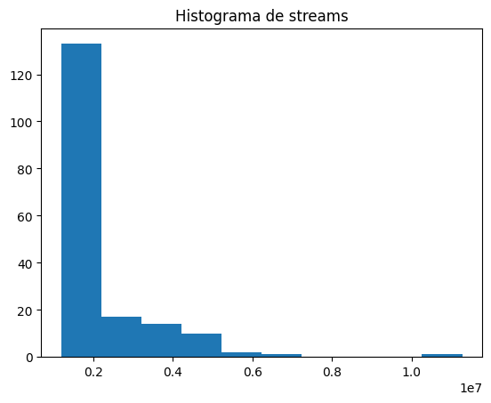
    


    C:\Users\Sarai\AppData\Local\Temp\ipykernel_29336\186195885.py:14: Pandas4Warning: For backward compatibility, 'str' dtypes are included by select_dtypes when 'object' dtype is specified. This behavior is deprecated and will be removed in a future version. Explicitly pass 'str' to `include` to select them, or to `exclude` to remove them and silence this warning.
    See https://pandas.pydata.org/docs/user_guide/migration-3-strings.html#string-migration-select-dtypes for details on how to write code that works with pandas 2 and 3.
      col_cat = df_limpio.select_dtypes(include='object').columns[0]


    
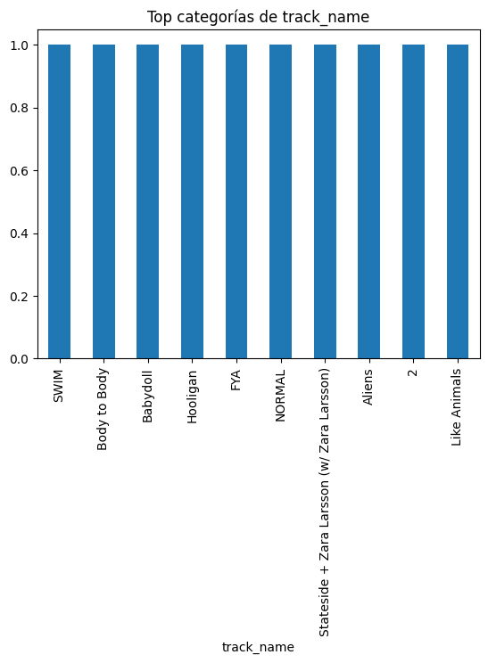
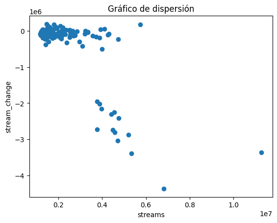
    


```python

```

# Análisis Exploratorio de Datos - Mercado Inmobiliario Airbnb
**Actividad Evaluable - Fase 1: EDA**

**Nombre:** Ana Sarai Zuñiga Esquivel.
**Fecha:** Abril 2026
**Dataset:** Airbnb Price Prediction (Kaggle)

---

## Introducción
En este notebook realize un análisis exploratorio de datos (EDA) sobre el mercado inmobiliario de Airbnb. El objetivo es entender la distribución de los datos, identificar variables clave que afectan el precio, y detectar posibles anomalías o patrones relevantes.

Dataset: https://www.kaggle.com/datasets/stevezhenghp/airbnb-price-prediction

---
## Parte 1: Carga de datos e importación de librerías


```python
!pip install seaborn
```


```python
# Importación de librerías
import pandas as pd
import numpy as np
import matplotlib.pyplot as plt
import seaborn as sns
import warnings

warnings.filterwarnings('ignore')

sns.set_theme(style='whitegrid', palette='muted')
plt.rcParams['figure.figsize'] = (10, 6)
plt.rcParams['font.size'] = 12

print('Librerías importadas correctamente')
print(f'pandas  v{pd.__version__}')
print(f'numpy   v{np.__version__}')
print(f'seaborn v{sns.__version__}')
```

    Librerías importadas correctamente
    pandas  v3.0.1
    numpy   v2.4.3
    seaborn v0.13.2


```python
# Carga del dataset
# Descargar desde: https://www.kaggle.com/datasets/stevezhenghp/airbnb-price-prediction
# Colocar train.csv en la misma carpeta que este notebook

df = pd.read_csv('train.csv', low_memory=False)

print('Dataset cargado sin errores')
print(f'Filas:    {df.shape[0]:,}')
print(f'Columnas: {df.shape[1]}')
```

    Dataset cargado sin errores
    Filas:    74,111
    Columnas: 29


```python
# Primer vistazo
df.head(10)
```


<div>
<style scoped>
    .dataframe tbody tr th:only-of-type {
        vertical-align: middle;
    }

    .dataframe tbody tr th {
        vertical-align: top;
    }

    .dataframe thead th {
        text-align: right;
    }
</style>
<table border="1" class="dataframe">
  <thead>
    <tr style="text-align: right;">
      <th></th>
      <th>id</th>
      <th>log_price</th>
      <th>property_type</th>
      <th>room_type</th>
      <th>amenities</th>
      <th>accommodates</th>
      <th>bathrooms</th>
      <th>bed_type</th>
      <th>cancellation_policy</th>
      <th>cleaning_fee</th>
      <th>...</th>
      <th>latitude</th>
      <th>longitude</th>
      <th>name</th>
      <th>neighbourhood</th>
      <th>number_of_reviews</th>
      <th>review_scores_rating</th>
      <th>thumbnail_url</th>
      <th>zipcode</th>
      <th>bedrooms</th>
      <th>beds</th>
    </tr>
  </thead>
  <tbody>
    <tr>
      <th>0</th>
      <td>6901257</td>
      <td>5.010635</td>
      <td>Apartment</td>
      <td>Entire home/apt</td>
      <td>{"Wireless Internet","Air conditioning",Kitche...</td>
      <td>3</td>
      <td>1.0</td>
      <td>Real Bed</td>
      <td>strict</td>
      <td>True</td>
      <td>...</td>
      <td>40.696524</td>
      <td>-73.991617</td>
      <td>Beautiful brownstone 1-bedroom</td>
      <td>Brooklyn Heights</td>
      <td>2</td>
      <td>100.0</td>
      <td>https://a0.muscache.com/im/pictures/6d7cbbf7-c...</td>
      <td>11201</td>
      <td>1.0</td>
      <td>1.0</td>
    </tr>
    <tr>
      <th>1</th>
      <td>6304928</td>
      <td>5.129899</td>
      <td>Apartment</td>
      <td>Entire home/apt</td>
      <td>{"Wireless Internet","Air conditioning",Kitche...</td>
      <td>7</td>
      <td>1.0</td>
      <td>Real Bed</td>
      <td>strict</td>
      <td>True</td>
      <td>...</td>
      <td>40.766115</td>
      <td>-73.989040</td>
      <td>Superb 3BR Apt Located Near Times Square</td>
      <td>Hell's Kitchen</td>
      <td>6</td>
      <td>93.0</td>
      <td>https://a0.muscache.com/im/pictures/348a55fe-4...</td>
      <td>10019</td>
      <td>3.0</td>
      <td>3.0</td>
    </tr>
    <tr>
      <th>2</th>
      <td>7919400</td>
      <td>4.976734</td>
      <td>Apartment</td>
      <td>Entire home/apt</td>
      <td>{TV,"Cable TV","Wireless Internet","Air condit...</td>
      <td>5</td>
      <td>1.0</td>
      <td>Real Bed</td>
      <td>moderate</td>
      <td>True</td>
      <td>...</td>
      <td>40.808110</td>
      <td>-73.943756</td>
      <td>The Garden Oasis</td>
      <td>Harlem</td>
      <td>10</td>
      <td>92.0</td>
      <td>https://a0.muscache.com/im/pictures/6fae5362-9...</td>
      <td>10027</td>
      <td>1.0</td>
      <td>3.0</td>
    </tr>
    <tr>
      <th>3</th>
      <td>13418779</td>
      <td>6.620073</td>
      <td>House</td>
      <td>Entire home/apt</td>
      <td>{TV,"Cable TV",Internet,"Wireless Internet",Ki...</td>
      <td>4</td>
      <td>1.0</td>
      <td>Real Bed</td>
      <td>flexible</td>
      <td>True</td>
      <td>...</td>
      <td>37.772004</td>
      <td>-122.431619</td>
      <td>Beautiful Flat in the Heart of SF!</td>
      <td>Lower Haight</td>
      <td>0</td>
      <td>NaN</td>
      <td>https://a0.muscache.com/im/pictures/72208dad-9...</td>
      <td>94117.0</td>
      <td>2.0</td>
      <td>2.0</td>
    </tr>
    <tr>
      <th>4</th>
      <td>3808709</td>
      <td>4.744932</td>
      <td>Apartment</td>
      <td>Entire home/apt</td>
      <td>{TV,Internet,"Wireless Internet","Air conditio...</td>
      <td>2</td>
      <td>1.0</td>
      <td>Real Bed</td>
      <td>moderate</td>
      <td>True</td>
      <td>...</td>
      <td>38.925627</td>
      <td>-77.034596</td>
      <td>Great studio in midtown DC</td>
      <td>Columbia Heights</td>
      <td>4</td>
      <td>40.0</td>
      <td>NaN</td>
      <td>20009</td>
      <td>0.0</td>
      <td>1.0</td>
    </tr>
    <tr>
      <th>5</th>
      <td>12422935</td>
      <td>4.442651</td>
      <td>Apartment</td>
      <td>Private room</td>
      <td>{TV,"Wireless Internet",Heating,"Smoke detecto...</td>
      <td>2</td>
      <td>1.0</td>
      <td>Real Bed</td>
      <td>strict</td>
      <td>True</td>
      <td>...</td>
      <td>37.753164</td>
      <td>-122.429526</td>
      <td>Comfort Suite San Francisco</td>
      <td>Noe Valley</td>
      <td>3</td>
      <td>100.0</td>
      <td>https://a0.muscache.com/im/pictures/82509143-4...</td>
      <td>94131</td>
      <td>1.0</td>
      <td>1.0</td>
    </tr>
    <tr>
      <th>6</th>
      <td>11825529</td>
      <td>4.418841</td>
      <td>Apartment</td>
      <td>Entire home/apt</td>
      <td>{TV,Internet,"Wireless Internet","Air conditio...</td>
      <td>3</td>
      <td>1.0</td>
      <td>Real Bed</td>
      <td>moderate</td>
      <td>True</td>
      <td>...</td>
      <td>33.980454</td>
      <td>-118.462821</td>
      <td>Beach Town Studio and Parking!!!11h</td>
      <td>NaN</td>
      <td>15</td>
      <td>97.0</td>
      <td>https://a0.muscache.com/im/pictures/4c920c60-4...</td>
      <td>90292</td>
      <td>1.0</td>
      <td>1.0</td>
    </tr>
    <tr>
      <th>7</th>
      <td>13971273</td>
      <td>4.787492</td>
      <td>Condominium</td>
      <td>Entire home/apt</td>
      <td>{TV,"Cable TV","Wireless Internet","Wheelchair...</td>
      <td>2</td>
      <td>1.0</td>
      <td>Real Bed</td>
      <td>moderate</td>
      <td>True</td>
      <td>...</td>
      <td>34.046737</td>
      <td>-118.260439</td>
      <td>Near LA Live, Staple's. Starbucks inside. OWN ...</td>
      <td>Downtown</td>
      <td>9</td>
      <td>93.0</td>
      <td>https://a0.muscache.com/im/pictures/61bd05d5-c...</td>
      <td>90015</td>
      <td>1.0</td>
      <td>1.0</td>
    </tr>
    <tr>
      <th>8</th>
      <td>180792</td>
      <td>4.787492</td>
      <td>House</td>
      <td>Private room</td>
      <td>{TV,"Cable TV","Wireless Internet","Pets live ...</td>
      <td>2</td>
      <td>1.0</td>
      <td>Real Bed</td>
      <td>moderate</td>
      <td>True</td>
      <td>...</td>
      <td>37.781128</td>
      <td>-122.501095</td>
      <td>Cozy Garden Studio - Private Entry</td>
      <td>Richmond District</td>
      <td>159</td>
      <td>99.0</td>
      <td>https://a0.muscache.com/im/pictures/0ed6c128-7...</td>
      <td>94121</td>
      <td>1.0</td>
      <td>1.0</td>
    </tr>
    <tr>
      <th>9</th>
      <td>5385260</td>
      <td>3.583519</td>
      <td>House</td>
      <td>Private room</td>
      <td>{"Wireless Internet","Air conditioning",Kitche...</td>
      <td>2</td>
      <td>1.0</td>
      <td>Real Bed</td>
      <td>moderate</td>
      <td>True</td>
      <td>...</td>
      <td>33.992563</td>
      <td>-117.895997</td>
      <td>No.7 Queen Size Cozy Room 舒适大床房</td>
      <td>NaN</td>
      <td>2</td>
      <td>90.0</td>
      <td>https://a0.muscache.com/im/pictures/8d2f08ce-b...</td>
      <td>91748</td>
      <td>1.0</td>
      <td>1.0</td>
    </tr>
  </tbody>
</table>
<p>10 rows × 29 columns</p>
</div>


```python
df.info()
```

    <class 'pandas.DataFrame'>
    RangeIndex: 74111 entries, 0 to 74110
    Data columns (total 29 columns):
     #   Column                  Non-Null Count  Dtype  
    ---  ------                  --------------  -----  
     0   id                      74111 non-null  int64  
     1   log_price               74111 non-null  float64
     2   property_type           74111 non-null  str    
     3   room_type               74111 non-null  str    
     4   amenities               74111 non-null  str    
     5   accommodates            74111 non-null  int64  
     6   bathrooms               73911 non-null  float64
     7   bed_type                74111 non-null  str    
     8   cancellation_policy     74111 non-null  str    
     9   cleaning_fee            74111 non-null  bool   
     10  city                    74111 non-null  str    
     11  description             74111 non-null  str    
     12  first_review            58247 non-null  str    
     13  host_has_profile_pic    73923 non-null  str    
     14  host_identity_verified  73923 non-null  str    
     15  host_response_rate      55812 non-null  str    
     16  host_since              73923 non-null  str    
     17  instant_bookable        74111 non-null  str    
     18  last_review             58284 non-null  str    
     19  latitude                74111 non-null  float64
     20  longitude               74111 non-null  float64
     21  name                    74111 non-null  str    
     22  neighbourhood           67239 non-null  str    
     23  number_of_reviews       74111 non-null  int64  
     24  review_scores_rating    57389 non-null  float64
     25  thumbnail_url           65895 non-null  str    
     26  zipcode                 73145 non-null  str    
     27  bedrooms                74020 non-null  float64
     28  beds                    73980 non-null  float64
    dtypes: bool(1), float64(7), int64(3), str(18)
    memory usage: 15.9 MB


```python
# Preparación de la variable precio
# El dataset usa log_price como target; la convertimos a precio real
if 'log_price' in df.columns:
    df['price'] = np.exp(df['log_price'])
    print('Columna price creada desde log_price')
elif 'price' in df.columns:
    if df['price'].dtype == object:
        df['price'] = df['price'].replace('[\$,]', '', regex=True).astype(float)
    print('Columna price disponible directamente')

print(f'Min: ${df["price"].min():.2f} | Max: ${df["price"].max():.2f}')
print(f'Media: ${df["price"].mean():.2f} | Mediana: ${df["price"].median():.2f}')
```

    Columna price creada desde log_price
    Min: $1.00 | Max: $1999.00
    Media: $160.37 | Mediana: $111.00


---
## Parte 2: Análisis Exploratorio de Datos (EDA)
### 2.1 Análisis Descriptivo


```python
# Estadísticas descriptivas generales
df.describe().T.round(2)
```


<div>
<style scoped>
    .dataframe tbody tr th:only-of-type {
        vertical-align: middle;
    }

    .dataframe tbody tr th {
        vertical-align: top;
    }

    .dataframe thead th {
        text-align: right;
    }
</style>
<table border="1" class="dataframe">
  <thead>
    <tr style="text-align: right;">
      <th></th>
      <th>count</th>
      <th>mean</th>
      <th>std</th>
      <th>min</th>
      <th>25%</th>
      <th>50%</th>
      <th>75%</th>
      <th>max</th>
    </tr>
  </thead>
  <tbody>
    <tr>
      <th>id</th>
      <td>74111.0</td>
      <td>11266617.10</td>
      <td>6081734.89</td>
      <td>344.00</td>
      <td>6261964.50</td>
      <td>12254147.00</td>
      <td>16402260.50</td>
      <td>21230903.00</td>
    </tr>
    <tr>
      <th>log_price</th>
      <td>74111.0</td>
      <td>4.78</td>
      <td>0.72</td>
      <td>0.00</td>
      <td>4.32</td>
      <td>4.71</td>
      <td>5.22</td>
      <td>7.60</td>
    </tr>
    <tr>
      <th>accommodates</th>
      <td>74111.0</td>
      <td>3.16</td>
      <td>2.15</td>
      <td>1.00</td>
      <td>2.00</td>
      <td>2.00</td>
      <td>4.00</td>
      <td>16.00</td>
    </tr>
    <tr>
      <th>bathrooms</th>
      <td>73911.0</td>
      <td>1.24</td>
      <td>0.58</td>
      <td>0.00</td>
      <td>1.00</td>
      <td>1.00</td>
      <td>1.00</td>
      <td>8.00</td>
    </tr>
    <tr>
      <th>latitude</th>
      <td>74111.0</td>
      <td>38.45</td>
      <td>3.08</td>
      <td>33.34</td>
      <td>34.13</td>
      <td>40.66</td>
      <td>40.75</td>
      <td>42.39</td>
    </tr>
    <tr>
      <th>longitude</th>
      <td>74111.0</td>
      <td>-92.40</td>
      <td>21.71</td>
      <td>-122.51</td>
      <td>-118.34</td>
      <td>-77.00</td>
      <td>-73.95</td>
      <td>-70.99</td>
    </tr>
    <tr>
      <th>number_of_reviews</th>
      <td>74111.0</td>
      <td>20.90</td>
      <td>37.83</td>
      <td>0.00</td>
      <td>1.00</td>
      <td>6.00</td>
      <td>23.00</td>
      <td>605.00</td>
    </tr>
    <tr>
      <th>review_scores_rating</th>
      <td>57389.0</td>
      <td>94.07</td>
      <td>7.84</td>
      <td>20.00</td>
      <td>92.00</td>
      <td>96.00</td>
      <td>100.00</td>
      <td>100.00</td>
    </tr>
    <tr>
      <th>bedrooms</th>
      <td>74020.0</td>
      <td>1.27</td>
      <td>0.85</td>
      <td>0.00</td>
      <td>1.00</td>
      <td>1.00</td>
      <td>1.00</td>
      <td>10.00</td>
    </tr>
    <tr>
      <th>beds</th>
      <td>73980.0</td>
      <td>1.71</td>
      <td>1.25</td>
      <td>0.00</td>
      <td>1.00</td>
      <td>1.00</td>
      <td>2.00</td>
      <td>18.00</td>
    </tr>
    <tr>
      <th>price</th>
      <td>74111.0</td>
      <td>160.37</td>
      <td>168.58</td>
      <td>1.00</td>
      <td>75.00</td>
      <td>111.00</td>
      <td>185.00</td>
      <td>1999.00</td>
    </tr>
  </tbody>
</table>
</div>


```python
# Estadísticas univariadas: media, mediana, moda, desviación estándar
num_cols = df.select_dtypes(include=[np.number]).columns.tolist()

stats = []
for col in num_cols:
    stats.append({
        'Variable':       col,
        'Media':          round(df[col].mean(), 3),
        'Mediana':        round(df[col].median(), 3),
        'Moda':           round(df[col].mode()[0], 3) if not df[col].mode().empty else None,
        'Desv. Std':      round(df[col].std(), 3),
        'Mínimo':         round(df[col].min(), 3),
        'Máximo':         round(df[col].max(), 3),
        'Asimetría':      round(df[col].skew(), 3),
        'Valores Nulos':  int(df[col].isnull().sum())
    })

pd.DataFrame(stats).set_index('Variable')
```


<div>
<style scoped>
    .dataframe tbody tr th:only-of-type {
        vertical-align: middle;
    }

    .dataframe tbody tr th {
        vertical-align: top;
    }

    .dataframe thead th {
        text-align: right;
    }
</style>
<table border="1" class="dataframe">
  <thead>
    <tr style="text-align: right;">
      <th></th>
      <th>Media</th>
      <th>Mediana</th>
      <th>Moda</th>
      <th>Desv. Std</th>
      <th>Mínimo</th>
      <th>Máximo</th>
      <th>Asimetría</th>
      <th>Valores Nulos</th>
    </tr>
    <tr>
      <th>Variable</th>
      <th></th>
      <th></th>
      <th></th>
      <th></th>
      <th></th>
      <th></th>
      <th></th>
      <th></th>
    </tr>
  </thead>
  <tbody>
    <tr>
      <th>id</th>
      <td>1.126662e+07</td>
      <td>1.225415e+07</td>
      <td>344.000</td>
      <td>6081734.887</td>
      <td>344.000</td>
      <td>2.123090e+07</td>
      <td>-0.261</td>
      <td>0</td>
    </tr>
    <tr>
      <th>log_price</th>
      <td>4.782000e+00</td>
      <td>4.710000e+00</td>
      <td>5.011</td>
      <td>0.717</td>
      <td>0.000</td>
      <td>7.600000e+00</td>
      <td>0.515</td>
      <td>0</td>
    </tr>
    <tr>
      <th>accommodates</th>
      <td>3.155000e+00</td>
      <td>2.000000e+00</td>
      <td>2.000</td>
      <td>2.154</td>
      <td>1.000</td>
      <td>1.600000e+01</td>
      <td>2.232</td>
      <td>0</td>
    </tr>
    <tr>
      <th>bathrooms</th>
      <td>1.235000e+00</td>
      <td>1.000000e+00</td>
      <td>1.000</td>
      <td>0.582</td>
      <td>0.000</td>
      <td>8.000000e+00</td>
      <td>3.691</td>
      <td>200</td>
    </tr>
    <tr>
      <th>latitude</th>
      <td>3.844600e+01</td>
      <td>4.066200e+01</td>
      <td>33.339</td>
      <td>3.080</td>
      <td>33.339</td>
      <td>4.239000e+01</td>
      <td>-0.535</td>
      <td>0</td>
    </tr>
    <tr>
      <th>longitude</th>
      <td>-9.239800e+01</td>
      <td>-7.699700e+01</td>
      <td>-122.511</td>
      <td>21.705</td>
      <td>-122.511</td>
      <td>-7.098500e+01</td>
      <td>-0.407</td>
      <td>0</td>
    </tr>
    <tr>
      <th>number_of_reviews</th>
      <td>2.090100e+01</td>
      <td>6.000000e+00</td>
      <td>0.000</td>
      <td>37.829</td>
      <td>0.000</td>
      <td>6.050000e+02</td>
      <td>3.703</td>
      <td>0</td>
    </tr>
    <tr>
      <th>review_scores_rating</th>
      <td>9.406700e+01</td>
      <td>9.600000e+01</td>
      <td>100.000</td>
      <td>7.837</td>
      <td>20.000</td>
      <td>1.000000e+02</td>
      <td>-3.381</td>
      <td>16722</td>
    </tr>
    <tr>
      <th>bedrooms</th>
      <td>1.266000e+00</td>
      <td>1.000000e+00</td>
      <td>1.000</td>
      <td>0.852</td>
      <td>0.000</td>
      <td>1.000000e+01</td>
      <td>1.990</td>
      <td>91</td>
    </tr>
    <tr>
      <th>beds</th>
      <td>1.711000e+00</td>
      <td>1.000000e+00</td>
      <td>1.000</td>
      <td>1.254</td>
      <td>0.000</td>
      <td>1.800000e+01</td>
      <td>3.358</td>
      <td>131</td>
    </tr>
    <tr>
      <th>price</th>
      <td>1.603710e+02</td>
      <td>1.110000e+02</td>
      <td>150.000</td>
      <td>168.580</td>
      <td>1.000</td>
      <td>1.999000e+03</td>
      <td>4.298</td>
      <td>0</td>
    </tr>
  </tbody>
</table>
</div>


```python
# Valores nulos
null_df = pd.DataFrame({
    'Nulos': df.isnull().sum(),
    '% Total': (df.isnull().mean() * 100).round(2)
})
null_df = null_df[null_df['Nulos'] > 0].sort_values('Nulos', ascending=False)
print('=== Valores Nulos ===')
print(null_df.to_string() if not null_df.empty else 'No hay valores nulos.')
```

    === Valores Nulos ===
                            Nulos  % Total
    host_response_rate      18299    24.69
    review_scores_rating    16722    22.56
    first_review            15864    21.41
    last_review             15827    21.36
    thumbnail_url            8216    11.09
    neighbourhood            6872     9.27
    zipcode                   966     1.30
    bathrooms                 200     0.27
    host_has_profile_pic      188     0.25
    host_identity_verified    188     0.25
    host_since                188     0.25
    beds                      131     0.18
    bedrooms                   91     0.12


```python
# Correlación con el precio: identificación de variables clave
correlaciones = df[num_cols].corr()['price'].drop('price').abs().sort_values(ascending=False)
print('=== Correlación Absoluta con el Precio (Top 10) ===')
print(correlaciones.head(10).to_string())
print('\nEstas son las variables candidatas a ser más influyentes en el precio.')
```

    === Correlación Absoluta con el Precio (Top 10) ===
    log_price               0.840001
    accommodates            0.519326
    bedrooms                0.494437
    bathrooms               0.459350
    beds                    0.433162
    number_of_reviews       0.070956
    review_scores_rating    0.067100
    longitude               0.057601
    latitude                0.031344
    id                      0.002698
    
    Estas son las variables candidatas a ser más influyentes en el precio.


```python
# Variables categóricas
cat_cols = df.select_dtypes(include=['object']).columns.tolist()
print(f'Variables categóricas ({len(cat_cols)}):' )
for col in cat_cols:
    n_u = df[col].nunique()
    top = df[col].value_counts().index[0]
    pct = df[col].value_counts(normalize=True).values[0] * 100
    print(f'  {col:<30} | {n_u:>4} únicos | Top: "{top}" ({pct:.1f}%)')
```

    Variables categóricas (18):
      property_type                  |   35 únicos | Top: "Apartment" (66.1%)
      room_type                      |    3 únicos | Top: "Entire home/apt" (55.7%)
      amenities                      | 67122 únicos | Top: "{}" (0.8%)
      bed_type                       |    5 únicos | Top: "Real Bed" (97.2%)
      cancellation_policy            |    5 únicos | Top: "strict" (43.7%)
      city                           |    6 únicos | Top: "NYC" (43.6%)
      description                    | 73479 únicos | Top: "Hello, I've been running guest house for Koreans visiting U.S. for 3years, and recently decided to run this place for other travelers also. There are 10 room in the house. They are mostly dormitory rooms and couple of couple room and family room. This places are our women's dormitory in third floor. There are three rooms, but no doors. It is basically open space. There are 2 beds in two rooms and 4 in one room. I do not have closet in this room but there are hangers and mini shelves. My travelers usually put their baggage on the floor. There is one full bathroom only for women in 2nd floor, which you will be sharing with other women guests. Right next that bathroom, there is unisex half bathroom. All bathrooms have hair dryers. You cannot use kitchen, but you can use refrigerator.  I offer breakfast every morning from 7-10 am. Bread, cereal, fruits, coffee, milk and juice will be served. You can eat take-out food in the kitchen, but please wash dishes that you used and put trash in the" (0.0%)
      first_review                   | 2554 únicos | Top: "2017-01-01" (0.5%)
      host_has_profile_pic           |    2 únicos | Top: "t" (99.7%)
      host_identity_verified         |    2 únicos | Top: "t" (67.3%)
      host_response_rate             |   80 únicos | Top: "100%" (77.5%)
      host_since                     | 3087 únicos | Top: "2015-03-30" (0.3%)
      instant_bookable               |    2 únicos | Top: "f" (73.8%)
      last_review                    | 1371 únicos | Top: "2017-04-30" (2.3%)
      name                           | 73359 únicos | Top: "Bunk bed in the Treat Street Clubhouse" (0.0%)
      neighbourhood                  |  619 únicos | Top: "Williamsburg" (4.3%)
      thumbnail_url                  | 65883 únicos | Top: "https://a0.muscache.com/im/pictures/70087089/bc66229a_original.jpg?aki_policy=small" (0.0%)
      zipcode                        |  769 únicos | Top: "11211.0" (1.9%)


---
### 2.2 Visualización de Datos
#### A) Histogramas


```python
# Histograma del precio (original y escala log)
fig, axes = plt.subplots(1, 2, figsize=(14, 5))

axes[0].hist(df['price'].dropna(), bins=80, color='steelblue', edgecolor='white', alpha=0.85)
axes[0].set_title('Distribución del Precio (original)', fontweight='bold')
axes[0].set_xlabel('Precio (USD)')
axes[0].set_ylabel('Frecuencia')
axes[0].axvline(df['price'].mean(),   color='red',    linestyle='--', label=f'Media: ${df["price"].mean():.0f}')
axes[0].axvline(df['price'].median(), color='orange', linestyle='--', label=f'Mediana: ${df["price"].median():.0f}')
axes[0].set_xlim(0, df['price'].quantile(0.99))
axes[0].legend()

log_p = np.log1p(df['price'].dropna())
axes[1].hist(log_p, bins=60, color='teal', edgecolor='white', alpha=0.85)
axes[1].set_title('Distribución del Precio (escala log)', fontweight='bold')
axes[1].set_xlabel('log(Precio + 1)')
axes[1].set_ylabel('Frecuencia')
axes[1].axvline(log_p.mean(),   color='red',    linestyle='--', label=f'Media: {log_p.mean():.2f}')
axes[1].axvline(log_p.median(), color='orange', linestyle='--', label=f'Mediana: {log_p.median():.2f}')
axes[1].legend()

plt.suptitle('Histogramas del Precio de Airbnb', fontsize=14, fontweight='bold', y=1.02)
plt.tight_layout()
plt.show()

print('Observación: El precio tiene distribución muy sesgada a la derecha.')
print('La transformación logarítmica produce una distribución más simétrica,')
print('lo cual es conveniente para modelos de regresión.')
```


    
**Revisar Imagen dentro de la capeta de visualizaciones**
    


    Observación: El precio tiene distribución muy sesgada a la derecha.
    La transformación logarítmica produce una distribución más simétrica,
    lo cual es conveniente para modelos de regresión.


```python
# Histogramas de otras variables importantes
vars_hist = [c for c in ['accommodates','bedrooms','bathrooms',
                          'number_of_reviews','review_scores_rating','availability_365']
             if c in df.columns]

cols_g = 3
rows_g = (len(vars_hist) + cols_g - 1) // cols_g
fig, axes = plt.subplots(rows_g, cols_g, figsize=(16, rows_g * 4))
axes = axes.flatten()
pal  = sns.color_palette('Set2', len(vars_hist))

for i, col in enumerate(vars_hist):
    data = df[col].dropna()
    axes[i].hist(data, bins=40, color=pal[i], edgecolor='white', alpha=0.85)
    axes[i].set_title(f'{col}', fontweight='bold')
    axes[i].set_xlabel(col)
    axes[i].set_ylabel('Frecuencia')
    axes[i].axvline(data.mean(),   color='red',    linestyle='--', label=f'Media: {data.mean():.1f}')
    axes[i].axvline(data.median(), color='orange', linestyle=':',  label=f'Mediana: {data.median():.1f}')
    axes[i].legend(fontsize=9)

for j in range(i+1, len(axes)): axes[j].set_visible(False)

plt.suptitle('Histogramas de Variables Numéricas Clave', fontsize=14, fontweight='bold', y=1.01)
plt.tight_layout()
plt.show()
```


    
**Revisar Imagen2 dentro de la capeta de visualizaciones**
    


#### B) Box Plots – Identificación de Outliers


```python
# Box plot: precio por tipo de habitación
if 'room_type' in df.columns:
    fig, axes = plt.subplots(1, 2, figsize=(14, 6))
    order = df.groupby('room_type')['price'].median().sort_values(ascending=False).index
    fp = dict(marker='o', markersize=3, alpha=0.35, color='gray')

    sns.boxplot(data=df, x='room_type', y='price', order=order, palette='Set3', ax=axes[0], flierprops=fp)
    axes[0].set_ylim(0, df['price'].quantile(0.97))
    axes[0].set_title('Precio por Tipo de Habitación', fontweight='bold')
    axes[0].set_xlabel('Tipo'); axes[0].set_ylabel('Precio (USD)')
    axes[0].tick_params(axis='x', rotation=20)

    sns.boxplot(data=df, x='room_type', y='price', order=order, palette='Set3', ax=axes[1], flierprops=fp)
    axes[1].set_yscale('log')
    axes[1].set_title('Precio por Tipo de Habitación (log)', fontweight='bold')
    axes[1].set_xlabel('Tipo'); axes[1].set_ylabel('Precio – escala log')
    axes[1].tick_params(axis='x', rotation=20)

    plt.suptitle('Box Plots: Precio por Tipo de Habitación', fontsize=14, fontweight='bold', y=1.02)
    plt.tight_layout()
    plt.show()

    print('Observación: "Entire home/apt" tiene el precio mediano más alto.')
    print('Todos los tipos presentan outliers hacia valores altos.')
```


    
**Revisar Imagen3 dentro de la capeta de visualizaciones**
    


    Observación: "Entire home/apt" tiene el precio mediano más alto.
    Todos los tipos presentan outliers hacia valores altos.


```python
# Box plots generales para detectar outliers en variables numéricas clave
vars_box = [c for c in ['price','accommodates','bedrooms','bathrooms','number_of_reviews']
            if c in df.columns]

fig, axes = plt.subplots(1, len(vars_box), figsize=(4*len(vars_box), 6))
if len(vars_box) == 1: axes = [axes]
pal_b = sns.color_palette('pastel', len(vars_box))

for i, col in enumerate(vars_box):
    q1, q3 = df[col].quantile(0.25), df[col].quantile(0.75)
    n_out  = int(((df[col] < q1-1.5*(q3-q1)) | (df[col] > q3+1.5*(q3-q1))).sum())
    axes[i].boxplot(df[col].dropna(), patch_artist=True,
                    boxprops=dict(facecolor=pal_b[i], alpha=0.75),
                    medianprops=dict(color='red', linewidth=2),
                    flierprops=dict(marker='o', markersize=3, alpha=0.3, color='dimgray'))
    axes[i].set_title(f'{col}\n({n_out:,} outliers)', fontsize=11, fontweight='bold')
    axes[i].set_ylabel('Valor'); axes[i].set_xticks([])

plt.suptitle('Box Plots – Identificación de Outliers', fontsize=14, fontweight='bold', y=1.02)
plt.tight_layout()
plt.show()

print('Observación: El precio y el número de reseñas tienen gran cantidad de outliers superiores.')
print('Esto indica distribuciones con colas largas que requieren tratamiento.')
```


    
**Revisar Imagen4 dentro de la capeta de visualizaciones**
    


    Observación: El precio y el número de reseñas tienen gran cantidad de outliers superiores.
    Esto indica distribuciones con colas largas que requieren tratamiento.


#### C) Scatter Plots – Relaciones entre Variables


```python
# Scatter plots: precio vs variables numéricas clave
sc_vars = [c for c in ['accommodates','bedrooms','bathrooms','number_of_reviews'] if c in df.columns]
df_plot = df[df['price'] < df['price'].quantile(0.99)].copy()

fig, axes = plt.subplots((len(sc_vars)+1)//2, 2, figsize=(14, ((len(sc_vars)+1)//2)*5))
axes = axes.flatten()
cols_sc = sns.color_palette('deep', len(sc_vars))

for i, var in enumerate(sc_vars):
    sub = df_plot[[var,'price']].dropna()
    axes[i].scatter(sub[var], sub['price'], alpha=0.2, s=8, color=cols_sc[i], edgecolors='none')
    z = np.polyfit(sub[var], sub['price'], 1)
    x_l = np.linspace(sub[var].min(), sub[var].max(), 100)
    axes[i].plot(x_l, np.poly1d(z)(x_l), 'r-', linewidth=2, label='Tendencia')
    corr = sub.corr().iloc[0,1]
    axes[i].set_title(f'Precio vs {var}  (r = {corr:.3f})', fontweight='bold')
    axes[i].set_xlabel(var); axes[i].set_ylabel('Precio (USD)')
    axes[i].legend(fontsize=9)

for j in range(i+1, len(axes)): axes[j].set_visible(False)

plt.suptitle('Scatter Plots: Relación entre Variables y el Precio', fontsize=14, fontweight='bold', y=1.01)
plt.tight_layout()
plt.show()

print('Observación: "accommodates" y "bedrooms" muestran la correlación positiva más clara.')
print('A mayor capacidad del alojamiento, mayor es el precio esperado.')
```


    
**Revisar Imagen5 dentro de la capeta de visualizaciones**
    


    Observación: "accommodates" y "bedrooms" muestran la correlación positiva más clara.
    A mayor capacidad del alojamiento, mayor es el precio esperado.


```python
# Scatter plot: precio vs calificación de reseñas
if 'review_scores_rating' in df.columns:
    df_rv = df.dropna(subset=['review_scores_rating','price'])
    df_rv = df_rv[df_rv['price'] < df_rv['price'].quantile(0.99)]

    fig, ax = plt.subplots(figsize=(10, 6))
    if 'room_type' in df.columns:
        for rt, color in zip(df_rv['room_type'].unique(), sns.color_palette('Set1')):
            s = df_rv[df_rv['room_type'] == rt]
            ax.scatter(s['review_scores_rating'], s['price'], alpha=0.25, s=10, color=color, label=rt, edgecolors='none')
        ax.legend(title='Tipo de habitación', fontsize=9)
    else:
        ax.scatter(df_rv['review_scores_rating'], df_rv['price'], alpha=0.25, s=10, color='steelblue', edgecolors='none')

    corr_rv = df_rv[['review_scores_rating','price']].corr().iloc[0,1]
    ax.set_title(f'Precio vs Calificación de Reseñas  (r = {corr_rv:.3f})', fontweight='bold')
    ax.set_xlabel('Review Score Rating'); ax.set_ylabel('Precio (USD)')
    plt.tight_layout()
    plt.show()

    print(f'Observación: correlación precio-calificación = {corr_rv:.3f}.')
    print('La puntuación de reseñas no es el principal determinante del precio.')
```


    
**Revisar Imagen6 dentro de la capeta de visualizaciones**
    


    Observación: correlación precio-calificación = 0.067.
    La puntuación de reseñas no es el principal determinante del precio.


#### D) Mapa de Calor de Correlaciones


```python
# Mapa de calor de correlaciones entre variables numéricas
num_df_hm   = df[num_cols].loc[:, df[num_cols].isnull().mean() < 0.5]
corr_matrix = num_df_hm.corr()
mask        = np.triu(np.ones_like(corr_matrix, dtype=bool))

fig, ax = plt.subplots(figsize=(14, 11))
sns.heatmap(corr_matrix, mask=mask, annot=True, fmt='.2f',
            cmap='coolwarm', center=0, vmin=-1, vmax=1,
            square=True, linewidths=0.4,
            cbar_kws={'shrink': 0.75, 'label': 'Coeficiente de Correlación'},
            ax=ax, annot_kws={'size': 9})

ax.set_title('Mapa de Calor – Matriz de Correlaciones', fontsize=14, fontweight='bold', pad=15)
plt.xticks(rotation=45, ha='right', fontsize=10)
plt.yticks(rotation=0, fontsize=10)
plt.tight_layout()
plt.show()

print('Observación: Se observan altas correlaciones entre variables de tamaño')
print('(accommodates, bedrooms, bathrooms), lo que indica posible multicolinealidad.')
```


    
**Revisar Imagen7 dentro de la capeta de visualizaciones**
    


    Observación: Se observan altas correlaciones entre variables de tamaño
    (accommodates, bedrooms, bathrooms), lo que indica posible multicolinealidad.


```python
# Gráfico: Top 10 variables más correlacionadas con el precio
top_corr = corr_matrix['price'].abs().sort_values(ascending=False).drop('price').head(10)

fig, ax = plt.subplots(figsize=(9, 5))
bars = ax.barh(top_corr.index[::-1], top_corr.values[::-1],
               color=sns.color_palette('RdYlGn_r', len(top_corr))[::-1])
ax.set_xlabel('Correlación Absoluta con el Precio', fontsize=12)
ax.set_title('Top 10 Variables – Correlación con el Precio', fontsize=13, fontweight='bold')
ax.axvline(0.1, color='gray', linestyle=':', linewidth=1.5)

for bar, val in zip(bars, top_corr.values[::-1]):
    ax.text(bar.get_width() + 0.004, bar.get_y() + bar.get_height()/2, f'{val:.3f}', va='center', fontsize=9)

plt.tight_layout()
plt.show()
```


    
**Revisar Imagen7.1 dentro de la capeta de visualizaciones**
    


#### E) Análisis adicional: Precio por Ciudad y Tipo de Propiedad


```python
# Precio por ciudad
if 'city' in df.columns:
    precio_ciudad = df.groupby('city')['price'].agg(Media='mean', Mediana='median', Conteo='count').sort_values('Media', ascending=False)
    print('=== Precio por Ciudad ==='); print(precio_ciudad.round(2).to_string())

    top15 = precio_ciudad.head(15)
    x, w  = np.arange(len(top15)), 0.38
    fig, ax = plt.subplots(figsize=(12, 6))
    ax.bar(x-w/2, top15['Media'],   w, label='Media',   color='steelblue',  alpha=0.85)
    ax.bar(x+w/2, top15['Mediana'], w, label='Mediana', color='darkorange', alpha=0.85)
    ax.set_xticks(x); ax.set_xticklabels(top15.index, rotation=45, ha='right')
    ax.set_ylabel('Precio (USD)')
    ax.set_title('Precio Promedio y Mediano por Ciudad', fontweight='bold')
    ax.legend(); plt.tight_layout(); plt.show()

    print('Observación: La ubicación geográfica es determinante del precio.')
    print('La brecha media-mediana refleja outliers altos en cada ciudad.')
```

    === Precio por Ciudad ===
              Media  Mediana  Conteo
    city                            
    SF       227.37    165.0    6434
    DC       217.93    125.0    5688
    Boston   165.63    136.0    3468
    LA       155.39    100.0   22453
    NYC      143.02    105.0   32349
    Chicago  132.48     99.0    3719


    
**Revisar Imagen8 dentro de la capeta de visualizaciones**
    


    Observación: La ubicación geográfica es determinante del precio.
    La brecha media-mediana refleja outliers altos en cada ciudad.


```python
# Tipo de propiedad
if 'property_type' in df.columns:
    top_props = df['property_type'].value_counts().head(10)

    fig, axes = plt.subplots(1, 2, figsize=(15, 5))
    top_props.plot(kind='bar', ax=axes[0], color=sns.color_palette('tab10',len(top_props)), edgecolor='white')
    axes[0].set_title('Top 10 Tipos de Propiedad (anuncios)', fontweight='bold')
    axes[0].set_xlabel(''); axes[0].tick_params(axis='x', rotation=40)

    precio_tipo = df[df['property_type'].isin(top_props.index)].groupby('property_type')['price'].median().sort_values(ascending=False)
    precio_tipo.plot(kind='bar', ax=axes[1], color=sns.color_palette('Set2',len(precio_tipo)), edgecolor='white')
    axes[1].set_title('Precio Mediano por Tipo de Propiedad', fontweight='bold')
    axes[1].set_xlabel(''); axes[1].tick_params(axis='x', rotation=40)

    plt.suptitle('Análisis por Tipo de Propiedad', fontsize=14, fontweight='bold', y=1.02)
    plt.tight_layout(); plt.show()
```


    
**Revisar Imagen9 dentro de la capeta de visualizaciones**
    


---
## Interpretación y Hallazgos Documentados


```python
print('=' * 65)
print('       RESUMEN DE HALLAZGOS – EDA AIRBNB')
print('=' * 65)

media   = df['price'].mean()
mediana = df['price'].median()
asim    = df['price'].skew()

print(f"""
1. DISTRIBUCIÓN DEL PRECIO
   Media: ${media:.2f}  |  Mediana: ${mediana:.2f}
   Asimetría: {asim:.2f} -> distribución sesgada a la derecha.
   Recomendación: usar log_price para modelado predictivo.

2. VARIABLES MÁS INFLUYENTES
   - 'accommodates' y 'bedrooms': mayor correlación positiva.
   - 'bathrooms': más baños implica mayor precio.
   - 'room_type': Entire home/apt > Private room > Shared room.
   - 'city': la ubicación introduce gran varianza en el precio.

3. OUTLIERS IDENTIFICADOS
   - Precios extremos (>$500/noche) presentes en todos los tipos.
   - 'number_of_reviews' también tiene outliers superiores.
   - Recomendación: winsorizing o filtrado en preprocesamiento.

4. VALORES NULOS
   - 'review_scores_rating' tiene datos faltantes.
   - Requiere imputación (media/mediana) en la siguiente fase.

5. MULTICOLINEALIDAD
   - accommodates, bedrooms y bathrooms están correlacionadas.
   - Evaluar regularización (Ridge/Lasso) o PCA.

6. PRÓXIMOS PASOS
   - Imputación de valores nulos.
   - Encoding de variables categóricas.
   - Feature engineering y selección de variables.
   - Construcción del modelo predictivo de precios.
""")
print('=' * 65)
```

    =================================================================
           RESUMEN DE HALLAZGOS – EDA AIRBNB
    =================================================================
    
    1. DISTRIBUCIÓN DEL PRECIO
       Media: $160.37  |  Mediana: $111.00
       Asimetría: 4.30 -> distribución sesgada a la derecha.
       Recomendación: usar log_price para modelado predictivo.
    
    2. VARIABLES MÁS INFLUYENTES
       - 'accommodates' y 'bedrooms': mayor correlación positiva.
       - 'bathrooms': más baños implica mayor precio.
       - 'room_type': Entire home/apt > Private room > Shared room.
       - 'city': la ubicación introduce gran varianza en el precio.
    
    3. OUTLIERS IDENTIFICADOS
       - Precios extremos (>$500/noche) presentes en todos los tipos.
       - 'number_of_reviews' también tiene outliers superiores.
       - Recomendación: winsorizing o filtrado en preprocesamiento.
    
    4. VALORES NULOS
       - 'review_scores_rating' tiene datos faltantes.
       - Requiere imputación (media/mediana) en la siguiente fase.
    
    5. MULTICOLINEALIDAD
       - accommodates, bedrooms y bathrooms están correlacionadas.
       - Evaluar regularización (Ridge/Lasso) o PCA.
    
    6. PRÓXIMOS PASOS
       - Imputación de valores nulos.
       - Encoding de variables categóricas.
       - Feature engineering y selección de variables.
       - Construcción del modelo predictivo de precios.
    
    =================================================================


---
## Conclusión

Este análisis exploratorio me permitió entender en profundidad la estructura y características del dataset de Airbnb. Los hallazgos principales son:

- **El precio está fuertemente sesgado** hacia la derecha; la transformación logarítmica es necesaria para el modelado.
- **Las variables de tamaño** (`accommodates`, `bedrooms`, `bathrooms`) son los mejores predictores numéricos del precio.
- **El tipo de habitación y la ubicación** son las variables categóricas más influyentes.
- **Existen outliers** significativos que deberán gestionarse antes del modelado.
- **La multicolinealidad** entre variables de tamaño requerirá atención durante el modelado.

---

