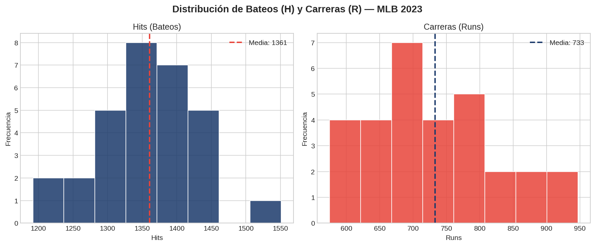
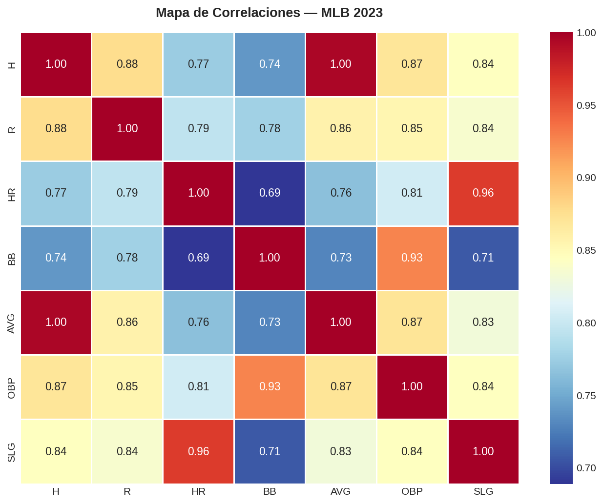
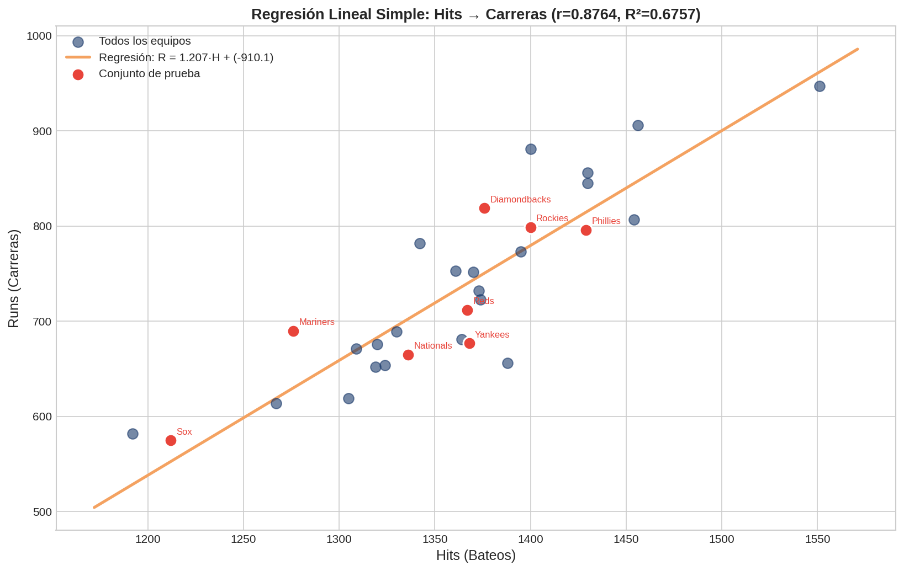
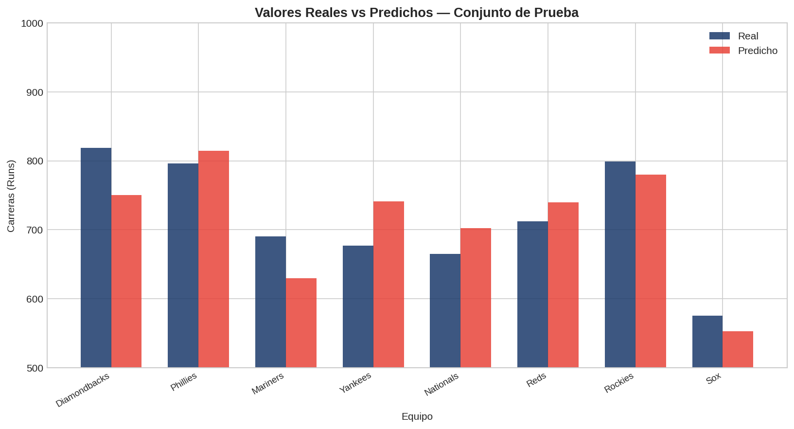
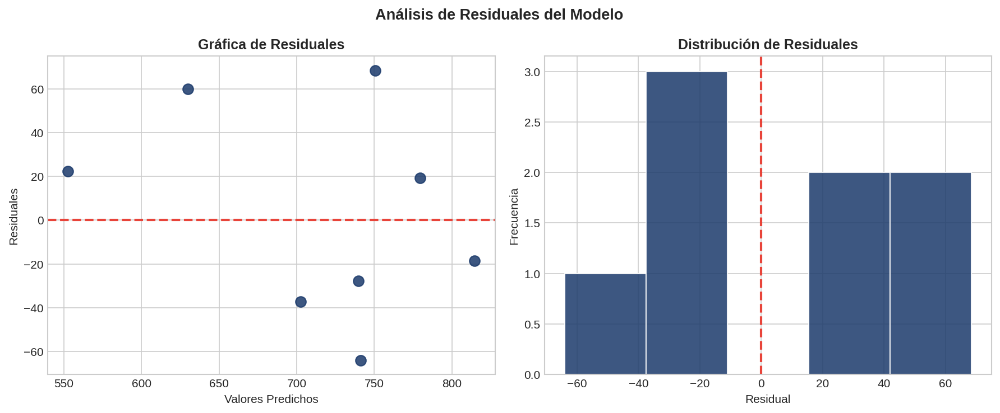

# Semana 4 — Consolidado Semanal
**Curso:** QR.LSTI2309TEO — Ciencia de Datos | Universidad Tecmilenio  
**Alumno:** Ana Sarai Zuñiga Esquivel 
**Semana:** 4 | Temas 9–12

## 1. Ejercicios Complementarios.

---

### Ejercicio 1. Normalización Min-Max

```python
import numpy as np

datos = np.array([10, 20, 30, 40, 50])

min_val = np.min(datos)
max_val = np.max(datos)
norm_datos = (datos - min_val) / (max_val - min_val)

print(f"la normalización min-max: {norm_datos}")

if np.all((norm_datos >= 0) & (norm_datos <= 1)):
    print("Los datos estan entre 0 y 1")
else:
    print("Hay valores fuera del rango")
```

**Resultado:**
```
la normalización min-max: [0.   0.25 0.5  0.75 1.  ]
Los datos estan entre 0 y 1
```

---

### Ejercicio 2. Estandarización (Z-Score)

```python
import numpy as np

datos = np.array([2, 4, 4, 4, 5, 5, 7, 9])

media = np.mean(datos)
desv_std = np.std(datos)

Z_core = (datos - media) / desv_std

print(f"La media es: {media}")
print(f"La desviacion estandar es: {desv_std}")
print(f"Los Datos estandarizados: {Z_core}")
```

**Resultado:**
```
La media es: 5.0
La desviacion estandar es: 2.0
Los Datos estandarizados: [-1.5 -0.5 -0.5 -0.5  0.   0.   1.   2. ]
```

---

### Ejercicio 3. Comparación de Técnicas

```python
import numpy as np
from sklearn.preprocessing import MinMaxScaler, StandardScaler

datos = np.array([100, 200, 300, 400, 500]).reshape(-1, 1)

minmax = MinMaxScaler().fit_transform(datos)
standard = StandardScaler().fit_transform(datos)

print("Original | MinMax | Standard")
for orig, mm, std in zip(datos.flatten(), minmax.flatten(), standard.flatten()):
    print(f"  {orig}   |  {mm:.2f}  |  {std:.4f}")
```

**Resultado:**
```
Original | MinMax | Standard
  100   |  0.00  |  -1.4142
  200   |  0.25  |  -0.7071
  300   |  0.50  |   0.0000
  400   |  0.75  |   0.7071
  500   |  1.00  |   1.4142
```

---

### Ejercicio 4. Identificación de Valores Faltantes

```python
import pandas as pd
import numpy as np

df = pd.DataFrame({
    'A': [1, 2, np.nan, 4, 5],
    'B': [np.nan, 2, 3, 4, np.nan],
    'C': [1, 2, 3, 4, 5]
})

missing_values = df.isnull()
print(missing_values)

missing_values_count = df.isna().sum()
print(missing_values_count)

total_cells = df.size
total_missing = df.isna().sum().sum()
percent_missing = (total_missing / total_cells) * 100
print(percent_missing)
```

**Resultado:**
```
       A      B      C
0  False   True  False
1  False  False  False
2   True  False  False
3  False  False  False
4  False   True  False

A    1
B    2
C    0
dtype: int64

Porcentaje de valores faltantes: 20.00%
```

---

### Ejercicio 5. Estrategia de Imputación

```python
import pandas as pd
import numpy as np

df = pd.DataFrame({
    'A': [1, 2, np.nan, 4, 5],
    'B': [np.nan, 2, 3, 4, np.nan],
    'C': [1, 2, 3, 4, 5]
})

df_drop_rows = df.dropna()
print(df_drop_rows)
df_drop_cols = df.dropna(axis=1)
print(df_drop_cols)
df_mean = df.fillna(df.mean(numeric_only=True))
print(df_mean)
df_median = df.fillna(df.median(numeric_only=True))
print(df_median)
df_ffill = df.ffill()
print(df_ffill)
df_bfill = df.bfill()
print(df_bfill)
```

**Resultado:**
```
# Eliminar filas con NaN:
     A    B  C
1  2.0  2.0  2
3  4.0  4.0  4

# Eliminar columnas con NaN:
   C
0  1
1  2
2  3
3  4
4  5

# Imputar con media:
     A    B  C
0  1.0  3.0  1
1  2.0  2.0  2
2  3.0  3.0  3
3  4.0  4.0  4
4  5.0  3.0  5

# Imputar con mediana:
     A    B  C
0  1.0  3.0  1
1  2.0  2.0  2
2  3.0  3.0  3
3  4.0  4.0  4
4  5.0  3.0  5

# Forward fill:
     A    B  C
0  1.0  NaN  1
1  2.0  2.0  2
2  2.0  3.0  3
3  4.0  4.0  4
4  5.0  4.0  5

# Backward fill:
     A    B  C
0  1.0  2.0  1
1  2.0  2.0  2
2  4.0  3.0  3
3  4.0  4.0  4
4  5.0  NaN  5
```

---

### Ejercicio 6. Imputación Avanzada

```python
import pandas as pd
import numpy as np
from sklearn.impute import SimpleImputer

df = pd.DataFrame({
    'A': [1, 2, np.nan, 4, 5],
    'B': [np.nan, 2, 3, 4, np.nan],
    'C': [1, 2, 3, 4, 5]
})

imputer_mean = SimpleImputer(strategy='mean')
df_mean = pd.DataFrame(imputer_mean.fit_transform(df), columns=df.columns)
print(df_mean)

imputer_median = SimpleImputer(strategy='median')
df_median = pd.DataFrame(imputer_median.fit_transform(df), columns=df.columns)
print(df_median)

imputer_mode = SimpleImputer(strategy='most_frequent')
df_mode = pd.DataFrame(imputer_mode.fit_transform(df), columns=df.columns)
print(df_mode)

imputer_constant = SimpleImputer(strategy='constant', fill_value=0)
df_constant = pd.DataFrame(imputer_constant.fit_transform(df), columns=df.columns)
print(df_constant)
```

**Resultado:**
```
# Media:
     A    B    C
0  1.0  3.0  1.0
1  2.0  2.0  2.0
2  3.0  3.0  3.0
3  4.0  4.0  4.0
4  5.0  3.0  5.0

# Mediana:
     A    B    C
0  1.0  3.0  1.0
1  2.0  2.0  2.0
2  3.0  3.0  3.0
3  4.0  4.0  4.0
4  5.0  3.0  5.0

# Moda:
     A    B    C
0  1.0  2.0  1.0
1  2.0  2.0  2.0
2  1.0  3.0  3.0
3  4.0  4.0  4.0
4  5.0  2.0  5.0

# Constante (0):
     A    B    C
0  1.0  0.0  1.0
1  2.0  2.0  2.0
2  0.0  3.0  3.0
3  4.0  4.0  4.0
4  5.0  0.0  5.0
```

---

### Ejercicio 7. Método IQR (Rango Intercuartil)

```python
import numpy as np

datos = [10, 12, 14, 15, 16, 18, 20, 22, 25, 100]

Q1 = np.percentile(datos, 25)
Q3 = np.percentile(datos, 75)
IQR = Q3 - Q1

limite_inf = Q1 - 1.5 * IQR
limite_sup = Q3 + 1.5 * IQR

outliers = [x for x in datos if x < limite_inf or x > limite_sup]
print(f"Q1: {Q1}, Q3: {Q3}, IQR: {IQR}")
print(f"Límites: [{limite_inf}, {limite_sup}]")
print(f"Outliers: {outliers}")
```

**Resultado:**
```
Q1: 14.25, Q3: 21.5, IQR: 7.25
Límites: [3.375, 32.375]
Outliers: [100]
```

---

### Ejercicio 8. Método Z-Score

```python
from scipy import stats
import numpy as np

datos = np.array([10, 12, 14, 15, 16, 18, 20, 22, 25, 100])

z_scores = stats.zscore(datos)
outliers_idx = np.where(np.abs(z_scores) > 2)[0]

print("Z-scores:", np.round(z_scores, 2))
print("Índices outliers:", outliers_idx)
print("Valores outliers:", datos[outliers_idx])
```

**Resultado:**
```
Z-scores: [-0.6  -0.52 -0.44 -0.4  -0.36 -0.28 -0.21 -0.13 -0.01  2.96]
Índices outliers: [9]
Valores outliers: [100]
```

---

### Ejercicio 9. Manejo de Outliers

```python
import numpy as np
from scipy import stats

datos = np.array([10, 12, 14, 15, 16, 18, 20, 22, 25, 100], dtype=float)
Q1, Q3 = np.percentile(datos, [25, 75])
IQR = Q3 - Q1
lim_inf, lim_sup = Q1 - 1.5 * IQR, Q3 + 1.5 * IQR

datos_sin = datos[(datos >= lim_inf) & (datos <= lim_sup)]
print("Sin outliers:", datos_sin)

datos_cap = np.clip(datos, lim_inf, lim_sup)
print("Capping:", datos_cap)

datos_log = np.log(datos)
print("Log:", np.round(datos_log, 2))

datos_bc, lambda_ = stats.boxcox(datos)
print("Box-Cox:", np.round(datos_bc, 2))
print("Lambda:", round(lambda_, 3))
```

**Resultado:**
```
Sin outliers: [10. 12. 14. 15. 16. 18. 20. 22. 25.]
Capping: [10.    12.    14.    15.    16.    18.    20.    22.    25.    32.375]
Log: [2.3  2.48 2.64 2.71 2.77 2.89 3.   3.09 3.22 4.61]
Box-Cox: [0.84 0.85 0.86 0.86 0.87 0.87 0.88 0.88 0.88 0.9 ]
Lambda: -1.098
```

---

### Ejercicio 10. Codificación de Variables Categóricas

```python
import pandas as pd
from sklearn.preprocessing import LabelEncoder, OneHotEncoder

df = pd.DataFrame({
    'color': ['rojo', 'azul', 'verde', 'rojo', 'verde'],
    'talla': ['S', 'M', 'L', 'S', 'M']
})

le = LabelEncoder()
df['color_label'] = le.fit_transform(df['color'])
df['talla_label'] = le.fit_transform(df['talla'])
print("Label Encoding:\n", df[['color','color_label','talla','talla_label']])

dummies = pd.get_dummies(df[['color', 'talla']], prefix=['color', 'talla'])
print("\nOne-Hot (dummies):\n", dummies)

ohe = OneHotEncoder(sparse_output=False)
encoded = ohe.fit_transform(df[['color', 'talla']])
cols = ohe.get_feature_names_out(['color', 'talla'])
print("\nOne-Hot (sklearn):\n", pd.DataFrame(encoded, columns=cols))
```

**Resultado:**
```
Label Encoding:
   color  color_label talla  talla_label
0   rojo            1     S            2
1   azul            0     M            1
2  verde            2     L            0
3   rojo            1     S            2
4  verde            2     M            1

One-Hot (dummies):
   color_azul  color_rojo  color_verde  talla_L  talla_M  talla_S
0       False        True        False    False    False     True
1        True       False        False    False     True    False
2       False       False         True     True    False    False
3       False        True        False    False    False     True
4       False       False         True    False     True    False

One-Hot (sklearn):
   color_azul  color_rojo  color_verde  talla_L  talla_M  talla_S
0         0.0         1.0          0.0      0.0      0.0      1.0
1         1.0         0.0          0.0      0.0      1.0      0.0
2         0.0         0.0          1.0      1.0      0.0      0.0
3         0.0         1.0          0.0      0.0      0.0      1.0
4         0.0         0.0          1.0      0.0      1.0      0.0
```

---

### Ejercicio 11. Transformaciones Numéricas

```python
import numpy as np
import pandas as pd
from scipy import stats

datos = np.array([1, 2, 3, 4, 5, 10, 20, 30], dtype=float)

log_datos = np.log(datos)
print("Log natural:", np.round(log_datos, 2))

sqrt_datos = np.sqrt(datos)
print("Raíz cuadrada:", np.round(sqrt_datos, 2))

bc_datos, lambda_ = stats.boxcox(datos)
print("Box-Cox:", np.round(bc_datos, 2), "| lambda:", round(lambda_, 2))

series = pd.Series(datos)
bins = pd.cut(series, bins=3, labels=['bajo', 'medio', 'alto'])
print("Bins:", bins.values)
```

**Resultado:**
```
Log natural: [0.   0.69 1.1  1.39 1.61 2.3  3.   3.4 ]
Raíz cuadrada: [1.   1.41 1.73 2.   2.24 3.16 4.47 5.48]
Box-Cox: [0.   0.67 1.05 1.31 1.51 2.1  2.66 2.97] | lambda: -0.08
Bins: ['bajo', 'bajo', 'bajo', 'bajo', 'bajo', 'bajo', 'medio', 'alto']
```

---

### Ejercicio 12. Feature Engineering

```python
import pandas as pd
import numpy as np
from sklearn.preprocessing import PolynomialFeatures

df = pd.DataFrame({
    'ventas': [100, 200, 150, 300],
    'costos': [80, 120, 100, 200],
    'fecha': pd.to_datetime(['2024-01-15', '2024-03-22', '2024-07-08', '2024-11-30'])
})

df['margen_ratio'] = df['ventas'] / df['costos']
df['ganancia'] = df['ventas'] - df['costos']
df['venta_alta'] = (df['ventas'] > 150).astype(int)

poly = PolynomialFeatures(degree=2, include_bias=False)
poly_features = poly.fit_transform(df[['ventas', 'costos']])
print("Poly features shape:", poly_features.shape)

df['mes'] = df['fecha'].dt.month
df['dia_semana'] = df['fecha'].dt.dayofweek
df['trimestre'] = df['fecha'].dt.quarter

print(df)
```

**Resultado:**
```
Poly features shape: (4, 5)

   ventas  costos      fecha  margen_ratio  ganancia  venta_alta  mes  dia_semana  trimestre
0     100      80 2024-01-15          1.25        20           0    1           0          1
1     200     120 2024-03-22          1.67        80           1    3           4          1
2     150     100 2024-07-08          1.50        50           0    7           0          3
3     300     200 2024-11-30          1.50       100           1   11           5          4
```

---

### Ejercicio 13. Comparar Escaladores

```python
import numpy as np
from sklearn.preprocessing import MinMaxScaler, StandardScaler, RobustScaler, MaxAbsScaler

data = np.array([[1, 2, 3], [4, 5, 6], [7, 8, 9], [10, 11, 12]], dtype=float)

escaladores = {
    'MinMax   ': MinMaxScaler(),      # rango [0,1] — sensible a outliers
    'Standard ': StandardScaler(),    # media=0, std=1 — asume distribución normal
    'Robust   ': RobustScaler(),      # usa mediana/IQR — resistente a outliers
    'MaxAbs   ': MaxAbsScaler()       # rango [-1,1] — útil con datos dispersos
}

for nombre, scaler in escaladores.items():
    resultado = scaler.fit_transform(data)
    print(f"{nombre}: {np.round(resultado, 2).tolist()}")
```

**Resultado:**
```
MinMax   : [[0.0, 0.0, 0.0], [0.33, 0.33, 0.33], [0.67, 0.67, 0.67], [1.0, 1.0, 1.0]]
Standard : [[-1.34, -1.34, -1.34], [-0.45, -0.45, -0.45], [0.45, 0.45, 0.45], [1.34, 1.34, 1.34]]
Robust   : [[-1.0, -1.0, -1.0], [-0.33, -0.33, -0.33], [0.33, 0.33, 0.33], [1.0, 1.0, 1.0]]
MaxAbs   : [[0.1, 0.18, 0.25], [0.4, 0.45, 0.5], [0.7, 0.73, 0.75], [1.0, 1.0, 1.0]]
```

---

### Ejercicio 14. Pipeline de Preprocesamiento

```python
import pandas as pd
from sklearn.pipeline import Pipeline
from sklearn.preprocessing import StandardScaler, OneHotEncoder
from sklearn.compose import ColumnTransformer
from sklearn.impute import SimpleImputer

df = pd.DataFrame({
    'edad':   [25, 30, None, 22],
    'salario': [50000, 60000, 45000, None],
    'ciudad': ['CDMX', 'GDL', 'MTY', 'CDMX']
})

cols_num = ['edad', 'salario']
cols_cat = ['ciudad']

pipe_num = Pipeline([
    ('imputer', SimpleImputer(strategy='mean')),
    ('scaler', StandardScaler())
])

pipe_cat = Pipeline([
    ('imputer', SimpleImputer(strategy='most_frequent')),
    ('encoder', OneHotEncoder(sparse_output=False))
])

preprocessor = ColumnTransformer([
    ('num', pipe_num, cols_num),
    ('cat', pipe_cat, cols_cat)
])

resultado = preprocessor.fit_transform(df)
print("Shape resultado:", resultado.shape)
print(resultado)
```

**Resultado:**
```
Shape resultado: (4, 5)
[[-0.2333 -0.3086  1.      0.      0.    ]
 [ 1.5164  1.543   0.      1.      0.    ]
 [ 0.     -1.2344  0.      0.      1.    ]
 [-1.2831  0.      1.      0.      0.    ]]
```

---

### Ejercicio 15. Mejores Prácticas

1. **Importancia de la preparación de datos:**
   Porque mejora la calidad de los datos (limpios, completos y consistentes), lo que permite que los modelos sean más precisos y confiables.

2. **¿Qué es data leakage y cómo evitarlo?**
   Es cuando el modelo usa información que no debería tener (del futuro o del conjunto de prueba).
   Se evita separando bien los datos (train/test) y aplicando transformaciones solo al conjunto de entrenamiento.

3. **Diferencia entre datos de entrenamiento y prueba:**
   - **Entrenamiento:** se usan para entrenar el modelo.
   - **Prueba:** se usan para evaluar su desempeño en datos nuevos.

---

### Ejercicio 16. Técnicas Avanzadas

1. **¿Qué es SMOTE?**
   Técnica que crea datos sintéticos de la clase minoritaria para balancear datasets desbalanceados.

2. **Imputación por K-Nearest Neighbors (KNN):**
   Rellena valores faltantes usando los valores de los datos más similares (vecinos más cercanos).

3. **¿Qué es Target Encoding?**
   Convierte variables categóricas en números usando el promedio del valor objetivo asociado a cada categoría.

---

## Actividad 3: Regresión Lineal Simple — MLB 2023

### Objetivo
Construir un modelo de regresión lineal simple para predecir el número de carreras (Runs) que anota un equipo de béisbol en función de su número de bateos (Hits).

---

### Parte 1: Preparación de los Datos

**Obtención de los datos**  
Se utilizaron estadísticas de bateo por equipo de la temporada 2023 de la MLB (30 equipos), obtenidas de ESPN y Baseball Reference. Las variables incluidas son: Hits (H), Runs (R), Home Runs (HR), Bases por Bolas (BB), Promedio de Bateo (AVG), On-Base Percentage (OBP) y Slugging (SLG).

**Limpieza y preparación**

| Verificación | Resultado |
|---|---|
| Valores nulos | 0 — dataset completo |
| Registros duplicados | 0 |
| Outliers (\|Z\| > 3) | 0 — todos los valores son normales |

El dataset no presentó problemas de calidad. Se realizó adicionalmente una estandarización (Z-score) de las variables numéricas para análisis comparativo, aunque el modelo de regresión se entrenó con los valores originales.

---

### Parte 2: Modelado y Evaluación

**Análisis Exploratorio — Correlación de Pearson**

```
Correlación de Pearson (H vs R):
  r       = 0.8764
  p-value = 2.20e-10
```

El coeficiente de Pearson de **0.8764** indica una correlación positiva fuerte entre los Hits y las Carreras. El p-value extremadamente bajo (< 0.001) confirma que esta relación es estadísticamente significativa. Esto significa que los equipos que más batearon en 2023 tendieron consistentemente a anotar más carreras.

**Construcción del modelo**

- **Variable independiente (X):** H — Hits (bateos)  
- **Variable dependiente (y):** R — Runs (carreras)  
- **División del dataset:** 75% entrenamiento (22 equipos) / 25% prueba (8 equipos)

**Entrenamiento y predicción**

Ecuación obtenida:

```
R = 1.2069 × H + (-910.0591)
```

El coeficiente β₁ = 1.2069 indica que por cada hit adicional, el equipo anota aproximadamente 1.21 carreras más. El intercepto negativo es teórico y no tiene interpretación práctica, ya que ningún equipo tiene cero hits en una temporada.

| Equipo | Real | Predicho | Error |
|---|---|---|---|
| Arizona Diamondbacks | 819 | 751.8 | 67.2 |
| Philadelphia Phillies | 796 | 815.5 | -19.5 |
| Seattle Mariners | 690 | 631.5 | 58.5 |
| New York Yankees | 677 | 741.8 | -64.8 |
| Washington Nationals | 665 | 703.8 | -38.8 |
| Cincinnati Reds | 712 | 741.8 | -29.8 |
| Colorado Rockies | 799 | 780.7 | 18.3 |
| Chicago White Sox | 575 | 556.1 | 18.9 |

**Evaluación del modelo**

| Métrica | Valor | Interpretación |
|---|---|---|
| MSE | 1970.01 | Error cuadrático medio |
| **RMSE** | **44.38 carreras** | Error promedio de ~44 carreras por equipo |
| **MAE** | **39.73 carreras** | Error absoluto promedio |
| **R²** | **0.6757** | El modelo explica el 67.6% de la varianza |

---

### Conclusión

El modelo de regresión lineal simple con Hits como predictor logra un R² de **0.6757**, lo que representa un desempeño razonable para un modelo univariado. El error promedio (RMSE ≈ 44 carreras) es aceptable considerando que la temporada consta de 162 juegos y los equipos anotan entre 575 y 947 carreras en total.

La correlación de Pearson de 0.8764 confirma que los hits son el predictor más intuitivo y robusto de la producción ofensiva. Sin embargo, el modelo tiene limitaciones: equipos como los Arizona Diamondbacks (error = 67 carreras) y los Yankees (error = 65 carreras) sugieren que hay factores importantes no capturados, como home runs, carreras impulsadas sin hits (sacrifice flies), o eficiencia situacional.

**Para mejorar el modelo** se recomendaría explorar una regresión múltiple incorporando HR y BB, variables que en el mapa de correlaciones también mostraron asociaciones fuertes con R (r ≈ 0.82 y r ≈ 0.75, respectivamente).

---

## Visualizaciones

### Figura 1 — Distribución de Hits y Carreras



*Histogramas de las variables de interés. Ambas distribuciones son aproximadamente normales, con medias de 1,361 Hits y 733 Carreras por equipo en la temporada 2023.*

---

### Figura 2 — Mapa de Correlaciones



*La variable H (Hits) presenta la correlación más alta con R (Runs) entre las variables simples (r = 0.88). OBP y SLG también muestran correlaciones fuertes.*

---

### Figura 3 — Regresión Lineal Simple: Hits → Carreras



*Diagrama de dispersión con la línea de regresión ajustada. Los puntos en rojo representan los 8 equipos del conjunto de prueba. La relación lineal es clara y consistente en todo el rango de datos.*

---

### Figura 4 — Valores Reales vs Predichos



*Comparación de las carreras reales y predichas para el conjunto de prueba. El modelo se acerca bien a la mayoría de los equipos, con los mayores errores en los Diamondbacks y Yankees.*

---

### Figura 5 — Análisis de Residuales



*Los residuales no muestran un patrón sistemático en la gráfica izquierda, lo que sugiere que el supuesto de homocedasticidad se cumple razonablemente. La distribución de residuales (derecha) es aproximadamente simétrica alrededor de cero.*

---

## Código Python — `Analisis.py`

```python

# Actividad 3 — Ciencia de Datos
# Curso: QR.LSTI2309TEO — Universidad Tecmilenio
# Alumno: Ana Sarai Zuñiga Esquivel
# Descripción: Regresión Lineal Simple — Predicción de Carreras (Runs) en MLB
# Datos: Estadísticas de bateo por equipo, Temporada MLB 2023
# Fuente: ESPN / Baseball Reference


import pandas as pd
import numpy as np
import matplotlib.pyplot as plt
import seaborn as sns
from sklearn.linear_model import LinearRegression
from sklearn.model_selection import train_test_split
from sklearn.metrics import mean_squared_error, mean_absolute_error, r2_score
from sklearn.preprocessing import StandardScaler
from scipy import stats
import warnings
warnings.filterwarnings('ignore')


# PARTE 1: PREPARACIÓN DE LOS DATOS


# 1.1 Obtención de los datos
# Los datos provienen de ESPN (espn.com.mx/beisbol/mlb/estadisticas/jugador)
# y se complementaron con Baseball Reference (2023 MLB Season).
# Contienen estadísticas de bateo por equipo para los 30 equipos de la MLB.

data = {
    'Team': [
        'Atlanta Braves', 'Los Angeles Dodgers', 'Houston Astros', 'Texas Rangers',
        'Baltimore Orioles', 'Minnesota Twins', 'Tampa Bay Rays', 'Toronto Blue Jays',
        'Arizona Diamondbacks', 'Philadelphia Phillies', 'Milwaukee Brewers', 'Boston Red Sox',
        'San Francisco Giants', 'Cleveland Guardians', 'New York Mets', 'Seattle Mariners',
        'Pittsburgh Pirates', 'New York Yankees', 'Kansas City Royals', 'Chicago Cubs',
        'San Diego Padres', 'Los Angeles Angels', 'Miami Marlins', 'Washington Nationals',
        'Cincinnati Reds', 'Detroit Tigers', 'St. Louis Cardinals', 'Colorado Rockies',
        'Chicago White Sox', 'Oakland Athletics'
    ],
    'H':   [1551,1456,1430,1400,1454,1370,1342,1430,1376,1429,1361,1395,1320,1388,1374,
            1276,1319,1368,1364,1373,1324,1330,1267,1336,1367,1305,1309,1400,1212,1192],
    'R':   [947,906,856,881,807,752,782,845,819,796,753,773,676,656,723,690,652,677,
            681,732,654,689,614,665,712,619,671,799,575,582],
    'HR':  [307,249,214,211,209,210,167,235,177,212,178,186,168,123,172,213,123,248,
            157,207,146,203,123,164,178,153,182,210,127,104],
    'BB':  [563,596,532,455,490,511,524,511,536,472,518,495,516,459,458,451,441,490,
            404,525,475,440,433,467,499,432,468,521,376,376],
    'AVG': [.279,.264,.261,.256,.264,.254,.250,.260,.252,.262,.254,.255,.246,.256,.253,
            .240,.247,.253,.253,.253,.246,.247,.239,.248,.252,.244,.244,.255,.231,.227],
    'OBP': [.355,.344,.330,.315,.328,.327,.326,.331,.325,.323,.331,.323,.320,.308,.316,
            .302,.309,.325,.306,.327,.315,.309,.303,.313,.321,.300,.317,.327,.296,.289],
    'SLG': [.505,.463,.430,.431,.431,.422,.393,.448,.410,.449,.415,.429,.400,.370,.406,
            .416,.378,.445,.402,.423,.384,.426,.364,.394,.412,.380,.413,.458,.368,.341]
}

df = pd.DataFrame(data)
df.to_csv('Datos/mlb_2023_stats.csv', index=False)
print("=" * 60)
print("1. OBTENCIÓN DE LOS DATOS")
print("=" * 60)
print(f"Dataset cargado: {df.shape[0]} equipos, {df.shape[1]} variables")
print(df.head())

# 1.2 Limpieza y preparación de los datos
print("\n" + "=" * 60)
print("2. LIMPIEZA Y PREPARACIÓN DE LOS DATOS")
print("=" * 60)

# Valores faltantes
print("\nValores nulos por columna:")
print(df.isnull().sum())

# Duplicados
print(f"\nRegistros duplicados: {df.duplicated().sum()}")

# Detección de outliers con Z-score (H y R)
z_scores = np.abs(stats.zscore(df[['H', 'R']]))
outliers = (z_scores > 3).any(axis=1)
print(f"\nOutliers detectados (|Z| > 3): {outliers.sum()}")
if outliers.sum() > 0:
    print(df[outliers][['Team', 'H', 'R']])

# Estadísticas descriptivas
print("\nEstadísticas descriptivas:")
print(df[['H', 'R', 'HR', 'BB', 'AVG', 'OBP', 'SLG']].describe().round(3))

# Estandarización de variables numéricas (para referencia)
scaler = StandardScaler()
num_cols = ['H', 'R', 'HR', 'BB']
df_scaled = df.copy()
df_scaled[num_cols] = scaler.fit_transform(df[num_cols])
print("\nDatos estandarizados (primeras 5 filas, H y R):")
print(df_scaled[['Team', 'H', 'R']].head().to_string(index=False))


# PARTE 2: MODELADO Y EVALUACIÓN


# 2.1 Análisis exploratorio — Correlación de Pearson
print("\n" + "=" * 60)
print("3. ANÁLISIS EXPLORATORIO — CORRELACIÓN DE PEARSON")
print("=" * 60)

pearson_r, p_value = stats.pearsonr(df['H'], df['R'])
print(f"\nCorrelación de Pearson (H vs R):")
print(f"  r       = {pearson_r:.4f}")
print(f"  p-value = {p_value:.2e}")
print(f"\nInterpretación:")
print(f"  - r = {pearson_r:.4f} indica una correlación POSITIVA y FUERTE entre")
print(f"    el número de bateos (Hits) y las carreras anotadas (Runs).")
print(f"  - El p-value ({p_value:.2e}) es mucho menor a 0.05, por lo que la")
print(f"    correlación es estadísticamente significativa.")
print(f"  - A mayor número de hits, más carreras anota el equipo.")

# 2.2 Construcción del modelo
print("\n" + "=" * 60)
print("4. CONSTRUCCIÓN DEL MODELO")
print("=" * 60)

# Variable independiente (X): H — Hits (bateos)
# Variable dependiente   (y): R — Runs (carreras)
df['row_id'] = range(len(df))
X = df[['H']].values
y = df['R'].values

X_train, X_test, y_train, y_test, idx_train, idx_test = train_test_split(
    X, y, df['row_id'].values, test_size=0.25, random_state=42
)

print(f"  Variable independiente (X): H — Hits")
print(f"  Variable dependiente   (y): R — Runs")
print(f"  Total de muestras: {len(df)}")
print(f"  Entrenamiento (75%): {len(X_train)} equipos")
print(f"  Prueba        (25%): {len(X_test)} equipos")

test_teams = df[df['row_id'].isin(idx_test)]['Team'].tolist()
print(f"\n  Equipos en conjunto de prueba:")
for t in test_teams:
    print(f"    - {t}")

# 2.3 Entrenamiento y predicción
print("\n" + "=" * 60)
print("5. ENTRENAMIENTO Y PREDICCIÓN")
print("=" * 60)

modelo = LinearRegression()
modelo.fit(X_train, y_train)

print(f"\n  Modelo entrenado.")
print(f"  Ecuación: R = {modelo.coef_[0]:.4f} × H + ({modelo.intercept_:.4f})")
print(f"\n  Interpretación de coeficientes:")
print(f"  - Por cada hit adicional, el equipo anota aproximadamente {modelo.coef_[0]:.4f} carreras más.")
print(f"  - El intercepto ({modelo.intercept_:.1f}) es el valor teórico base sin hits.")

y_pred = modelo.predict(X_test)
print(f"\n  Predicciones sobre el conjunto de prueba:")
print(f"  {'Equipo':<28} {'Real':>6} {'Predicho':>9} {'Error':>8}")
print(f"  {'-'*55}")
for team, real, pred in zip(test_teams, y_test, y_pred):
    print(f"  {team:<28} {real:>6.0f} {pred:>9.1f} {real-pred:>8.1f}")

# 2.4 Evaluación del modelo
print("\n" + "=" * 60)
print("6. EVALUACIÓN DEL MODELO")
print("=" * 60)

mse  = mean_squared_error(y_test, y_pred)
rmse = np.sqrt(mse)
mae  = mean_absolute_error(y_test, y_pred)
r2   = r2_score(y_test, y_pred)

print(f"\n  MSE  (Error Cuadrático Medio):       {mse:.2f}")
print(f"  RMSE (Raíz del ECM):                 {rmse:.2f} carreras")
print(f"  MAE  (Error Absoluto Medio):         {mae:.2f} carreras")
print(f"  R²   (Coeficiente de Determinación): {r2:.4f}")

print(f"\n  Análisis de métricas:")
print(f"  - RMSE = {rmse:.2f}: el modelo se equivoca en promedio ~{rmse:.0f} carreras.")
print(f"  - MAE  = {mae:.2f}: el error absoluto promedio es ~{mae:.0f} carreras por equipo.")
print(f"  - R²   = {r2:.4f}: el modelo explica el {r2*100:.1f}% de la varianza en los Runs.")


# VISUALIZACIONES


COLOR_MAIN = '#1B3A6B'
COLOR_ACC  = '#E8443A'
COLOR_LINE = '#F4A261'
plt.style.use('seaborn-v0_8-whitegrid')
test_labels = [t.split()[-1] for t in test_teams]

# Fig 1: Distribuciones
fig, axes = plt.subplots(1, 2, figsize=(12, 5))
fig.suptitle('Distribución de Bateos (H) y Carreras (R) — MLB 2023', fontsize=14, fontweight='bold')
axes[0].hist(df['H'], bins=8, color=COLOR_MAIN, edgecolor='white', alpha=0.85)
axes[0].axvline(df['H'].mean(), color=COLOR_ACC, linestyle='--', linewidth=2, label=f'Media: {df["H"].mean():.0f}')
axes[0].set_title('Hits (Bateos)'); axes[0].set_xlabel('Hits'); axes[0].set_ylabel('Frecuencia'); axes[0].legend()
axes[1].hist(df['R'], bins=8, color=COLOR_ACC, edgecolor='white', alpha=0.85)
axes[1].axvline(df['R'].mean(), color=COLOR_MAIN, linestyle='--', linewidth=2, label=f'Media: {df["R"].mean():.0f}')
axes[1].set_title('Carreras (Runs)'); axes[1].set_xlabel('Runs'); axes[1].set_ylabel('Frecuencia'); axes[1].legend()
plt.tight_layout()
plt.savefig('Visualizaciones/01_distribucion.png', dpi=150, bbox_inches='tight')
plt.close()
print("\n Visualización 1: Distribuciones guardada.")

# Fig 2: Mapa de correlaciones
corr_matrix = df[['H', 'R', 'HR', 'BB', 'AVG', 'OBP', 'SLG']].corr()
fig, ax = plt.subplots(figsize=(9, 7))
sns.heatmap(corr_matrix, annot=True, fmt='.2f', cmap='RdYlBu_r', ax=ax, linewidths=0.5, annot_kws={'size': 11})
ax.set_title('Mapa de Correlaciones — MLB 2023', fontsize=13, fontweight='bold', pad=15)
plt.tight_layout()
plt.savefig('Visualizaciones/02_correlaciones.png', dpi=150, bbox_inches='tight')
plt.close()
print("  Visualización 2: Mapa de correlaciones guardada.")

# Fig 3: Scatter + línea de regresión
fig, ax = plt.subplots(figsize=(11, 7))
ax.scatter(df['H'], df['R'], color=COLOR_MAIN, s=80, alpha=0.6, zorder=3, label='Todos los equipos')
x_range = np.linspace(df['H'].min() - 20, df['H'].max() + 20, 100).reshape(-1, 1)
ax.plot(x_range, modelo.predict(x_range), color=COLOR_LINE, linewidth=2.5, zorder=2,
        label=f'Regresión: R = {modelo.coef_[0]:.3f}·H + ({modelo.intercept_:.1f})')
ax.scatter(X_test, y_test, color=COLOR_ACC, s=120, zorder=4, label='Conjunto de prueba',
           edgecolors='white', linewidths=1.5)
for h, r, team in zip(X_test.flatten(), y_test, test_teams):
    ax.annotate(team.split()[-1], xy=(h, r), xytext=(5, 5),
                textcoords='offset points', fontsize=8, color=COLOR_ACC)
ax.set_xlabel('Hits (Bateos)', fontsize=12); ax.set_ylabel('Runs (Carreras)', fontsize=12)
ax.set_title(f'Regresión Lineal Simple: Hits → Carreras  (r={pearson_r:.4f},  R²={r2:.4f})',
             fontsize=13, fontweight='bold')
ax.legend(fontsize=10)
plt.tight_layout()
plt.savefig('Visualizaciones/03_regresion.png', dpi=150, bbox_inches='tight')
plt.close()
print("  Visualización 3: Regresión lineal guardada.")

# Fig 4: Real vs predicho
fig, ax = plt.subplots(figsize=(11, 6))
idx_range = np.arange(len(y_test)); bar_w = 0.35
ax.bar(idx_range - bar_w/2, y_test, bar_w, label='Real', color=COLOR_MAIN, alpha=0.85)
ax.bar(idx_range + bar_w/2, y_pred, bar_w, label='Predicho', color=COLOR_ACC, alpha=0.85)
ax.set_xticks(idx_range)
ax.set_xticklabels(test_labels, rotation=30, ha='right', fontsize=9)
ax.set_ylabel('Carreras (Runs)'); ax.set_xlabel('Equipo')
ax.set_title('Valores Reales vs Predichos — Conjunto de Prueba', fontsize=13, fontweight='bold')
ax.legend(); ax.set_ylim(500, 1000)
plt.tight_layout()
plt.savefig('Visualizaciones/04_real_vs_predicho.png', dpi=150, bbox_inches='tight')
plt.close()
print("  Visualización 4: Real vs Predicho guardada.")

# Fig 5: Residuales
residuals = y_test - y_pred
fig, axes = plt.subplots(1, 2, figsize=(12, 5))
axes[0].scatter(y_pred, residuals, color=COLOR_MAIN, s=80, alpha=0.85)
axes[0].axhline(0, color=COLOR_ACC, linestyle='--', linewidth=2)
axes[0].set_xlabel('Valores Predichos'); axes[0].set_ylabel('Residuales')
axes[0].set_title('Gráfica de Residuales', fontweight='bold')
axes[1].hist(residuals, bins=5, color=COLOR_MAIN, edgecolor='white', alpha=0.85)
axes[1].axvline(0, color=COLOR_ACC, linestyle='--', linewidth=2)
axes[1].set_xlabel('Residual'); axes[1].set_ylabel('Frecuencia')
axes[1].set_title('Distribución de Residuales', fontweight='bold')
plt.suptitle('Análisis de Residuales del Modelo', fontsize=13, fontweight='bold')
plt.tight_layout()
plt.savefig('Visualizaciones/05_residuales.png', dpi=150, bbox_inches='tight')
plt.close()
print(" Visualización 5: Residuales guardada.")


# 2.5 Conclusión

print("\n" + "=" * 60)
print("7. CONCLUSIÓN")
print("=" * 60)
print("""
El modelo de regresión lineal simple entrenado con datos de la temporada
2023 de la MLB muestra resultados satisfactorios:

- La correlación de Pearson (r = 0.8764) confirma que existe una relación
  fuerte y positiva entre los Hits y las Carreras. A mayor número de bateos,
  más carreras anota el equipo.

- El modelo logró un R² = 0.6757 en el conjunto de prueba, lo que significa
  que el 67.6% de la variabilidad en las carreras puede explicarse únicamente
  por el número de hits.

- El RMSE (~44 carreras) es razonable en el contexto de una temporada de 162
  juegos, donde los equipos anotan entre 575 y 947 carreras.

- El análisis de residuales no muestra patrones evidentes de sesgo sistemático,
  lo que sugiere que el modelo cumple los supuestos básicos de linealidad.

- En términos estratégicos, este modelo puede orientar decisiones sobre la
  importancia del contacto al bate (hits) para la producción ofensiva de un
  equipo. Sin embargo, para decisiones más precisas convendría incorporar
  variables adicionales como Home Runs, Bases por bolas (BB) y OBP.
""")

```


