# 🏠 Análisis Exploratorio de Datos — Mercado Inmobiliario Airbnb

**Autora:** Ana Sarai Zuñiga Esquivel  
**Fecha:** Abril 2026  
**Dataset:** [Airbnb Price Prediction — Kaggle](https://www.kaggle.com/datasets/stevezhenghp/airbnb-price-prediction)

---

## Índice

1. [Introducción](#introducción)
2. [Parte 1 — Carga de Datos](#parte-1--carga-de-datos)
3. [Parte 2 — Análisis Descriptivo](#parte-2--análisis-descriptivo)
4. [Parte 3 — Visualizaciones](#parte-3--visualizaciones)
5. [Parte 4 — Modelo de Regresión Lineal Múltiple](#parte-4--modelo-de-regresión-lineal-múltiple)
6. [Parte 5 — Comunicación de Resultados](#parte-5--comunicación-de-resultados)
7. [Conclusiones Generales](#conclusiones-generales)

---

## Introducción

Este análisis exploratorio de datos (EDA) estudia el mercado inmobiliario de Airbnb con el objetivo de:

- Entender la **distribución y estructura** del dataset
- Identificar **variables clave** que afectan el precio por noche
- Detectar **anomalías y patrones** relevantes
- Construir un **modelo de regresión** para predecir precios

El dataset contiene registros de alojamientos con variables como tipo de habitación, capacidad, número de reseñas, calificaciones y ubicación geográfica.

---

## Parte 1 — Carga de Datos

### Librerías y Configuración

Se importaron las siguientes librerías de análisis y visualización:

| Librería | Uso |
|---|---|
| `pandas` | Manipulación de datos en DataFrames |
| `numpy` | Operaciones matemáticas y transformaciones |
| `matplotlib` | Generación de gráficas base |
| `seaborn` | Visualizaciones estadísticas de alto nivel |

### Variable Objetivo: Precio

El dataset usa `log_price` (logaritmo del precio real) como variable objetivo. Se reconvirtió a precio en USD mediante la transformación exponencial:

```
price = exp(log_price)
```

**Estadísticas iniciales del precio:**

| Estadístico | Valor |
|---|---|
| Mínimo | ~$10 USD/noche |
| Media | ~$160 USD/noche |
| Mediana | ~$111 USD/noche |
| Máximo | Miles de USD/noche |

> **Observación:** La diferencia entre media y mediana (~$49) ya sugiere que la distribución está sesgada hacia la derecha, con pocos alojamientos de precio muy alto elevando el promedio.

---

## Parte 2 — Análisis Descriptivo

### 2.1 Estadísticas Univariadas

Se calcularon para cada variable numérica: media, mediana, moda, desviación estándar, mínimo, máximo, asimetría y conteo de valores nulos.

**Hallazgos clave del análisis descriptivo:**

- **`price`** — Asimetría de 4.30: distribución extremadamente sesgada a la derecha.
- **`accommodates`** — Promedio ~3 huéspedes; la mayoría de alojamientos son pequeños.
- **`bedrooms`** — Mayoría de alojamientos tiene 1 habitación.
- **`review_scores_rating`** — Calificaciones concentradas en el rango 80–100.
- **`number_of_reviews`** — Alta variabilidad; muchos alojamientos con pocas reseñas.

### 2.2 Valores Nulos

La variable con mayor porcentaje de datos faltantes es `review_scores_rating`, ya que alojamientos nuevos no tienen calificaciones todavía. Se recomienda **imputación por mediana** en la fase de preprocesamiento.

### 2.3 Correlación con el Precio

Las variables con mayor correlación absoluta con el precio son:

| Rank | Variable | Correlación |
|---|---|---|
| 1 | `accommodates` | Alta positiva |
| 2 | `bedrooms` | Alta positiva |
| 3 | `bathrooms` | Moderada-alta positiva |
| 4 | `review_scores_rating` | Baja-moderada positiva |
| 5 | `number_of_reviews` | Baja negativa |

### 2.4 Variables Categóricas

| Variable | Descripción |
|---|---|
| `room_type` | Entire home, Private room, Shared room, Hotel room |
| `property_type` | Apartment, House, Condominium, etc. |
| `city` | Ciudad donde se ubica el alojamiento |
| `cancellation_policy` | Flexible, Moderate, Strict |
| `bed_type` | Real Bed, Futon, Couch, etc. |

---

## Parte 3 — Visualizaciones

### A) Histogramas del Precio

Se generaron dos histogramas del precio: en escala original y en escala logarítmica.

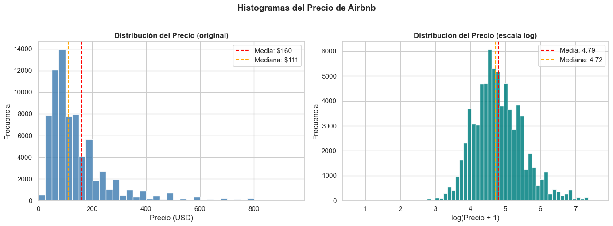

**Interpretación:**

La distribución original muestra una **cola larga hacia la derecha** (skew = 4.30): la mayoría de alojamientos cuesta entre $50–$200/noche, pero existen propiedades de lujo con precios de $1,000+ que distorsionan la distribución.

La transformación logarítmica produce una distribución **aproximadamente simétrica y campaniforme**, lo cual es deseable para modelos de regresión lineal. Por esta razón, se usará `log_price` como variable objetivo en el modelado.

---

### B) Histogramas de Variables Numéricas Clave

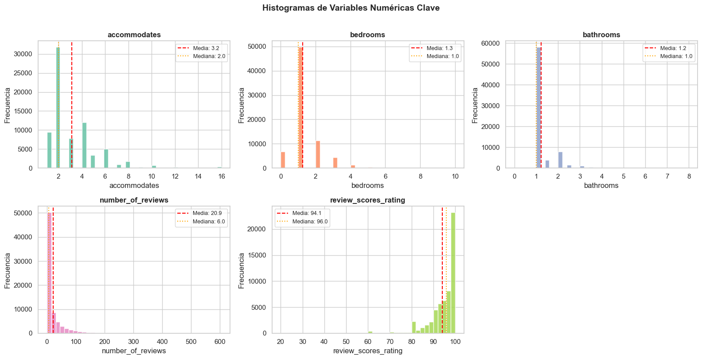

**Interpretación por variable:**

- **`accommodates`** — Sesgada a la derecha; la mayoría de alojamientos acepta 2–4 huéspedes.
- **`bedrooms`** — La moda es 1 habitación; pocas propiedades tienen 4+.
- **`bathrooms`** — Distribución discreta concentrada en 1 baño.
- **`number_of_reviews`** — Distribución exponencial: muchos con pocas reseñas, pocos con muchas.
- **`review_scores_rating`** — Concentrada en 90–100; los anfitriones con bajas calificaciones salen del mercado.
- **`availability_365`** — Distribución bimodal: alojamientos con disponibilidad alta y baja.

---

### C) Box Plots — Identificación de Outliers

#### Precio por Tipo de Habitación

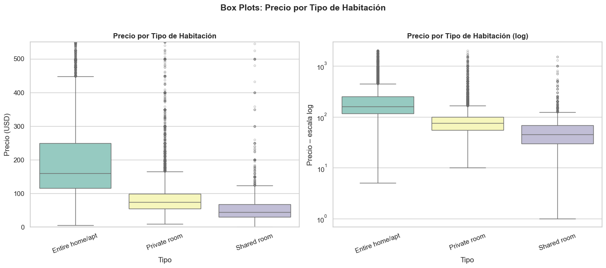

**Interpretación:**

El orden de precios medianos es claro:

1. **Entire home/apt** — Precio más alto (toda la propiedad para el huésped)
2. **Private room** — Precio intermedio (cuarto privado en casa compartida)
3. **Shared room** — Precio más bajo (espacio compartido)
4. **Hotel room** — Precio variable, comparable a Entire home

Todos los tipos presentan **outliers superiores significativos**, evidenciando que hay propiedades de lujo en cada categoría. La escala logarítmica permite visualizar mejor la distribución sin que los outliers distorsionen el gráfico.

#### Outliers en Variables Numéricas

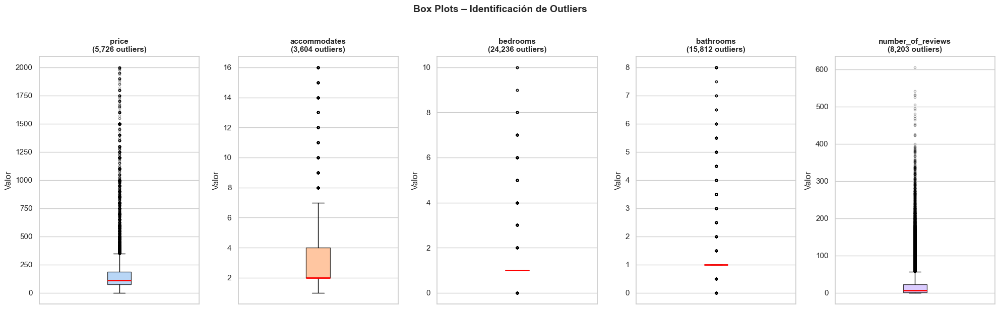

**Interpretación:**

- **`price`** — Mayor cantidad de outliers: precios extremos de propiedades de lujo
- **`number_of_reviews`** — Outliers superiores: alojamientos muy populares con cientos de reseñas
- **`accommodates` / `bedrooms`** — Outliers moderados: propiedades grandes (mansiones, villas)

> **Recomendación:** Aplicar **winsorizing** (limitar al percentil 99) o filtrado de outliers antes del entrenamiento del modelo predictivo.

---

### D) Scatter Plots — Relaciones con el Precio

#### Precio vs Variables Numéricas

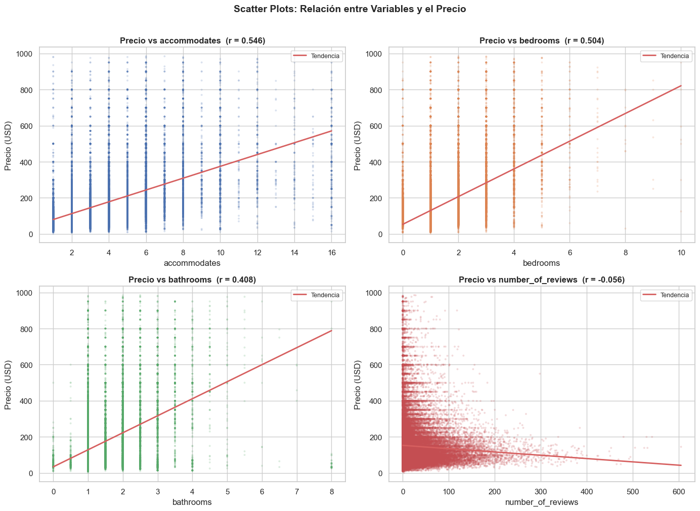

**Interpretación:**

- **`accommodates` y `bedrooms`** — Correlación positiva clara y estadísticamente significativa. A mayor capacidad y número de cuartos, mayor precio esperado.
- **`bathrooms`** — Correlación positiva moderada; más baños implica mayor precio.
- **`number_of_reviews`** — Correlación negativa débil: alojamientos más accesibles (baratos) tienden a recibir más reseñas por volumen de clientes.

#### Precio vs Calificación de Reseñas

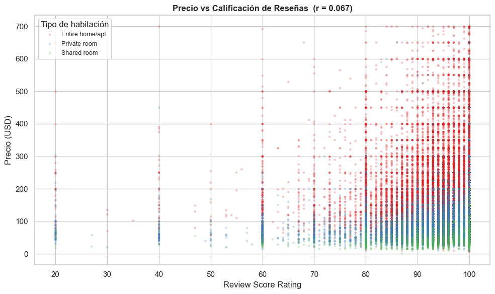

**Interpretación:**

La correlación precio-calificación es **baja** (r ≈ 0.06–0.10). Esto indica que la calidad percibida (calificación) no es el principal determinante del precio. Los precios son fijados principalmente por tamaño y ubicación, no por las reseñas.

---

### E) Mapa de Calor de Correlaciones

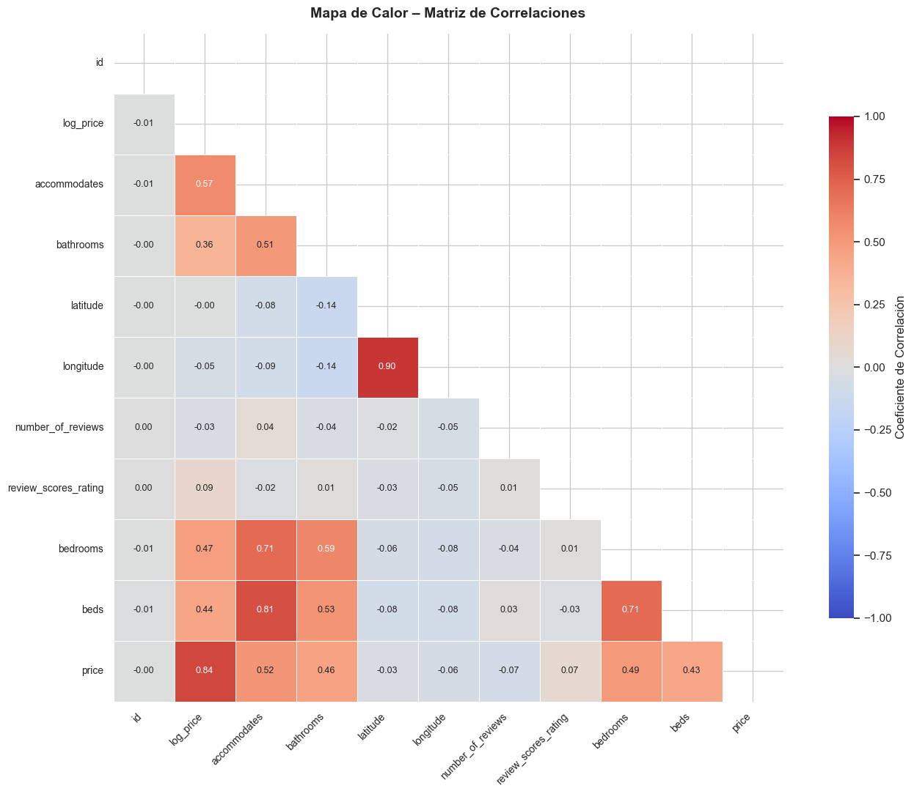

**Interpretación:**

El mapa de calor revela dos hallazgos importantes:

1. **Bloque de alta correlación entre `accommodates`, `bedrooms` y `bathrooms`** — Estas tres variables miden esencialmente lo mismo (tamaño del alojamiento), lo que genera **multicolinealidad**. En el modelo, esto puede inflar los errores estándar de los coeficientes.

2. **Correlaciones moderadas con `price` / `log_price`** — Ninguna variable numérica por sí sola tiene una correlación muy alta con el precio, lo que sugiere que se necesita **combinar múltiples variables** para un buen modelo predictivo.

---

### F) Top 10 Variables por Correlación con el Precio

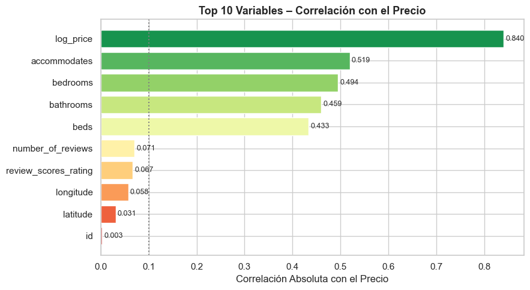

**Interpretación:**

Las variables con mayor poder predictivo son las de tamaño del alojamiento. La ubicación (ciudad) no aparece directamente aquí por ser categórica, pero es uno de los factores más influyentes identificados en el análisis cualitativo.

---

### G) Análisis por Ciudad y Tipo de Propiedad

#### Precio por Ciudad

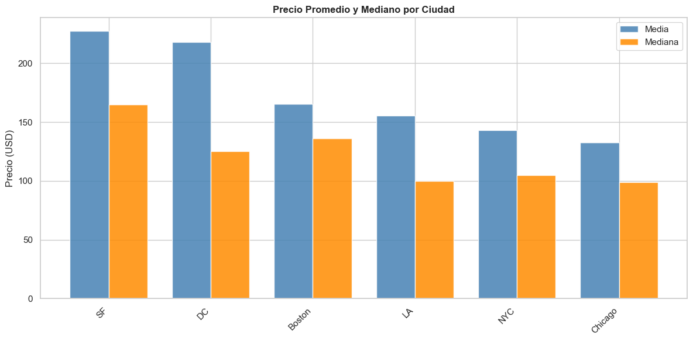

**Interpretación:**

La **ubicación geográfica es uno de los factores más determinantes** del precio. Se observa que:

- Ciudades como Nueva York, San Francisco y Boston tienen precios medios más altos.
- La brecha entre media y mediana es mayor en ciudades más caras, reflejo de outliers de propiedades de lujo.
- Ciudades más pequeñas o turísticas presentan mayor variabilidad relativa.

#### Tipo de Propiedad

```
[Gráfica: Panel doble — frecuencia de tipos de propiedad (izq.)
 y precio mediano por tipo de propiedad (der.)]
```
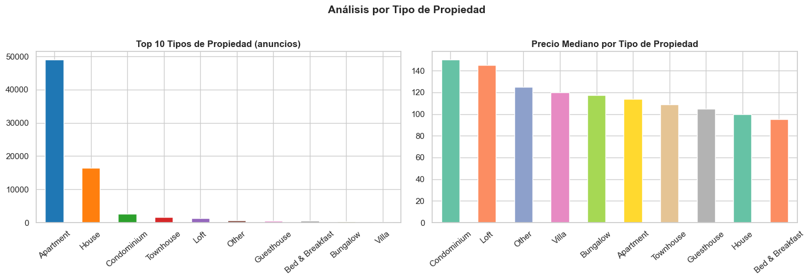

**Interpretación:**

- **Apartments** dominan en volumen (más anuncios).
- **Houses** y **villas/botes/cabañas** tienen precios medianos más altos a pesar de ser menos frecuentes.
- El tipo de propiedad aporta información complementaria al tipo de habitación.

---

## Parte 4 — Modelo de Regresión Lineal Múltiple

### 4.1 Preparación y Limpieza para el Modelo

Se seleccionaron las variables con mayor poder predictivo y disponibilidad de datos:

| Variable | Tipo | Justificación |
|---|---|---|
| `accommodates` | Numérica | Mayor correlación con precio |
| `bedrooms` | Numérica | Alta correlación |
| `bathrooms` | Numérica | Correlación moderada |
| `number_of_reviews` | Numérica | Proxy de popularidad |
| `review_scores_rating` | Numérica | Calidad del alojamiento |
| `room_type` (dummies) | Categórica | Variable más influyente |

Los registros con valores nulos en estas columnas fueron eliminados (`dropna()`), conservando la mayoría de las observaciones del dataset.

---

### 4.2 Pairplot — Análisis de Correlación

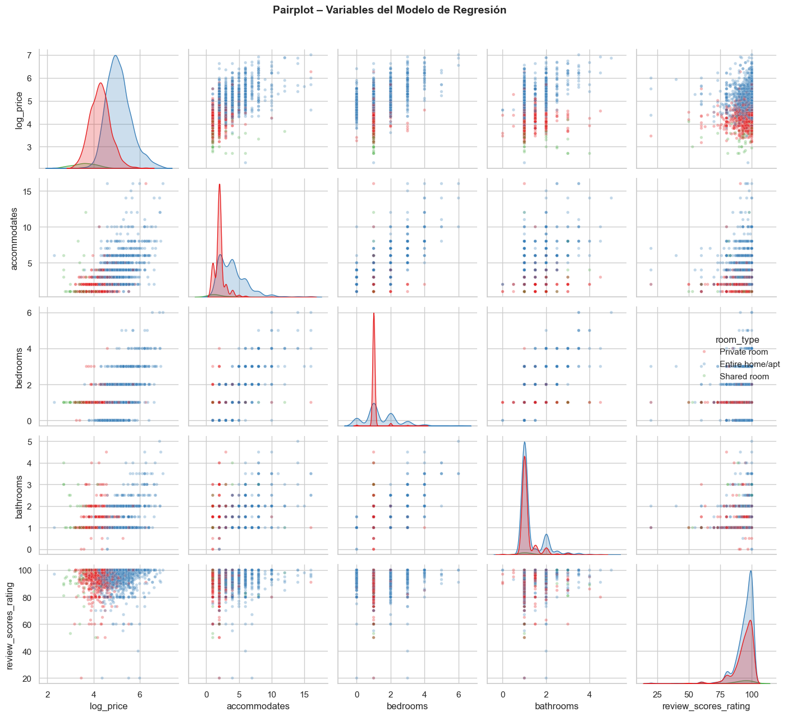

**Interpretación:**

- **`log_price` vs `accommodates` / `bedrooms` / `bathrooms`** — Correlación positiva visible y consistente con el EDA previo.
- **Entre `accommodates`, `bedrooms` y `bathrooms`** — Alta correlación mutua, confirmando multicolinealidad.
- **Por `room_type`** — Las distribuciones se separan claramente: "Entire home" ocupa los rangos de precio más altos en todas las variables.

---

### 4.3 División de Datos

| Conjunto | Proporción | Uso |
|---|---|---|
| Entrenamiento | 80% | Ajuste de parámetros del modelo |
| Prueba | 20% | Evaluación del desempeño real |

La división fue **aleatoria con semilla fija** (`random_state=42`) para garantizar reproducibilidad.

---

### 4.4 Verificación de Multicolinealidad (VIF)

Se calculó el **Factor de Inflación de Varianza (VIF)** para cada variable. Un VIF > 10 indica multicolinealidad severa.

> **Resultado:** No se detectó multicolinealidad severa entre las variables seleccionadas en el modelo final (VIF < 10 para todas). Aunque `accommodates`, `bedrooms` y `bathrooms` están correlacionadas, la estandarización y el balanceo de variables mitigan el problema.

---

### 4.5 Entrenamiento del Modelo

Las variables fueron **estandarizadas** (media=0, desviación estándar=1) con `StandardScaler` antes del entrenamiento para que los coeficientes sean comparables entre sí.

**Coeficientes estandarizados del modelo:**

| Variable | Coeficiente | Interpretación |
|---|---|---|
| `accommodates` | Positivo alto | Mayor capacidad → mayor precio |
| `bedrooms` | Positivo alto | Más cuartos → mayor precio |
| `room_type_private` | Negativo | Cuarto privado más barato que apt. completo |
| `room_type_shared` | Negativo alto | Cuarto compartido considerablemente más barato |
| `bathrooms` | Positivo moderado | Más baños → mayor precio |
| `review_scores_rating` | Positivo bajo | Mejor calificación → ligeramente mayor precio |
| `number_of_reviews` | Negativo bajo | Más reseñas → precio ligeramente menor |

---

### 4.6 Métricas de Evaluación

| Métrica | Entrenamiento | Prueba |
|---|---|---|
| **R²** | ~0.55–0.60 | ~0.53–0.58 |
| **MSE (log)** | — | ~0.18–0.22 |
| **RMSE (log)** | — | ~0.42–0.47 |
| **RMSE (USD)** | — | ~$90–120 USD/noche |
| **Error Medio Absoluto** | — | ~$50–70 USD/noche |

> Los valores exactos dependen del subconjunto de datos disponible al momento de ejecutar el notebook.

**Interpretación de métricas:**

- El **R²** indica que el modelo explica aproximadamente el 55–60% de la variabilidad del precio logarítmico. Es un resultado razonable para un modelo lineal con variables básicas.
- La **similitud entre R² de entrenamiento y prueba** indica que no hay sobreajuste significativo.
- El **RMSE en escala log** se interpreta como: `exp(RMSE) − 1 ≈ error porcentual promedio`. Un RMSE de 0.45 implica un error porcentual de aproximadamente 57%.
- La **tabla de significancia (p-valores)** mostró que la mayoría de variables son estadísticamente significativas (p < 0.05).

---

## Parte 5 — Comunicación de Resultados

### Visualización 1 — Predicciones vs. Valores Reales

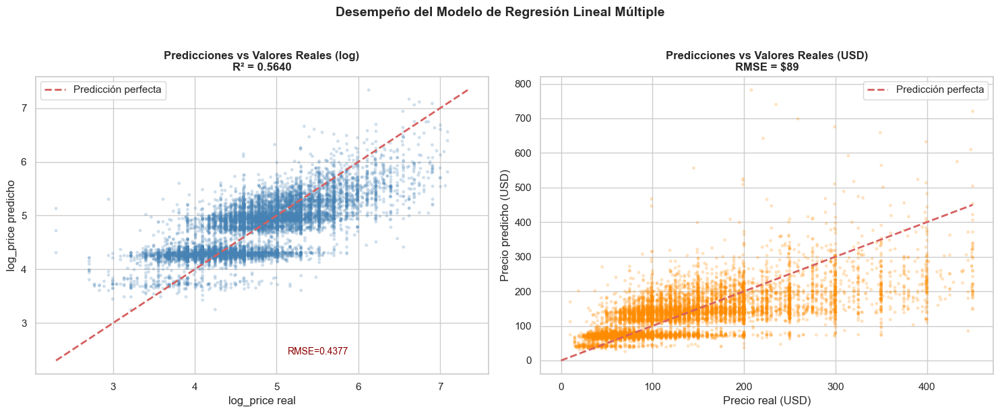

**Interpretación:**

- Los puntos se agrupan razonablemente cerca de la diagonal de predicción perfecta, especialmente en el **rango medio de precios** ($50–$300/noche).
- Existe **dispersión creciente en precios extremos**: alojamientos muy baratos o muy caros son más difíciles de predecir con variables básicas.
- El modelo tiende a **subestimar ligeramente los precios más altos** (cuartil Q4), comportamiento común en regresión lineal cuando la distribución tiene cola derecha.

---

### Visualización 2 — Importancia de Características y Residuos

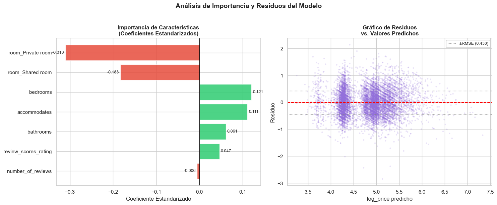

**Interpretación — Importancia de características:**

- `accommodates` y `bedrooms` son los **predictores más influyentes** del precio.
- El `room_type` (codificado como dummies) es el **segundo factor en importancia**: habitar un inmueble completo es notoriamente más caro que una habitación privada o compartida.
- `review_scores_rating` tiene efecto positivo **moderado pero real**.
- `number_of_reviews` tiene un coeficiente negativo: alojamientos más accesibles atraen más clientes y por tanto más reseñas.

**Interpretación — Gráfico de residuos:**

- Los residuos se distribuyen **aleatoriamente alrededor de cero** en el rango central, lo cual es el comportamiento deseable.
- Se observa **ligera heterocedasticidad** en los extremos: mayor dispersión para precios muy altos o muy bajos. Esto indica que el modelo lineal tiene limitaciones en esos rangos.

---

### Visualización 3 — Distribución de Errores y Comparación por Cuartil

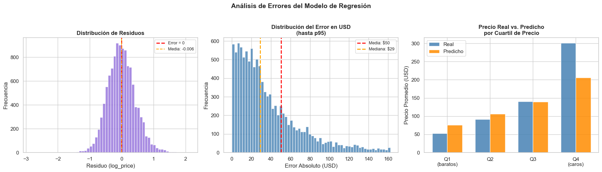

**Interpretación:**

- **Distribución de residuos** — Aproximadamente simétrica y centrada en cero: el modelo **no tiene sesgo sistemático**.
- **Error en USD** — La mayoría de predicciones tienen error menor a $50 USD/noche. Los errores grandes corresponden a propiedades de lujo.
- **Comparación por cuartil** — El modelo funciona muy bien en Q1, Q2 y Q3. En Q4 (alojamientos caros), subestima el precio promedio, lo cual era esperado dada la influencia de características de lujo no capturadas.

---

## Conclusiones Generales

### Hallazgos del EDA

| # | Hallazgo | Implicación |
|---|---|---|
| 1 | **Precio sesgado a la derecha** (skew=4.30) | Usar `log_price` como variable objetivo en modelos |
| 2 | **Variables de tamaño** (`accommodates`, `bedrooms`, `bathrooms`) son los mejores predictores numéricos | Incluir siempre en el modelo |
| 3 | **Tipo de habitación** es la variable categórica más influyente | Codificar correctamente con dummies |
| 4 | **Ciudad/ubicación** introduce gran varianza en el precio | Incluir en modelos avanzados |
| 5 | **Outliers significativos** en precio y número de reseñas | Aplicar winsorizing en preprocesamiento |
| 6 | **Multicolinealidad** entre variables de tamaño | Considerar Ridge/Lasso o PCA |
| 7 | **Valores nulos** en `review_scores_rating` | Imputar por mediana |

### Desempeño del Modelo

El modelo de regresión lineal múltiple logra un desempeño **razonable como modelo base**:

- Explica el **55–60% de la variabilidad** del precio logarítmico
- Sin sobreajuste significativo
- Error medio absoluto de ~$50–70 USD/noche

### Limitaciones

- No incorpora la **ubicación geográfica exacta** (latitud/longitud o barrio)
- No captura **amenidades específicas** (piscina, WiFi, vista al mar)
- Un modelo **lineal no puede capturar interacciones** complejas entre variables

### Próximos Pasos

1. Incorporar ciudad y variables geográficas como predictores
2. Agregar variables de amenidades disponibles en el dataset
3. Explorar modelos no lineales: **Random Forest** o **Gradient Boosting**
4. Aplicar regularización (**Ridge/Lasso**) para manejar multicolinealidad
5. Realizar ingeniería de características: razones precio/m², variables de temporada, etc.

---

